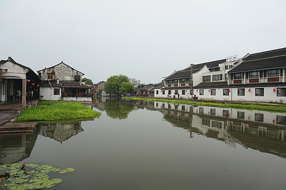
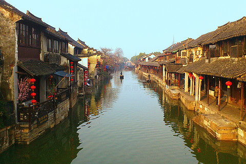

# 西塘 ✨

## 🌧️ 开篇：生活着的千年古镇

在浙江嘉善，有一座小镇。
春秋战国时期，这里是吴国和越国的交界。
所以叫"吴根越角"。

一千年了。
这座小镇，还是原来的样子。

九条河，在镇子里交汇。
二十七座石桥，把河的两岸连起来。
一千多米长的烟雨长廊，沿着河，一直延伸到镇子的尽头。
早上，有雾。
傍晚，有烟。
下雨的时候，雨滴从廊棚的瓦当上滴下来，滴滴答答。

这就是西塘。

很多人说，江南的古镇都长得差不多。
但是西塘不一样。
它是所有江南古镇里，最安静的一个，
也是最有"生活气息"的一个。

"春秋的水，唐宋的镇，明清的建筑，现代的人。"
这句话，说的就是西塘。

## 📜 一千年的西塘

**公元733年 建镇**
唐朝开元年间，这里就有人住了。那时候它叫"胥塘"。后来慢慢改名叫"西塘"。

**明清时期 手工业重镇**
明清的时候，西塘是江南有名的手工业重镇。烧窑，做酒，种粮食。这里的人，勤劳，富裕，生活安稳。

**公元1997年 开发旅游**
在此之前，西塘几乎没有人知道。它就是一个普普通通的江南小镇，年轻人都出去打工了，只剩下老人留在镇子里。

后来，有人发现了这里。
拍了照片，写了文章。
慢慢的，游客来了。
民宿开起来了，酒吧开起来了，咖啡馆开起来了。

西塘火了。

但是，直到今天，镇子里还有很多原住民在生活。
它没有变成一个纯粹的"景区"。
它还是一个"活着"的镇子。

---

## 🌟 西塘的必看

### 📍 烟雨长廊：西塘的灵魂

这就是西塘最有名的烟雨长廊。

一千多米长，沿着河，从镇的这一头，一直延伸到那一头。
廊棚下面，是青石板路。
一边是河，一边是店铺。
下雨的时候，你不用打伞，就可以从镇的这一头，走到那一头。

这是西塘人最智慧的发明。
几百年前，这里的生意人，为了下雨天也能做生意，就在自己家门口搭了棚子。
你家搭一段，我家搭一段。
慢慢就连成了这一千多米的长廊。

"雨天不湿鞋，照样走人家。"

> 💡 **导游贴士**：
> 一定要下雨天来西塘。
> 雨下得越大越好。
> 那个时候，
> 游客都躲起来了，
> 整个长廊都是你的。
> 你就沿着廊棚慢慢走，
> 听着雨滴打在瓦当上的声音，
> 看着雨落在河面上的涟漪。
> 那个时候，
> 你就懂了什么叫"江南"。

---

### 📍 石皮弄：西塘最窄的弄堂

这是西塘最有名的一条弄堂。
全长68米，最窄的地方，只有0.8米。
两个人面对面走，要侧着身子才能过去。

因为这条弄堂的石板，薄得像皮一样。
所以叫"石皮弄"。

两边是高高的院墙。
抬头往上看，只能看到一线天。
走在弄堂里，你的脚步声，会在两面墙之间来回反射。
那个感觉，特别奇妙。

很多人喜欢在这里拍照。
一个穿着旗袍的姑娘，站在弄堂的尽头。
那是西塘最经典的画面。

---

### 📍 送子来凤桥：走左边生儿子，走右边生女儿

这座桥建于明朝崇祯年间。
桥的一边是台阶，一边是斜坡。
当地有个说法：
"新婚夫妇，走左边的台阶，生儿子；
走右边的斜坡，生女儿。"

当然，这只是个传说。
但是每个来西塘的游客，都会在这座桥上，选择一边走。
有的选左边，有的选右边。
图个吉利，总是好的。

站在桥上，往两边看。
烟雨长廊沿着河延伸过去。
船从桥洞底下划过。
那个画面，特别美。

---

### 📍 坐船：在西塘的河里摇啊摇

来西塘，一定要坐一次船。
最好是傍晚的时候。
天快黑了，灯刚刚亮起来。
那个时候坐船，是最美的。

船娘站在船尾，摇着橹。
船在河面上慢慢划。
两边的灯笼一盏一盏地亮起来。
灯光倒映在水里，晃啊晃。
偶尔有别的船从旁边划过。
船老大之间会互相打个招呼。

那个时候，你会觉得，
时间好像静止了。
整个世界，就只剩下你，和这条河，和这座小镇。

---

### 📍 夜西塘：越夜越美丽

很多人说，西塘的白天和晚上，是两个完全不一样的地方。

白天的西塘，是安静的，古朴的，像水墨画一样。
晚上的西塘，灯亮起来了，酒吧的音乐响起来了，人多起来了。
它突然就活了。

你可以找一个临河的酒吧，坐下来。
点一杯酒，听着歌手唱歌。
看着河面上的灯光，晃啊晃。
你可以什么都想，也可以什么都不想。

那种感觉，在别的地方是找不到的。

---

## 🍺 西塘的两种打开方式

西塘有两种完全不同的打开方式。

**第一种：安静的西塘**
早上七点钟起床。
游客还没来。
整个镇子都是空的。
只有当地的老人，在河边锻炼，在买菜。
你可以沿着烟雨长廊，慢慢走。
吃一屉刚蒸好的小笼包，喝一碗豆腐花。
那个时候的西塘，是属于你一个人的。

**第二种：热闹的西塘**
晚上。
酒吧一条街的灯都亮了。
音乐响起来了。
人多起来了。
你可以找一个喜欢的酒吧，进去坐一坐。
听着歌，喝着酒。
看着窗外的人来人往。
那个时候的西塘，是属于年轻人的。

很多人说，西塘太商业化了，酒吧太吵了。
其实不是。
你只要早起两个小时，
你就能看到那个最安静、最古朴的西塘。
它一直都在。
只是你起得太晚了。

---

## 🎯 游览实用指南

### 🚗 交通指南

西塘在浙江嘉兴嘉善，离上海、杭州、苏州都很近。

**从上海出发**：
- 上海虹桥火车站坐高铁到嘉善南站，约20分钟。然后坐公交K222直达西塘，约30分钟。
- 上海汽车站有直达西塘的大巴，约1.5小时。

**从杭州出发**：
- 杭州东站坐高铁到嘉善南站，约30分钟。然后坐公交K222直达西塘。

**从苏州出发**：
- 苏州北火车站坐高铁到嘉善南站，约40分钟。
- 苏州汽车站有直达西塘的大巴，约1小时。

**自驾**：
- 上海→西塘：约1小时
- 杭州→西塘：约1.5小时
- 苏州→西塘：约1小时
- 停车场很大，10元/天

### 🎫 门票信息（2025年参考）
- **大门票**：95元，当天有效
- **半价票**：学生、60-69岁老人
- **免票**：70岁以上、军人、残疾人、记者
- **预约**：关注"西塘旅游"公众号预约
- **省钱技巧**：晚上8点以后入园，免门票！

### ⏰ 最佳游览时间
- **春秋季（3-5月、9-11月）**：天气最好，不冷不热
- **下雨天**：强烈推荐！雨中的西塘才是真正的西塘
- **建议游览时长**：一定要住一晚！1天1夜是标配，2天1夜最佳

### 🗺️ 推荐路线

**经典1天1夜游**：
- 下午3点：入园 → 烟雨长廊 → 石皮弄 → 送子来凤桥
- 傍晚6点：坐摇橹船，看日落
- 晚上8点：逛酒吧街，看夜景
- 住西塘
- 第二天早上7点：逛清晨的西塘 → 吃早餐 → 返程

**深度2天1夜游**：
- 第一天：下午入园，慢慢逛，坐船，看夜景
- 第二天：早起逛无人的西塘 → 西园 → 醉园 → 纽扣博物馆 → 下午返程

> 💡 **最重要的建议**：
> 一定要住一晚！一定要住一晚！一定要住一晚！
> 一定要早起！一定要早起！一定要早起！
> 不住一晚，不早起，等于白来西塘。

### 🏨 住宿建议

**住在古镇里面**：
- 推荐！各种档次的民宿都有，150-1000元/晚
- 优点是可以多次进出，早上可以逛没有人的西塘
- 一定要选临河的房间！推开窗就是河，那种感觉太棒了

**住在古镇外面**：
- 各种酒店都有，100-300元/晚
- 优点是便宜，条件好，有停车场
- 缺点是看不到清晨和深夜的西塘

### 🍜 西塘美食
- **粉蒸肉**：西塘第一名菜，肥而不腻，一定要试
- **芡实糕**：西塘特产，糯糯的，甜甜的，可以当伴手礼
- **臭豆腐**：西塘的臭豆腐，外酥里嫩，蘸着酱吃，特别香
- **小笼包**：早上来一屉刚蒸好的小笼包，配一碗豆浆，完美
- **黄酒**：西塘的黄酒，冬天温一下，喝一杯，特别舒服

### ⚠️ 避坑指南
1. ✅ **晚上8点以后免门票**：不要傻傻地买全价票
2. ❌ **不要在酒吧街的酒吧消费**：特别贵，往里走，安静的小酒吧性价比高很多
3. ✅ **一定要早起**：7点钟起床，那个时候的西塘才是真正的西塘
4. ✅ **下雨天来最好**：人少，而且特别有感觉
5. ❌ **不要买"古镇特产"**：全国的古镇卖的东西都一样
6. ✅ **选临河的民宿**：贵一点，但是绝对值

## 💫 结语：生活的另一种可能

很多人来西塘，是来"逃避"的。
逃避城市的喧嚣，逃避工作的压力，逃避生活的琐碎。

他们在这里待一两天。
看看风景，喝喝酒，发发呆。
然后，再回到原来的生活里去。

西塘就像一个临时的避风港。
它给你两天时间，让你慢下来。
让你知道，原来生活，还可以这个样子。
原来日子，可以过得这么慢，这么美。

然后你回去。
继续面对你的工作，你的生活，你的烦恼。
但是你心里知道。
在不远的地方，有这样一座小镇。
有一千多米的烟雨长廊。
有二十七座古桥。
有永远滴滴答答的雨声。
有永远慢悠悠的日子。

只要你想，
你随时可以回去。

> 📌 **旅行感悟**：
> 有人说，
> 西塘是一个去了就不想走的地方。
>
> 其实不是不想走。
> 是不想回到那个快得让人喘不过气的世界里去。
>
> 但是没关系。
> 只要你知道，
> 这个世界上，
> 还有这样一个地方，
> 能让你慢下来。
> 这就够了。

---

*本页内容基于实景图片分析与西塘历史文化研究整理，由AI导游系统2025年6月生成*
