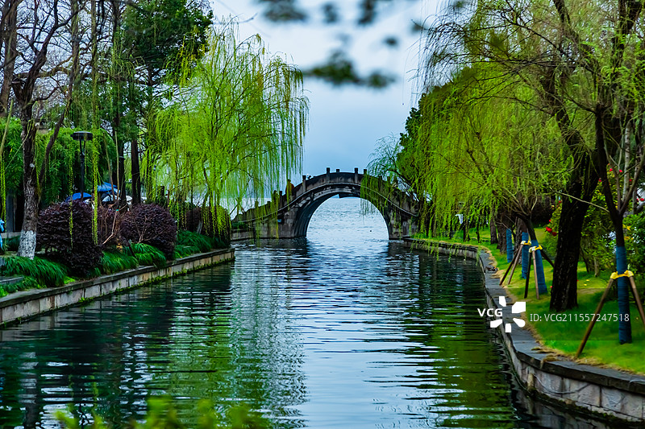

# 西湖风景名胜区 ✨

## 🌿 开篇：杭州的灵魂

"天下西湖三十六，就中最好是杭州。"

没有哪一座城市，能像杭州这样与一个湖如此密不可分。西湖不大，绕湖一周仅15公里；西湖不奇，没有险峻的山峰；西湖不贵，它不收门票，永远免费向所有人开放。但就是这一泓碧水，成为了杭州的灵魂，成为了中国人心中最柔软的那个江南梦。

三面云山一面城，一湖秀水半城诗。西湖的美，美在自然与人文的完美交融。在这里，每一座桥都有故事，每一座塔都有传说，每一条堤都承载着历史。2011年，西湖文化景观被列入《世界遗产名录》，成为全人类共同的文化财富。

## 📜 千年西湖：一首写不完的诗

**隋唐 西湖初成**
隋朝时，杭州刺史杨素修筑州城，西湖开始成为城市景观。唐朝李泌、白居易等历任杭州刺史，持续疏浚西湖，修筑湖堤，奠定了西湖的基本格局。

**北宋 苏东坡与苏堤**
元祐四年（1089年），苏东坡任杭州知州。他动用二十万民工疏浚西湖，用挖出的淤泥修筑了一条长堤——这就是今天的苏堤。"欲把西湖比西子，淡妆浓抹总相宜。"苏东坡的这句诗，从此成为西湖最经典的注脚。

**南宋 西湖全盛**
南宋定都杭州，西湖迎来了它的黄金时代。"一色楼台三十里，不知何处觅孤山"，当时的西湖沿岸遍布皇家园林和达官显贵的别墅，湖上游船如织，笙歌彻夜。

**明清 杨孟瑛与李卫**
明正德年间，杨孟瑛任杭州知府，再次大规模疏浚西湖，修筑了杨公堤。清雍正年间，浙江总督李卫主持西湖修缮，确立了"西湖十景"的格局。

**2002年 西湖免费开放**
西湖成为中国第一个免费开放的5A级景区。有人说，杭州放弃了每年数亿的门票收入，却赢得了整个城市的未来。

---

## 🌟 核心景点详解

### 📍 西湖烟柳：江南最诗意的画面

这是西湖最典型的江南意象——新绿的垂柳如烟似雾，一座石拱桥横跨碧水，桥洞在水中投下完美的倒影。春雨过后，走在这样的堤岸上，你会突然明白，为什么千百年来无数文人墨客为西湖魂牵梦萦。

**最佳观赏季节**：
- **3月下旬-4月上旬**：柳树抽芽，桃花盛开，是西湖最美的季节
- **6月-7月**：荷花盛开，"接天莲叶无穷碧，映日荷花别样红"
- **10月-11月**：秋高气爽，桂花飘香，是西湖最舒服的季节
- **冬季雪后**："断桥残雪"是西湖十景之首，可遇不可求

**拍摄技巧**：
清晨是拍西湖的最佳时间。早上6-7点，湖面平静如镜，游客稀少，晨雾缭绕，是拍出"水墨西湖"的黄金时刻。用前景的柳条做框架，可以拍出极强的纵深感。

> 💡 **导游贴士**：
> 逛西湖不要急着打卡所有景点。找一个清晨，沿着苏堤慢慢走，什么也不做，只是看湖、看柳、看远处的山。那一刻，你会真正懂西湖。

---

### 📍 西湖十景：中国审美的巅峰

西湖十景，是中国园林美学的最高成就。每一个景名，都是一首诗、一幅画：

**春·苏堤春晓**
苏堤的春天，是西湖最美的季节。六桥烟柳，桃花灼灼，走在堤上，一步一景，步步生春。

**夏·曲院风荷**
夏日的曲院，荷花盛开，酒香与荷香交织，是西湖最热闹的季节。

**秋·平湖秋月**
中秋之夜，在平湖赏月，"万顷湖平长似镜，四时月好最宜秋"。

**冬·断桥残雪**
雪后的断桥，远看似断非断，是西湖最著名也最难得一见的景致。

**晨昏昼夜**
- **雷峰夕照**：傍晚时分，雷峰塔被夕阳镀上金色
- **南屏晚钟**：暮色中，净慈寺的钟声回荡在南屏山间
- **三潭印月**：中秋夜，三个石塔中点灯，天上月、水中月、塔中月，三月争辉

---

### 📍 三堤：三位官员的遗产

西湖有三条著名的长堤，每一条都以一位杭州官员命名：

**白堤·白居易**
"最爱湖东行不足，绿杨阴里白沙堤。"白堤是西湖最古老的堤，连接断桥和平湖秋月，是观赏西湖全景的最佳位置。

**苏堤·苏东坡**
全长2.8公里，六座石拱桥错落有致，是苏东坡留给杭州最珍贵的礼物。"苏堤春晓"位列西湖十景之首。

**杨公堤·杨孟瑛**
相比白堤和苏堤的喧闹，杨公堤更加安静，这里有西湖最原生态的自然风光，是本地人最喜欢的散步地。

> 💡 **游览建议**：
> 如果只能走一条堤，推荐杨公堤。那里人少、树多、景美，最能体会西湖的宁静之美。

---

## 🎯 游览实用指南

### 🚇 交通指南
- **地铁**：1号线龙翔桥站出，步行5分钟即到西湖东岸（最方便）
- **公交**：7、27、51、52、118路，环湖公交51/52路绕湖一圈，非常方便
- **共享单车**：游西湖最推荐的方式！可以随时停下来看风景
- **自驾**：不推荐！西湖周边停车场极少且昂贵，公共交通是最佳选择

### 🎫 门票信息
- **西湖本身**：完全免费！中国最良心的5A级景区
- **三潭印月（小瀛洲）**：船票+门票55元（需要坐船前往）
- **雷峰塔**：40元（登塔俯瞰西湖全景，推荐）
- **岳王庙**：25元
- **灵隐寺**：飞来峰45元+香火钱30元
- **无需预约**：西湖免费开放，直接来就可以

### ⏰ 最佳游览时间
- **清晨6-8点**：人少、景美、空气好，是游览西湖的黄金时间
- **下午4-6点**：看夕阳，雷峰夕照
- **晚上7-9点**：看西湖夜景，北山街灯光很美
- **建议游览时长**：半天到一天，可以环湖骑行

### 🚲 经典环湖路线
**骑行路线（约3小时）**：
断桥 → 白堤 → 苏堤 → 花港观鱼 → 雷峰塔 → 长桥 → 柳浪闻莺 → 湖滨音乐喷泉

**步行路线（约5小时）**：
断桥 → 白堤 → 岳王庙 → 苏堤 → 花港观鱼 → 坐船到三潭印月 → 雷峰塔

### 🍜 杭州美食
- **楼外楼**：西湖醋鱼、东坡肉，百年老店，价格较高
- **知味观**：杭州小吃，小笼包、猫耳朵，本地人也爱去
- **新白鹿/外婆家**：杭帮菜连锁，性价比高，推荐
- **西湖藕粉**：杭州特产，景区就可以买到

## 💫 结语：西湖是一种生活方式

西湖不是一个"景点"。

它是杭州人早上跑步的地方，是傍晚跳广场舞的地方，是周末一家人野餐的地方，是年轻人谈恋爱的地方。它就在城市中心，与这座城市、与这里的人们呼吸与共。

这就是西湖最珍贵的地方——它不是高高在上的世界遗产，而是融入市民生活的日常。它不设围墙，不收门票，不端架子。你可以花几百元在楼外楼吃一餐西湖醋鱼，也可以花几块钱买个包子坐在湖边喂一下午鱼。在西湖面前，人人平等。

所以，来西湖吧。不需要做什么攻略，不需要赶什么景点。找一条长椅坐下来，发发呆，吹吹风，看看湖。

这就是西湖。这就是杭州。

> 📌 **旅行感悟**：
> 西湖的美，不在某一个具体的景点，而在你走在湖边时的那种心境。那种平静、那种从容、那种与自然融为一体的感觉，才是西湖真正的魅力。
>
> 毕竟，苏东坡早就说过了："此心安处是吾乡。"

---

*本页内容基于实景图片分析与历史资料整理，由AI导游系统2025年6月生成*
