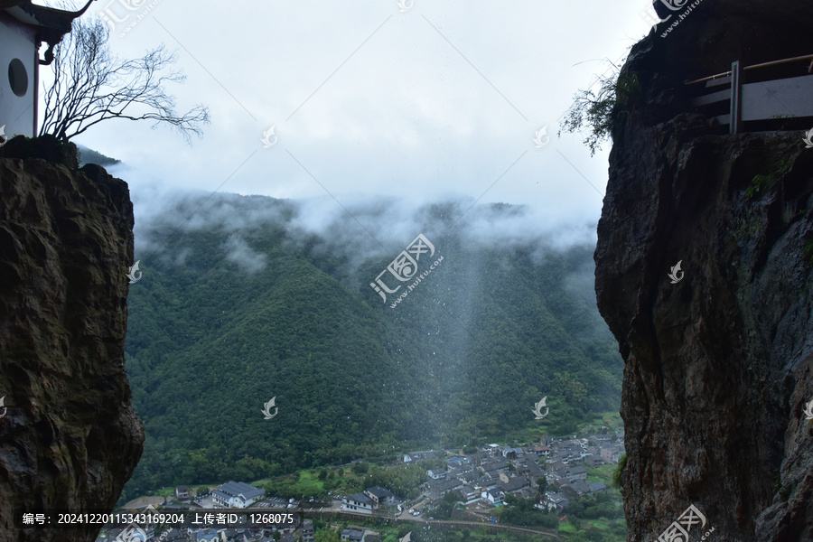
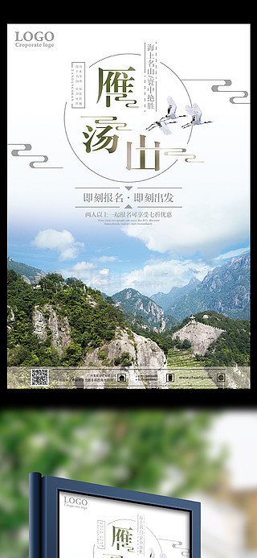

# 雁荡山风景名胜区 🏔️

## 🌄 开篇：海上名山，寰中绝胜

"雁荡经行云漠漠，龙湫宴坐雨蒙蒙。"

一千多年前，唐代诗僧贯休写下了这两句诗，从此，雁荡山的名字就和这两句诗紧紧联系在了一起。这座位于浙江温州的名山，素有"海上名山"、"寰中绝胜"的美誉，是中国十大名山之一。

雁荡山的美，是那种奇秀的美。一亿两千万年前的火山运动，在这里留下了神奇的火山岩地貌。一座座山峰拔地而起，形状奇特，像剪刀，像犀牛，像夫妻，像老僧。每一座山峰都有一个故事，每一块石头都有一个传说。

但是雁荡山最特别的，是它的"二灵一龙"——灵峰、灵岩、大龙湫。灵峰的夜景，灵岩的飞渡，大龙湫的瀑布，被称为"雁荡三绝"。尤其是灵峰夜景，同一个山峰，在白天和晚上看是完全不同的样子——白天是合掌峰，晚上就变成了情侣峰。这种移步换形、昼夜不同的奇观，在全世界都是独一无二的。

来雁荡山吧。在这里，你会惊叹于大自然的鬼斧神工，你会相信，山水之间真的有灵气。

## 📜 历史与文化：从火山到名山

**一亿两千万年前 火山的杰作**
雁荡山是一座古火山。一亿两千万年前，这里发生了剧烈的火山喷发，喷出的岩浆和火山灰覆盖了整个地区。后来，经过几百万年的风化和流水侵蚀，形成了今天我们看到的这些奇特的峰林和洞穴。可以说，雁荡山的每一块石头，都是火山运动的杰作。

**南北朝 开山建寺**
雁荡山的开发始于南北朝。梁武帝大同元年（535年），昭明太子萧统在这里建了芙蓉寺，这是雁荡山最早的寺庙。从此，雁荡山开始成为佛教圣地。

**宋代 鼎盛时期**
宋代是雁荡山的鼎盛时期。当时的温州是全国重要的港口城市，经济发达，文化繁荣。很多文人墨客来到雁荡山，留下了大量的诗词和题刻。沈括在《梦溪笔谈》里详细描述了雁荡山的地貌，他说"雁荡诸峰，皆峭拔险怪，上耸千尺，穹崖巨谷，不类他山"。

**明代 徐霞客的考察**
徐霞客曾经三次来到雁荡山，对这里的山水进行了详细的考察。他写的《游雁宕山日记》，是中国古代地理学的重要文献。徐霞客特别喜欢雁荡山，他说"欲穷雁荡之胜，非飞仙不能"。

**现代 5A级景区**
1982年，雁荡山被列为第一批国家重点风景名胜区。2005年，雁荡山被联合国教科文组织评为世界地质公园。2007年，雁荡山被评为国家5A级旅游景区。现在，雁荡山已经成为了中国东南沿海最著名的旅游胜地之一。

## 🌟 核心景点详解

### 📍 灵峰夜景：移步换形的奇迹

这是雁荡山最神奇的景观——灵峰夜景。照片中这座山峰，白天看是两只手合在一起，叫"合掌峰"；晚上看，就变成了一对紧紧相拥的情侣，所以也叫"情侣峰"。

**最神奇的地方**：
同一个山峰，从不同的角度看，会看到完全不同的景象：
- **正面看**：一对情侣紧紧相拥，男的穿着中山装，女的留着齐耳短发
- **往前走50米看**：变成了一只巨大的雄鹰，展翅欲飞
- **再往前走50米看**：变成了一个老婆婆，驼背、满脸皱纹

**导游的讲解是灵魂**：
看灵峰夜景一定要听导游讲解。导游会用手电筒照着山峰，给你讲每一块石头的故事。听着故事，你会越看越像，越看越觉得神奇。很多人说："如果不听讲解，灵峰夜景就是几块石头；听了讲解，就变成了一个童话世界。"

**你不知道的故事**：
灵峰夜景的发现，其实是一个意外。据说当年有一个游客，晚上住在灵峰寺里，出来散步，突然发现白天的合掌峰在月光下变成了一对情侣。他把这个发现告诉了别人，一传十，十传百，灵峰夜景就出名了。

> 💡 **游览贴士**：
> 看灵峰夜景最好的时间是农历十五前后，月光最亮的时候。如果没有月亮，效果会差很多。另外，尽量跟团，或者在景区门口请一个讲解员，50块钱，非常值得。没有讲解，你真的看不出什么名堂。

---

### 📍 灵岩飞渡：悬崖上的舞蹈

在灵岩景区，每天都有一场惊心动魄的表演——灵岩飞渡。照片中那个在几百米高的悬崖上走钢丝的人，就是灵岩飞渡的表演者。

**灵岩飞渡的历史**：
灵岩飞渡已经有一百多年的历史了。最早的时候，当地农民为了采悬崖上的石斛（一种名贵药材），练就了一身在悬崖上行走的本领。后来，慢慢演变成了一种表演艺术。

**表演内容**：
- **悬崖滑索**：表演者从270米高的天柱峰顶，沿着一根钢索滑下来，一边滑一边做各种动作，比如翻跟头、撒纸钱
- **悬空表演**：表演者在半空中停下来，做一些高难度的动作，比如倒挂金钩、蜻蜓点水
- **飞渡到对面**：最后，表演者沿着钢索飞到对面的展旗峰上

**最让人揪心的时刻**：
当表演者从山顶往下跳的那一刻，全场观众都会屏住呼吸。那个自由落体的瞬间，太惊险了。然后，当表演者在半空中打开红旗的时候，全场都会爆发出热烈的掌声。

**你不知道的冷知识**：
灵岩飞渡的表演者都是当地的农民，没有什么专业的训练，就是从小在山里爬，爬着爬着就会了。最有名的表演者叫周明，他已经在悬崖上飞了四十多年，被称为"悬崖上的舞蹈家"。

> 💡 **观看建议**：
> 灵岩飞渡每天上午10点和下午3点各有一场，周末节假日会加场。最好提前20分钟到灵岩寺前面的广场上，找一个好位置。记得抬头看，不要低头玩手机，精彩的表演就在你头顶上。

---

### 📍 大龙湫：中国四大瀑布之一

这就是大龙湫——中国四大瀑布之一，也是雁荡山最著名的瀑布。照片中这道瀑布，从197米的高处倾泻而下，是中国单级落差最大的瀑布。

**大龙湫的特点**：
- **高度**：197米，单级落差全国第一
- **变化多端**：不同的季节，不同的天气，大龙湫有完全不同的样子
- **形态优美**：瀑布不是直泻而下，而是像一条白龙，在空中飞舞，最后落入潭中
- **声音好听**：水流落下的声音，不是轰鸣，而是像音乐一样悦耳

**四季不同的大龙湫**：
- **夏季**：水量大，像一条愤怒的白龙，声势浩大
- **秋季**：水量适中，像一条透明的珠帘，最美
- **冬季**：水量小，像一串珍珠，断断续续往下掉
- **雨后**：水量最大，最壮观，整个山谷都是水雾

**袁枚的诗**：
清代诗人袁枚写过一首《大龙湫》："龙湫山高势绝天，一线瀑走兜罗绵。五丈以上尚是水，十丈以下全为烟。况复百丈至千丈，水云烟雾难分焉。"这首诗把大龙湫的美写得淋漓尽致。

> 💡 **拍照建议**：
> 拍大龙湫最好用慢快门，1/4秒或者更慢，这样拍出来的水流像丝绸一样顺滑。如果是晴天，上午10点左右，阳光照进山谷，会在瀑布前面形成彩虹，非常漂亮。另外，一定要往瀑布跟前走，站在潭边看，那才是最震撼的。

---

### 📍 小龙湫与断肠崖：神雕侠侣的取景地

在灵岩景区的深处，有小龙湫瀑布和断肠崖。这里是刘亦菲版《神雕侠侣》的取景地——小龙女跳崖的那个地方，就是这里。

**小龙湫的特点**：
- **高度**：70多米，虽然没有大龙湫高，但是更秀气
- **位置**：藏在一个幽深的峡谷里，周围都是陡峭的悬崖
- **卧龙谷**：小龙湫上面有一个卧龙谷，可以坐电梯上去，俯瞰整个山谷

**断肠崖的故事**：
《神雕侠侣》里，小龙女在断肠崖上留下了"十六年后，在此重会，夫妻情深，勿失信约"十六个字，然后跳崖了。电视剧播出后，很多游客来到这里，寻找小龙女的足迹。现在，断肠崖上还刻着那十六个字。

**玻璃栈道**：
断肠崖旁边有一条玻璃栈道，建在悬崖上，往下看就是几十米深的山谷。虽然不长，但是很刺激。胆子大的朋友可以去走走。

> 💡 **游览贴士**：
> 小龙湫需要坐电梯上去，电梯票已经包含在门票里了。上去之后，先走卧龙谷，然后到断肠崖，最后从另一条路下来。整个过程大约需要1个小时。如果是《神雕侠侣》的粉丝，一定要在断肠崖那里拍张照片，打卡一下小龙女跳崖的地方。

---

## 🎯 游览实用指南

### 🚗 交通指南
- **高铁**：甬台温高铁到雁荡山站，出站后有直达景区的大巴，车程约20分钟
- **自驾**：从温州出发，走沈海高速，全程约1小时
- **景区交通**：景区内有观光车，40元/人，两天有效，可以在各个景点之间乘坐

### 🎫 门票信息（2025年参考）
- **灵峰景区**：50元（日景），50元（夜景）
- **灵岩景区**：50元
- **大龙湫景区**：50元
- **三折瀑景区**：20元
- **雁湖景区**：15元
- **联票**：200元（包含所有景区，三天有效）

### ⏰ 最佳旅游时间
- **4-5月**：春天，杜鹃花开，雨水适中，瀑布好看
- **9-11月**：秋天，秋高气爽，能见度高，看夜景最好
- **6-8月**：夏天，雨水多，瀑布最壮观，但是比较热
- **避开**：台风季节，下雨的时候山路不好走，也不安全

### 🗺️ 经典游览路线

**一日精华游**：
上午：灵峰日景 → 三折瀑
中午：景区内吃饭
下午：灵岩景区（看飞渡表演） → 大龙湫 → 灵峰夜景 → 返程

**两日深度游**：
Day1：灵峰日景 → 灵岩 → 灵峰夜景 → 住雁荡山
Day2：大龙湫 → 方洞 → 雁湖 → 返程

**三日休闲游**：
在两日游基础上，增加显胜门、羊角洞等景区，慢慢玩，不着急

### 🍜 美食推荐
- **雁荡山八大碗**：当地特色菜，包括蛤蜊豆腐汤、香螺、溪鱼、土鸡等
- **温州鱼圆**：温州特色，用新鲜的鱼肉做的，Q弹好吃
- **炒粉干**：温州最有名的小吃，一定要尝
- **清明粿**：用艾草做的点心，甜咸两种，都很好吃

## 💫 结语：山水有灵，人有情

雁荡山是一座有灵气的山。

在这里，你会惊叹于大自然的鬼斧神工——怎么会有这么神奇的山峰，怎么会有这么秀美的瀑布，怎么会有这么奇妙的夜景。你会相信，山水之间真的有灵气。

但是雁荡山最打动我的，不是那些神奇的山水，而是这里的人。那些在悬崖上飞渡的表演者，那些给你讲解夜景的导游，那些开民宿的当地人——他们朴实、热情、真诚，像这座山一样，让人觉得舒服。

很多人说，雁荡山玩一天就够了。但是我觉得，雁荡山适合慢慢玩。住下来，白天看看山，看看水，晚上看看夜景，和当地人聊聊天，吃一顿地道的农家菜。那种感觉，才是旅行真正的意义。

山水有灵，人有情。这就是雁荡山。它不是那种让你尖叫的震撼之美，它是那种让你安静下来，慢慢品味的美。就像一杯好茶，初尝平淡，但是越品越香，越品越有味道。

来雁荡山吧。在这里，放慢脚步，放松心情，感受山水的灵气，感受人间的温情。

> 📌 **旅行感悟**：
> 旅行就像读书，有的书需要快速浏览，有的书需要细细品读。雁荡山就是一本需要细细品读的书。每一座山峰，每一道瀑布，每一块石头，都有它的故事，都有它的美。你需要静下心来，慢慢读，才能读懂它。

---

*本页内容基于实景图片分析与历史资料整理，由AI导游系统2025年7月生成*
