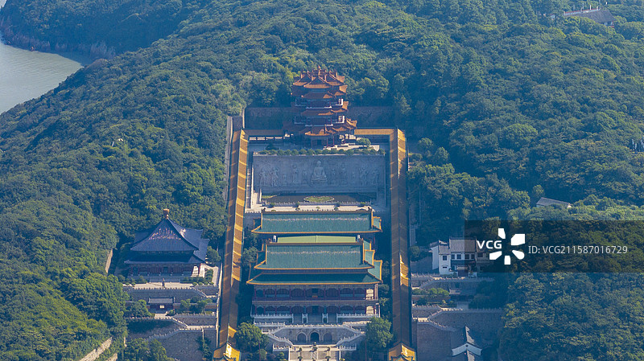
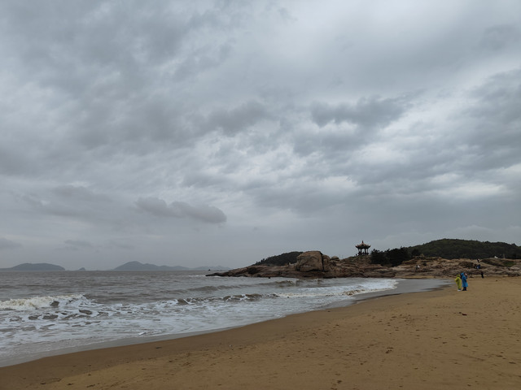

# 普陀山 ✨

## 🌊 开篇：海天佛国

在东海之上，有一座小岛。
面积只有12.5平方公里，还不如一个大学大。
但是，每天都有成千上万的人，
从全国各地，甚至全世界各地，
漂洋过海，来到这里。

这就是普陀山。
观音菩萨的道场。

一千多年来，
无论是帝王将相，还是平民百姓，
无论是达官贵人，还是贩夫走卒，
只要心中有信仰，
都会来到这座小岛上，
烧一炷香，拜一拜佛，
许一个愿，求一份心安。

这里没有名山大川的雄伟，
没有名胜古迹的繁华。
但是，这里有海，有佛，有信仰。
这里是中国人心中最清净的地方。

"海上有仙山，山在虚无缥缈间。"
说的，就是这里。

## 📜 一千年的香火

**公元916年 慧锷和尚**
故事要从唐朝说起。
一个叫慧锷的日本和尚，
从五台山请了一尊观音像，
想带回日本去。
船经过普陀山的时候，
突然海上起了风暴，
无数的铁莲花把船团团围住，
怎么走都走不了。

慧锷和尚心想，
这是观音菩萨不想去日本啊。
于是他就在山上找了个地方，
把观音像留了下来。
这就是普陀山的第一座寺庙——
不肯去观音院。

从此，普陀山，
就成了观音菩萨的道场。

**宋元明清 香火日盛**
从宋朝开始，
历代皇帝都很重视普陀山。
宋太祖拨款建寺，
元世祖赐金修庙，
明朝万历皇帝亲自赐名，
清朝康熙皇帝更是把普陀山
钦定为"南海普陀山"。

一千年过去了，
朝代换了一个又一个，
皇帝换了一个又一个，
但是普陀山的香火，
从来没有断过。

---

## 🌟 普陀三绝

### 📍 宝陀讲寺：海上的布达拉宫

这是普陀山最新的一座寺庙，
也是最壮观的一座。
依山而建，层层叠叠，
从海边一直延伸到山顶。
站在天上往下看，
就像是一座建在海上的布达拉宫。

**宝陀讲寺的特别之处**：
- **位置**：建在海边的山坡上，面朝大海，背靠青山
- **规模**：普陀山最大的寺庙，比普济寺还要大
- **风格**：仿明清的宫廷建筑，黄瓦红墙，特别有气势
- **人少**：因为比较新，旅行团来得少，特别清净

很多人来普陀山，
都只去普济、法雨、慧济三大寺，
错过了这座宝陀讲寺。
但其实，
这里才是普陀山看海景最好的地方。

站在寺庙最高处的藏经阁，
面朝大海，
听着海浪声，
听着庙里的钟声，
你会突然觉得，
什么烦恼都没有了。

---

### 📍 百步沙：听着海浪声拜佛

普陀山最特别的地方，
就是它不是一座山，
而是一座海岛。

别的寺庙，
要么在山里，要么在城里。
只有普陀山的寺庙，
推开庙门，就是大海。
烧完香，出门就是沙滩。

百步沙，就是普陀山最美的一片沙滩。
就在普济寺的门口，
走几步路就到。

沙子是金黄色的，
特别细，特别软。
海浪一层层涌上来，
退下去的时候，
会在沙滩上留下一道道波纹。

早上可以在这里看日出，
傍晚可以在这里看日落，
白天可以在沙滩上走走，
晚上可以坐在礁石上，
听着海浪声，看着月亮。

> 💡 **普陀山的特别体验**：
> 别的地方拜佛，
> 是在深山老林里，
> 是在香烟缭绕中。
> 但是在普陀山，
> 你可以听着海浪声拜佛，
> 可以吹着海风念经，
> 可以踩着沙子去烧香。
> 这种感觉，
> 在全世界任何一个佛教圣地，
> 都找不到。

---

### 📍 三大寺：一千年的信仰

**普济寺**：
普陀山的主寺，也是最大的寺。
圆通宝殿里，供奉着8.8米高的观音菩萨。
每天早上四点钟，
早课的钟声就会响起，
那声音，隔着几公里都能听到。

**法雨寺**：
在普陀山的后山，
比普济寺安静很多。
最有名的是九龙藻井，
是从南京明朝的皇宫里拆过来的，
国宝级的文物。

**慧济寺**：
在佛顶山上，
是普陀山最高的寺庙。
坐缆车上山，
穿过一片古树林，
突然就在山顶看到这座寺庙，
有一种豁然开朗的感觉。

---

## 🙏 来普陀山，到底是为了什么？

很多人问：
普陀山到底灵不灵？

其实，
灵不灵，
不在菩萨，
在你自己。

一个人，
漂洋过海，
坐几个小时的船，
来到这座小岛上，
把手机放下，
把工作放下，
把生活中的各种烦恼放下，
安安静静地烧一炷香，
拜一拜佛，
许一个愿。

这个过程本身，
就是一种修行。

你千里迢迢来到这里，
说明你心里还有敬畏，
还有期待，还有希望。
这就够了。

普陀山最灵的，
从来都不是菩萨帮你实现了什么愿望。
而是你在来的路上，
在烧香拜佛的过程中，
自己想明白了很多事情。

心安，
就是最大的灵验。

---

## 🎯 朝拜实用指南

### 🚢 交通指南
普陀山是个岛，必须坐船才能到。

**怎么到普陀山**：
- **飞机**：舟山普陀山机场，下飞机后打车到朱家尖蜈蚣峙码头，坐船10分钟到普陀山
- **高铁**：宁波站/杭州东站，然后坐大巴到朱家尖码头
- **大巴**：上海/杭州/宁波都有直达朱家尖码头的大巴
- **自驾**：车不能开上普陀山！只能停在朱家尖码头的停车场，然后坐船过去

**船票**：
- 朱家尖→普陀山：船票30元，航程10-15分钟，15分钟一班，船很多
- 门票 + 船票可以一起买，很方便

**岛上交通**：
- 普陀山岛上没有私家车，所有车都是景区的环保车
- 5元、10元一站，招手即停，很方便
- 佛顶山可以坐索道上去，单程40元，双程70元

### 🎫 门票信息（2025年参考）
- **大门票**：160元（1、2月、12月淡季140元）
- **船票**：来回60元（必须买，不然上不了岛）
- **各小寺庙**：香火券5-6元，都很便宜
- **索道**：佛顶山索道，双程70元
- **半价票**：学生、60-69岁老人
- **免票**：70岁以上、军人、残疾人、记者、僧尼
- **预约**：关注"普陀山"公众号预约，节假日一定要提前约！
- **门票有效期**：门票可以用1次，出岛再进要重新买，所以建议住在岛上

### ⏰ 最佳游览时间
- **3-4月、10-11月**：春秋季，天气最好，不冷不热，人也相对少
- **5-9月**：夏天，可以下海游泳，但是人特别多，而且台风多
- **12-2月**：冬天，人最少，最清净，适合真心来朝拜的人
- **建议游览时长**：2天1夜是标配，3天2夜最从容，1天太赶了

### 🗺️ 经典朝拜路线
**一日游（赶时间版）**：
码头 → 普济寺 → 百步沙 → 索道上佛顶山 → 慧济寺 → 索道下 → 法雨寺 → 千步沙 → 南海观音 → 码头

**二日游（推荐版）**：
- **第一天**：下午上岛 → 普济寺 → 百步沙看日落 → 住岛上
- **第二天**：早起普济寺早课 → 索道上佛顶山 → 慧济寺 → 走路下山到法雨寺 → 千步沙 → 南海观音 → 下午离岛

**三日游（深度朝拜版）**：
在二日游基础上，增加：
- 洛迦山（一定要去！不去洛迦山，等于没到普陀山）
- 西天景区（心字石、磐陀石、梅福庵）
- 紫竹林、不肯去观音院（普陀山最开始的地方）

> 💡 **最重要的提醒**：
> 一定要去洛迦山！
> 洛迦山是观音菩萨真正修行的地方，
> 从普陀山坐船过去20分钟，
> 那句话怎么说的——
> "不到洛迦山，就不算朝完普陀山。"

### 🏨 住宿建议
来普陀山，一定要住在岛上！
不要住在朱家尖，不要住在沈家门，
每天来回坐船特别麻烦，
而且你会错过普陀山的清晨和夜晚。

**住宿选择**：
- **高端酒店**：普陀山大酒店、祥生大酒店，1000元+，条件好
- **中端酒店**：各种三星、四星酒店，300-800元/晚
- **农家乐/民宿**：100-300元/晚，很多本地人家开的，很亲切
- **寺庙挂单**：如果是真正的居士，可以住在寺庙里，几十块钱一晚，还可以和师父们一起吃斋饭

> 小贴士：节假日房价会涨2-3倍，而且很难订，一定要提前订！

### 🍜 普陀山美食
- **素斋**：一定要吃！各大寺庙都有，普济寺的最有名，10块钱一份，吃到饱
- **海鲜面**：岛上的海鲜面，30-50元一碗，很鲜
- **观音饼**：普陀山特产，各种口味，当伴手礼正好
- **洛迦山的观音茶**：山上的茶农自己种的，很香

### ⚠️ 注意事项（非常重要！）
1. ❌ 不要相信码头拉客的"导游""算命大师"，基本都是骗子
2. ❌ 不要在景区门口买天价香，庙里有请香的地方，很便宜
3. ✅ 烧香讲究"三支香"，不是越多越好，心诚则灵
4. ✅ 穿着要得体，不要穿短裤短裙进寺庙
5. ✅ 拜佛要顺时针走，不要走回头路
6. ✅ 保持安静，不要在寺庙里大声喧哗

## 💫 结语：心安即是归处

很多人来普陀山，
来了一次又一次。

不是因为这里的风景有多美，
也不是因为这里的菩萨有多灵。
是因为这座岛，
有一种神奇的力量。

不管你在外面的世界，
有多忙，有多累，有多少烦恼，
只要你踏上这座小岛，
闻着香火味，
听着海浪声，
听着庙里的钟声，
你的心，
就会莫名其妙地静下来。

就好像，
这里是这个浮躁的世界里，
最后一片清净的地方。

所以，
如果你觉得累了，
如果你觉得心里乱了，
如果你觉得生活没有方向了，
就来一趟普陀山吧。

不用许什么大愿，
就安安静静地，
烧三支香，
拜一拜佛，
听一听海浪声。

你会发现，
原来心安，
才是人生最好的答案。

> 📌 **旅行感悟**：
> 有人问师父：
> "菩萨到底能不能听见我们的心愿？"
> 师父说：
> "菩萨听不听得见不重要，
> 重要的是，
> 你说出这个心愿的时候，
> 你自己，听见了。"

---

*本页内容基于实景图片分析与普陀山佛教文化研究整理，由AI导游系统2025年6月生成*
