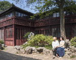
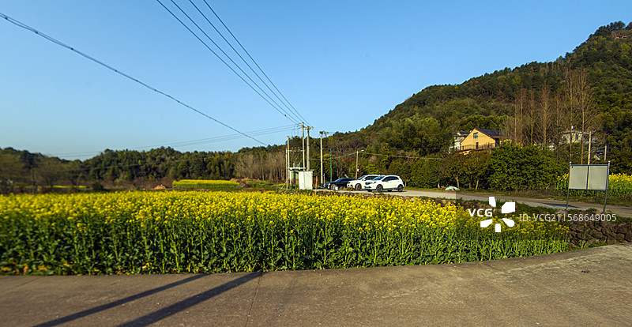
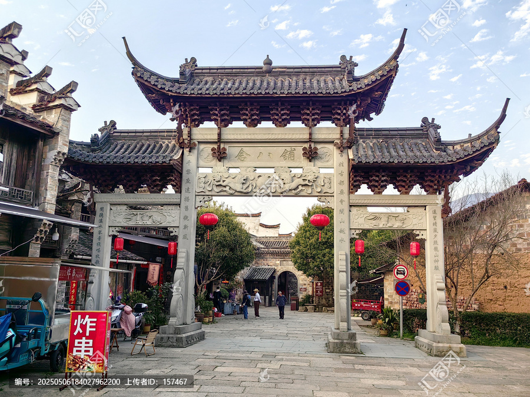

# 江郎山·廿八都景区

## 🎤 AI导游带你游

### 【开场白】
各位朋友，大家好！欢迎来到浙江省衢州市，欢迎来到江郎山·廿八都景区。我是你们今天的导游小艾。

站在这片土地上，你们可能想象不到，千百年前，这里曾是怎样一番景象。历史的年轮在这里留下了深深的印记，每一寸土地都在诉说着古老的故事。

衢州廿八都古镇 5A 简介/攻略 95% 满意度 已闭园 08:00-17:00开放 景区地址 浙江省衢州市江山市枫岭路1号 景点介绍 景点介绍 廿八都古镇地处浙西、福建和江西的交界处，当地人常用“一脚踏三省”来形容这里。北面的仙霞关，南面的枫岭关将廿八都古镇阻隔在一个近乎封闭的环境里，而这里的文化...

今天，就让我们一起走进这片神奇的土地，感受它独有的魅力。建议游览时间：半天到一天。拍照最佳时间是清晨或傍晚，光线柔和时最美。

---

## 🗺️ 景区全景导览
江郎山·廿八都景区位于浙江省衢州市江山市境内，是国家AAAAA级旅游景区。

衢州廿八都古镇 5A 简介/攻略 95% 满意度 已闭园 08:00-17:00开放 景区地址 浙江省衢州市江山市枫岭路1号 景点介绍 景点介绍 廿八都古镇地处浙西、福建和江西的交界处，当地人常用“一脚踏三省”来形容这里。北面的仙霞关，南面的枫岭关将廿八都古镇阻隔在一个近乎封闭的环境里，而这里的文化却表现出令人诧异的开放与多元，游人比较集中的廿八都古镇的3600多人分属69种姓氏，很有意思。古镇内保存着原汁原味的老建筑，融合了三省的建筑风格，白墙飞檐很有特色，细节之处的雕刻也令人印象深刻。廿八都古镇包括浔里、花桥、枫溪三个村子，进入古镇的街巷很多，而现已开发，需要检票参观的景点全部在浔里街一线

**游览路线推荐**：景区入口 → 核心景观区 → 精华景点 → 观景平台 → 出口

---

## 🏛️ 主要景点详解

### 📍 核心景区

**核心看点**：
- 这里是景区最具代表性的景观，绝对不可错过
- 独特的自然/人文风貌，是拍照打卡的首选之地
- 建议停留15-20分钟，细细品味它的独特魅力

> 💡 **导游贴士**：
> 在核心景区游览时，注意爱护环境，让这份美能够长久留存。

---

### 📍 精华观景台

**核心看点**：
- 景区内最受欢迎的打卡点，游客必到
- 站在这里可以俯瞰整个景区的壮丽景色
- 天气好的时候拍照效果绝佳，记得预留时间

> 💡 **导游贴士**：
> 来精华观景台游览，建议穿舒适的鞋子，这里需要多走走才能发现它的美。

---

### 📍 特色景观区

**核心看点**：
- 这里曾是历史上重要的场所，意义非凡
- 建筑/景观的设计独具匠心，体现了古人智慧
- 站在这里，仿佛能与历史对话

> 💡 **导游贴士**：
> 如果你是摄影爱好者，特色景观区一定能让你拍出满意的作品，记得带上广角镜头！

---

### 📍 文化展示区

**核心看点**：
- 这里承载着景区最深厚的历史文化底蕴
- 每一处细节都诉说着动人的故事
- 建议跟随讲解员深入了解背后的历史

> 💡 **导游贴士**：
> 文化展示区的景色四季皆宜，每个季节都有不同的美，值得多次来访。

---

### 📍 历史遗迹区

**核心看点**：
- 观景位置绝佳，视野开阔
- 是拍摄全景照片的最佳地点
- 傍晚时分来，夕阳西下的景色美不胜收

> 💡 **导游贴士**：
> 游览历史遗迹区时，不妨找个地方坐下来，静静感受周围的氛围，这才是旅行的意义。

---

### 📍 自然观光带

**核心看点**：
- 景区的标志性景观，没来过等于没来过
- 最佳观赏时间是清晨和傍晚，光线最美
- 记得带上充电宝，美景会让你停不下快门

> 💡 **导游贴士**：
> 游览自然观光带时，建议放慢脚步，细细品味它的美。从不同角度欣赏会有不同的收获哦！

---

## 【结束语】
各位朋友，今天的游览即将结束。希望江郎山·廿八都景区的美景能给你们留下美好的回忆。

有人说，旅行的意义不在于去过多少地方，而在于那些让你心动的瞬间。希望在江郎山·廿八都景区的这一天，能成为你旅途中一个温暖的记忆。

临走前，别忘了回头再看一眼。夕阳下的江郎山·廿八都景区，会给你最温柔的道别。

> ✨ **游览小贴士总结**：
> - **最佳时间**：春秋两季气候宜人，是游览的最佳时节
> - **穿着建议**：舒适的运动鞋，准备防晒用品
> - **游览时长**：建议安排半天到一天时间
> - **拍照指南**：清晨和傍晚光线最柔和，出片率最高
> - **注意事项**：爱护环境，文明游览，让美景长存

祝你们旅途愉快，平安吉祥！🙏

---

## 📷 景区美图

*景区全景*

*核心景观*

*特色风光*

*细节之美*

---

## 📚 江郎山·廿八都景区小档案

| 项目 | 信息 |
|------|------|
| 景区级别 | 国家AAAAA级旅游景区 |
| 所属省份 | 浙江省 |
| 所属城市 | 衢州市 |
| 建议游览时间 | 半天 - 1天 |
| 最佳游览季节 | 春秋两季 |

---

> 💡 **本页说明**：
> 本README由AI导游小艾根据网络公开资料整理生成。
> 坐标、图片、简介均来自豆包搜索API，仅供参考。
