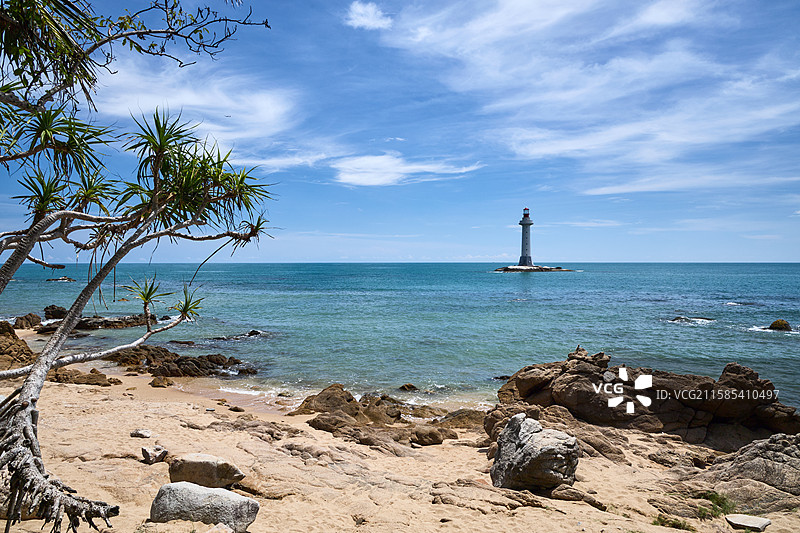
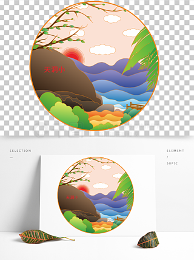
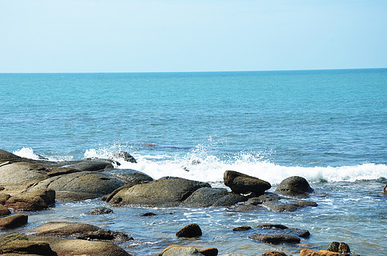
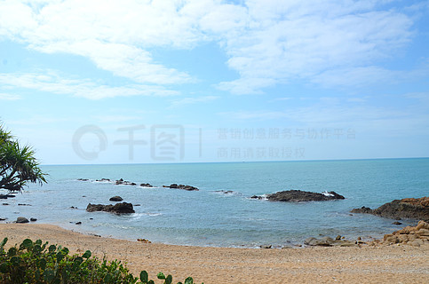
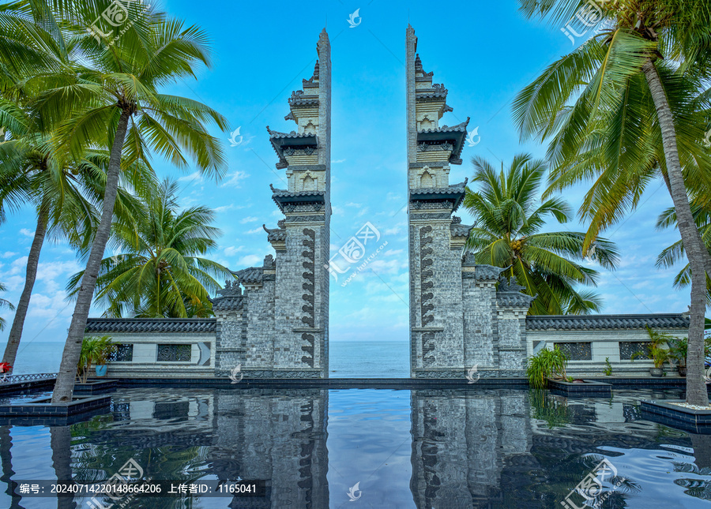

# 南山大小洞天旅游区 ✨

## 🌅 开篇：八百年前的道家避世之地

"福如东海，寿比南山。"

这句话，几乎所有中国人都会说。

但你可能不知道，"南山"指的就是这里--海南三亚崖州的南山。

而"寿比南山"的源头，就在大小洞天。

南宋淳佑年间（约1245年），一位叫陈昭炽的道士，从广东罗浮山渡海来到海南。他在南山脚下，发现了一片临海的山崖。山崖上有奇石，有古洞，有千年不老松，有碧蓝的大海。

陈昭炽站在山崖上，看了三天三夜。

第四天清晨，他对弟子说："这就是道教所说的'洞天福地'。我们留下来。"

他在这里建了一座道观，叫"海山奇观"。这就是大小洞天的开山之始。

后来，他的弟子在山崖上刻下"大小洞天"四个字。这四个字，今天还在那里。

800多年了。

崖壁还是那片崖壁，海还是那片海，松还是那几棵松。

只是来看它们的人，换了一茬又一茬。

## 📜 一处洞天的千年缘起

**南宋：开山祖师陈昭炽**

南宋淳祐年间（1245年左右），广东罗浮山道士陈昭炽来到崖州。

陈昭炽是道教南宗的实际创始人白玉蟾的再传弟子。他来海南的目的，是寻找一个适合修炼的"洞天福地"。

道教有"三十六洞天，七十二福地"的说法。每个洞天福地，都是与天相通的神圣空间。

陈昭炽在崖州南山找到的地方，被他自己定为"第22洞天"。他在山崖上刻下"海山奇观"四个字，意为"山海之间的奇观"。

**南宋：王妹太守的赞助**

南宋咸淳三年（1267年），崖州知军（地方长官）毛奎上任。毛奎是个信道的人，他到任后听说大小洞天，亲自来游。

游完之后，毛奎写了一篇《大小洞天记》，刻在石头上。这篇文章至今还在大小洞天景区内，是研究南宋海南历史的重要文献。

毛奎还自掏腰包，重修了海山奇观，开辟了上山的石阶。

**元代：渐衰**

元代，道教在海南的传播受阻。大小洞天逐渐荒废。

**明清：重修**

明洪武年间（1380年左右），崖州知州重修大小洞天，恢复了它的香火。

清乾隆年间（1780年左右），大小洞天再次重修，规模比明代更大。

**民国：再度衰落**

民国时期，海南战乱不断，大小洞天再次荒废。

**1962年：郭沫若的探访**

1962年1月，郭沫若来到海南视察。他听说崖州有个"大小洞天"，便来探访。

郭沫若在大小洞天住了一周。他每天在海边散步，研究崖壁上的古石刻。他发现了几处失传已久的宋代摩崖石刻，其中包括毛奎的《大小洞天记》。

郭沫若写了一首长诗《访大小洞天》，其中有一句："崖州一奇境，洞天小有天。"

这一句诗，让大小洞天重新进入公众视野。

**1992年：景区开放**

1992年，三亚市政府投资开发大小洞天，对外开放。

**2007年：晋升5A景区**

**今天**：大小洞天是海南省历史最悠久的景区，是海南文化的"根"。

## 🌟 核心景点详解

### 📍 小洞天：一块石头的传奇

小洞天是大小洞天景区的核心景点，是一块天然的海蚀石洞。

这块石头高3米，宽4米，深5米。洞内可容3-4人站立。洞顶有一个天然的天窗，阳光可以照进来。

**陈昭炽当年刻的"小洞天"三个字**，就在洞口的上方。这三个字是行书，每字约30厘米见方，苍劲有力。

**为什么叫"小洞天"**：
道教认为，洞天福地是仙人居住的地方。陈昭炽找到这个洞，认为它是仙人修真的场所。但他不敢自称"大洞天"（"大洞天"是道教十大洞天的称谓），所以叫"小洞天"。

**一个有趣的故事**：
据说陈昭炽曾在这个洞里修炼了49天。第49天的清晨，他看到洞外的海面上，有一条白龙从水里腾起，飞向天空。

陈昭炽认为这是祥瑞，便把这件事刻在了洞口的另一面。这块"白龙升天"的石刻，至今还在。

> 💡 **导游贴士**：
> 1. 进洞时要低头，洞口只有1.5米高
> 2. 洞内冬暖夏凉，是避暑的好地方
> 3. 洞顶的天窗是拍照的好机位，光线从上洒下，特别有"仙气"
> 4. 据说在洞里许愿很灵，尤其是求健康、求长寿

---

### 📍 鉴真和尚登岸雕塑：唐代高僧的海南之行

在小洞天旁边，有一组群雕，是鉴真和尚和他的弟子。

**雕塑的故事**：

公元748年，鉴真第5次东渡日本。船在海上遇到大风，漂流了14天后，在海南崖州登岸。

鉴真登岸的地方，据考证就在大小洞天附近。

他在海南停留了一年半，期间在大小洞天讲经、传戒。他在这里收了一位弟子，叫思托。后来思托跟着鉴真东渡日本，成为日本天台宗的祖师之一。

**雕塑的细节**：
- 雕塑高3.8米，用青铜铸造
- 鉴真居中，双手合十
- 鉴真身后有4位弟子，其中有一位日本人（思托的日本弟子）
- 雕塑底座上刻着"鉴真登岸处"五个大字
- 雕塑面朝大海，意为鉴真从海上来

> 💡 **导游贴士**：
> 1. 雕塑前的广场是看日出最佳地点
> 2. 早上6:30日出，可以来这里迎接三亚的第一缕阳光
> 3. 雕塑后面有一块石碑，刻着鉴真在海南的事迹，值得细读
> 4. 拍雕塑时，蹲下来仰拍，可以把鉴真和大海、天空一起拍进去

---

### 📍 不老松：八百年不死的奇迹

大小洞天最让人震撼的，是那些"不老松"。

不老松的学名叫"龙血树"，是一种生长极慢的树。一棵碗口粗的龙血树，可能已经长了500年。

大小洞天的龙血树，最古老的一棵，树龄超过8000年。是的，你没有看错--8000年。

这棵8000年的龙血树，被称为"南山不老松"。它见证了人类文明的兴衰，从新石器时代一直活到今天。

**关于龙血树的冷知识**：
- 龙血树流出的树脂是红色的，叫"血竭"，是名贵中药材
- 龙血树生长极慢，一年只长1-2毫米
- 龙血树的寿命可达1万年，是世界上寿命最长的树
- 龙血树的树皮一旦受伤，会流出红色树脂，像流血一样
- 当地传说，龙血树是龙的化身，受伤流血，所以叫"龙血树"

**为什么"寿比南山"**：
因为这棵8000年的龙血树，让"南山"成了长寿的象征。后来人们说"寿比南山"，意思就是"像南山的龙血树一样长寿"。

> 💡 **导游贴士**：
> 1. 不要攀爬树！龙血树受伤会"流血"
> 2. 不要摸树皮！手上的油脂会伤害树
> 3. 8000年的古树在景区最深处的"延寿园"
> 4. 在古树下许愿"长寿"，是大小洞天的传统
> 5. 古树最佳拍摄时间：早上8-9点，斜阳穿过树枝

---

### 📍 海山奇观石刻群：八百年的字

海山奇观石刻群是大小洞天的精华，集中了从南宋到民国的30多处摩崖石刻。

**最值得看的几处石刻**：

1. **"海山奇观"**：陈昭炽手书，南宋淳祐年间（约1245年），距今780年。这是大小洞天的开山石刻。

2. **"大小洞天"**：陈昭炽弟子所刻，南宋淳祐年间。这是景区名字的来源。

3. **"钓台"**：南宋知军毛奎手书。相传毛奎常在这里钓鱼。

4. **"岩瞻"**：南宋淳祐年间，意为"在岩石上仰望"。

5. **《大小洞天记》**：毛奎撰文并书写，南宋咸淳三年（1267年）。这是研究南宋海南历史的重要文献，全文500字。

6. **"试剑峰"**：相传是南宋一位将军在这里试剑，一剑把巨石劈成两半。

7. **"仙人足"**：一块石头上有几个像脚印的凹陷，传说仙人在这里走过。

8. **郭沫若诗碑**：1962年，郭沫若题写的《访大小洞天》诗。

> 💡 **导游贴士**：
> 1. 石刻群在崖壁上，要走一段石阶才能看完
> 2. 建议请讲解员，不然这些石刻看起来都差不多
> 3. 石刻最适合拍摄的时机：下午3-4点，阳光斜照，字迹最清楚
> 4. 不要拓印！拓印会损坏石刻

---

### 📍 南海龙王别院：四海龙王的传说

南海龙王别院是大小洞天景区内的一座小型道观，供奉南海龙王。

**为什么这里有南海龙王**：
道教传说，四海各有龙王。南海龙王叫敖明，是四海龙王之首。他的龙宫就在南海深处。

大小洞天在南海之滨，被认为是"南海龙王的别院"--也就是南海龙王在陆地上的休息场所。

**别院里的"龙文化"**：
- 主殿供奉南海龙王敖明
- 左殿供奉龙女（敖明的女儿，民间传说中"龙女拜观音"的那位）
- 右殿供奉龟丞相
- 别院里有一个"龙井"，相传与南海龙宫相通
- 别院门口有一棵"龙王松"，树龄500年

**别院的特别之处**：
每年农历二月初二（龙抬头），大小洞天会在这里举行盛大的"祭海典礼"。这是海南省级非物质文化遗产，已经举办了800多年。

> 💡 **导游贴士**：
> 1. 进别院要烧3支香（每人3支）
> 2. 别院后院有一口"龙井"，井水清凉甘甜，可以喝
> 3. 别院门口的龙王松是拍照的好地方
> 4. 别院旁边的"龙王石"像一条盘龙，从特定角度看特别像

---

### 📍 鳌山：道家仙山的真身

鳌山是大小洞天所在的山，海拔400米，是南山的主峰之一。

**鳌山的名字由来**：
"鳌"是中国神话中的一种巨龟，传说女娲用鳌的四条腿撑起了天。

道教认为，鳌山是巨鳌的化身，巨鳌背着这座山，浮在南海之上。山上的"小洞天"，就是巨鳌呼吸的口。

**鳌山的"五奇"**：
1. **奇石**：山上有各种形状的奇石，如"鳌头石"、"试剑石"、"仙人足"
2. **奇洞**：除了小洞天，山上还有"大洞天"、"鳌鱼洞"等
3. **奇松**：山上的龙血树是世界上最长寿的树
4. **奇景**：山上的"鳌山晚霞"是崖州八景之一
5. **奇文**：山上有30多处历代摩崖石刻

**鳌山的"五大洞天"**：
1. **小洞天**（前面介绍过）
2. **大洞天**：据陈昭炽的记载，大洞天在小洞天对面，但至今未找到。有人说它已被海水淹没
3. **鳌鱼洞**：在鳌山顶部，洞内可容纳20人
4. **半仙洞**：在鳌山半山腰，相传有半仙在此修炼
5. **观音洞**：在鳌山脚下，洞内有天然观音像

**关于"大洞天"之谜**：
南宋陈昭炽的《大小洞天记》里写："小洞天之外，有大洞天，宏大深邃，非人可至。"这"大洞天"到底在哪里，800年来一直是个谜。有人说它在海里，有人说它在鳌山顶上，有人说它根本不存在，只是陈昭炽的隐喻。

直到今天，每年都有道教研究者和考古爱好者，来大小洞天寻找"大洞天"。这是中国道教史上的一个未解之谜。

> 💡 **导游贴士**：
> 1. 鳌山不需要爬到顶，主景点都在山脚下
> 2. 如果想爬到山顶，需要2-3小时，路很陡
> 3. 山顶看南海，视野极好
> 4. 山上的"试剑峰"是看日落的好地方
> 5. 山顶风大，注意保暖（虽然三亚热，但山顶傍晚凉）

## 🎯 游览实用指南

### 🚗 交通指南

**飞机**：三亚凤凰国际机场，距大小洞天约35公里，打车50分钟，约100元

**高铁**：崖州站，距大小洞天约8公里，打车15分钟

**公交**：从三亚市区坐25路公交车，直达大小洞天，1.5小时，票价8元

**自驾**：三亚市区出发，走G98海南环岛高速，崖州出口下，约40分钟

**直通车**：三亚市区有发往大小洞天的旅游专线，往返50元

### 🎫 门票信息（2025年参考）
- **门票**：90元
- **学生票**：45元
- **电瓶车**：15元（可选，景区不大，可以走）
- **讲解**：80元/批（强烈建议请，不然看不懂）
- **免票**：70岁以上、军人、残疾人、1.2米以下儿童
- **开放时间**：7:30-18:30
- **预约**：节假日建议在"大小洞天"公众号预约

### ⏰ 最佳游览时间

- **10月-次年3月**：凉爽少雨，是最佳季节
- **4月-5月**：天气渐热，但海水最清
- **6月-9月**：雨季+台风季，但景区人会少
- **建议游览时长**：3-4小时，可以玩半天

### 🗺️ 推荐路线

**经典半日游（最推荐）**：
- 8:00到达景区 -> 鉴真和尚登岸雕塑 -> 小洞天 -> 海山奇观石刻群 -> 不老松 -> 南海龙王别院 -> 出景区

**深度一日游**：
- 上午：景区入口 -> 鉴真雕塑 -> 小洞天 -> 海山奇观石刻群
- 中午：在景区餐厅吃素斋
- 下午：不老松 -> 南海龙王别院 -> 鳌山登顶
- 傍晚：在鳌山看日落

**文化深度游**：
- 必须请讲解员！
- 重点看：海山奇观石刻群、毛奎《大小洞天记》、郭沫若诗碑
- 在小洞天静坐10分钟，感受800年道家文化

> 💡 **最重要的建议**：
> 1. 一定要早上来！早上人少，能静静感受道家氛围
> 2. 一定要请讲解员！不然你看不出门道
> 3. 一定要在鳌山看一次日落！"鳌山晚霞"是崖州八景之一
> 4. 一定要看小洞天！这是800年历史的核心
> 5. 一定要看8000年的不老松！这是"寿比南山"的源头

### 🍜 三亚美食

- **崖州粉**：崖州特色米粉，比抱罗粉更细
- **疍家海鲜**：海上人家做的海鲜，鲜美
- **椰子鸡**：用椰汁煮的鸡肉火锅
- **清补凉**：海南特色甜品
- **椰子饭**：香甜软糯
- **文昌鸡**：海南四大名菜

### ⚠️ 注意事项

1. **不要攀爬石刻**：800年文物，损坏无法挽回
2. **不要触摸龙血树**：树皮受伤会"流血"
3. **不要乱扔垃圾**：景区是国家级文物保护单位
4. **防晒！**：三亚紫外线强，SPF50+
5. **穿运动鞋**：景区内有石阶，要爬一些坡
6. **不要踩门槛**：道教传统，要跨过去
7. **不要在道观内拍照**：尤其是神像
8. **台风季节**：6-10月注意天气预报，台风天景区会关闭

## 💫 结语：在八百年的崖壁前，学会慢下来

大小洞天是一个"慢"的地方。

800年的崖壁，8000年的古松，800年的道观，800年的文化。

它慢得让你心慌。

我们这一代人，活在一个"快"的世界里。

我们要快吃饭，快走路，快说话，快赚钱，快成功。
我们要打卡快，拍照快，发朋友圈快。
我们要"高效"，要"产出"，要"KPI"。

我们什么都快，就是不快乐。

我们跑得太快了。
我们跑得连灵魂都跟不上。
我们跑得把自己跑丢了。

大小洞天告诉你：慢一点。

你看那棵8000年的龙血树，它一年只长1-2毫米。8000年，它就长成了一棵碗口粗的树。它没急着长，但它活得最久。

你看那块800年的"小洞天"石刻，它就那样刻在崖壁上，不动，不变。它没急着让所有人看见，但它成了历史。

你看那片800年的海，它每天涨潮退潮，从不停歇，但它从来没有说过"我在忙"。

慢，是一种力量。

慢，是一种智慧。

慢，是一种长寿的秘诀。

也许，"寿比南山"的真正含义，不是要我们活多久，而是要我们学会像南山一样，慢慢地活。

不急。不躁。不慌。不忙。

像那棵树，像那块石，像那片海。

8000年的树，告诉你：慢一点，才能久一点。
800年的石刻，告诉你：真东西，是经得起时间的。
800年的海，告诉你：动得最厉害的，反而是最持久的。

希望你从大小洞天回去以后，能学会这种"慢"。

不是变懒，是变慢。
不是变笨，是变沉。
不是放弃追求，是放下急躁。

像那棵8000年的龙血树一样。

慢慢地长，慢慢地老，慢慢地美。

> 📌 **旅行感悟**：
> 在大小洞天，
> 我摸了一下崖壁。
> 崖壁冰凉，粗糙，
> 但很稳。
> 800年了，它没动过。
> 它就在那里。
> 它不需要证明自己。
> 它只是存在着，
> 就已经是奇迹。

---

*本页内容基于实景图片分析与道教文化研究整理，由AI导游系统2025年7月生成*
