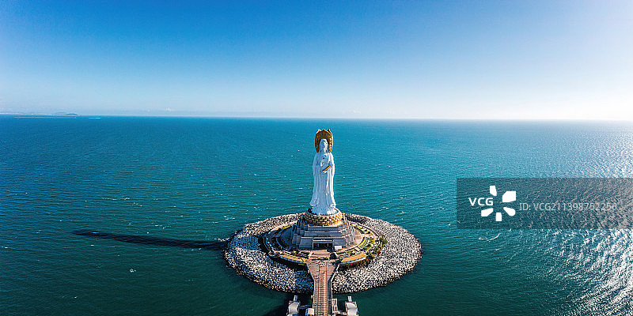
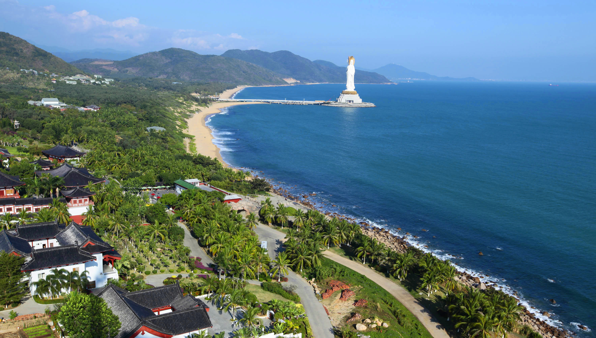
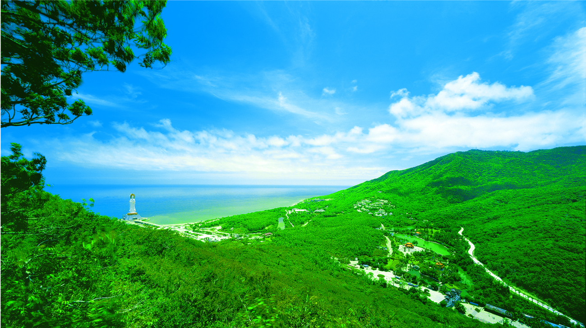
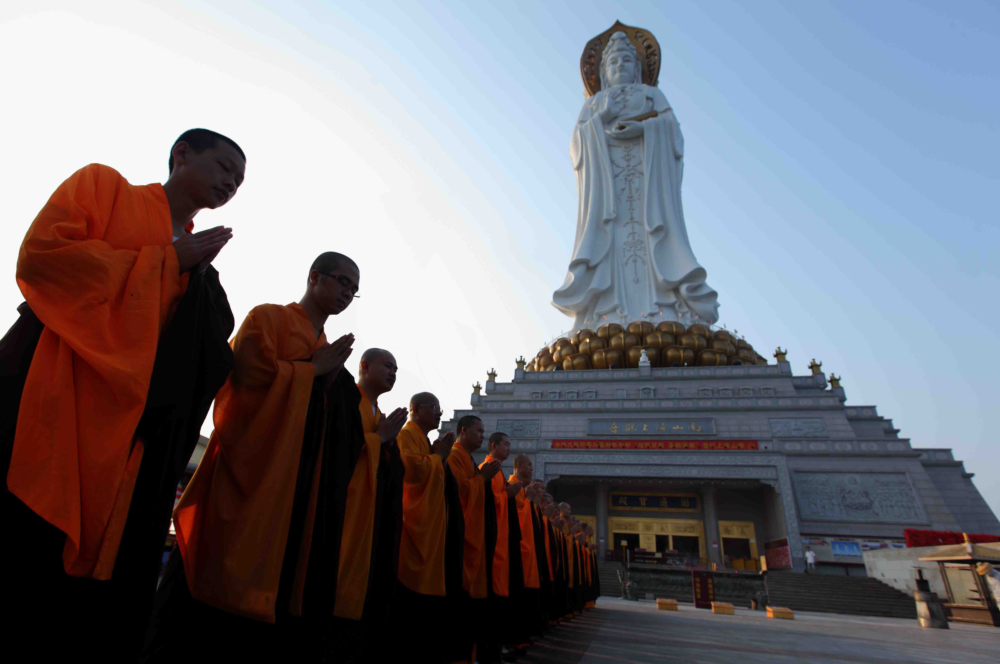
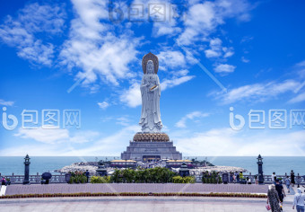
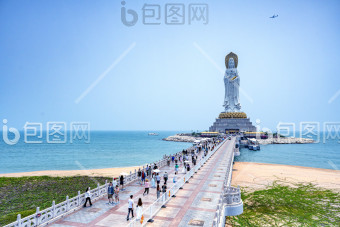

# 南山文化旅游区 ✨

## 🌅 开篇：南海之滨，108米高的慈悲

"海天佛国，南山一拜。"

飞机降落在三亚凤凰国际机场之前，如果你坐在靠窗的位置，请向右看。

你会看到海。

无边无际的、碧蓝的、闪着金光的南海。

然后，在海的边缘，有一尊白色的观音像，从海面上升起来。她有三张脸，朝向三个方向：一面朝陆地，保佑众生；一面朝东，看日出；一面朝西，看日落。

她高108米，比纽约自由女神像还高12米。

她建在一座人工岛上，岛用一座280米长的金色大桥与陆地相连。

每当夕阳西下，整尊观音像被染成金色。海风掠过她的衣袂，仿佛她真的在缓缓转身，看着每一个来到这里的人。

这就是南山寺的"海上观音"。

是中国佛教文化的最高杰作之一。

也是中国最南端的佛教圣地。

## 📜 一座寺院的千年缘起

**唐代：鉴真东渡的传说**

南山文化旅游区的历史，要从唐代鉴真和尚说起。

公元748年，鉴真第六次东渡日本。这一次，他的船在海上遇到大风，被吹到了海南岛。

鉴真在海南住了一年半。他看到三亚崖州有一座山，山势如南海之龙，气象不凡。他说："此地当为南海佛教圣地。"

他在这里讲经、传戒、收徒，把佛教的种子撒在了海南。

公元753年，鉴真终于成功东渡日本。临行前，他对弟子说："南山之地，佛缘未尽，他日必有复兴。"

这句话，等了一千二百年。

**宋代：南山寺的初建**

南宋绍兴年间（约1140年），当地信众在鉴真曾经讲经的地方，建了一座小庙，叫"南山寺"。这是南山寺的开山之始。

但宋元明清几百年间，南山寺时兴时废，规模一直不大。海南地处边陲，远离中原，佛教在这里始终没有真正繁荣。

**1949年后：南山寺衰落**

到了20世纪中叶，南山寺已经破败不堪，只剩下几间破房子和几个老和尚。文化大革命期间，寺院彻底停止活动。

**1988年：海南建省**

海南建省后，三亚旅游业开始兴起。当地政府决定重建南山寺，将其打造成中国最南端的佛教文化圣地。

**1995年：南山寺重建**

1995年，中国佛教协会会长赵朴初亲自为南山寺选址。他在地图上画了一个圈，说："这里，背山面海，左青龙，右白虎，是建佛寺的风水宝地。"

这个地方，就是现在的南山文化旅游区所在地。

**1999年：海上观音开建**

1999年，海上观音工程正式动工。这项工程历时6年，耗资8亿元，用了2000多吨钛合金钢板。

**2005年：海上观音开光**

2005年4月24日，海上观音举行开光大典。来自全球108位高僧大德齐聚南山，共同主法。

赵朴初先生生前曾预言："南山海上观音，将成为中国佛教的新地标。"今天看来，他没说错。

**2007年：晋升5A景区**

**今天**：南山文化旅游区是中国规模最大的佛教文化主题景区，占地34.7平方公里，每年接待游客超过300万人次。

## 🌟 核心景点详解

### 📍 海上观音：108米的慈悲

海上观音是南山文化旅游区的核心，也是中国佛教文化的标志性建筑。

**关于108米的高度**：
- 108是佛教的圣数
- 108种烦恼，108种业障，108声钟响
- 念佛108遍，可以消除108种烦恼
- 海上观音高108米，意味着她能消除一切烦恼

**关于三面观音**：
- **正面（手持经箧）**：代表智慧，朝向陆地，普度众生
- **左面（手持莲花）**：代表和平，朝向东方，看日出
- **右面（手持佛珠）**：代表慈悲，朝向西方，看日落

**关于材质**：
- 主体：钛合金钢板，2000多吨
- 内部：钢筋混凝土
- 表面：白色氟碳漆
- 抗风：能抵抗12级台风
- 抗震：能抵抗7级地震
- 寿命：设计寿命100年

**关于内部**：
观音像内部是空的，可以进入。内部有8层楼，每层供奉不同的佛像和文物。最珍贵的是第8层--那里供奉着一颗从尼泊尔请来的佛舍利。

> 💡 **导游贴士**：
> 1. 必须坐景区电瓶车到"海上观音站"
> 2. 进观音像内部要脱鞋
> 3. 顺时针绕观音像一圈，叫"绕佛"，是一种修行
> 4. 绕佛时要默念"南无观世音菩萨"
> 5. 拍照时不要拍佛像的背影，佛教传统认为这会"漏福"
> 6. 站在观音像脚下仰望，你会突然觉得自己很渺小--那种感觉就是信仰的开始

---

### 📍 南山寺：中国最南端的佛教寺院

南山寺是南山文化旅游区的核心寺院，也是中国最南端的佛教寺院。

寺院占地400亩，建筑面积4万平方米，是仿唐代风格的建筑群。

**南山寺的主要建筑**：
- **金堂（大雄宝殿）**：供奉释迦牟尼佛、药师佛、阿弥陀佛。殿堂高22米，是寺院的核心
- **仁王门（山门）**：寺院的入口，两侧有哼哈二将
- **钟楼鼓楼**：左钟右鼓，每天清晨4:30敲钟，晚上21:00击鼓
- **兜率内院**：供奉弥勒菩萨
- **藏经楼**：收藏佛教经典
- **观音院**：供奉千手观音

**南山寺的"镇寺三宝"**：
1. **佛舍利**：从斯里兰卡请来的释迦牟尼佛真身舍利，供奉在金堂内
2. **金玉观世音**：高3.8米，用100多公斤黄金、120多克拉南非钻石、上千颗红蓝宝石、翡翠、珊瑚打造，价值1.92亿元
3. **贝叶经**：用贝多罗树叶刻写的佛经，是佛教最古老的经书形式，全国仅存几百部

**南山寺的日常**：
- 凌晨4:30：早课
- 早晨5:30：早斋
- 上午8:00：法师讲经
- 中午11:00：午斋（过午不食）
- 下午13:30：晚课
- 晚上21:00：击鼓休息

> 💡 **导游贴士**：
> 1. 寺庙免费提供清香，不需要自己买
> 2. 每人限拿3支香，代表"戒、定、慧"
> 3. 烧香时左手插香（佛教以左为尊）
> 4. 大殿内不要拍照，不要喧哗
> 5. 不要踩门槛！要跨过去
> 6. 不要穿短裤短裙进寺庙，肩膀要遮住
> 7. 可以在寺内吃素斋，中午11:00-13:00，25元/位

---

### 📍 不二法门：进入佛国的入口

不二法门是南山文化旅游区的入口，也是景区的第一个标志性建筑。

这是一座仿唐代的石牌坊，高18米，宽30米。正中刻着"不二"两个大字，是赵朴初先生的手迹。

**"不二"是什么意思**：
- "不二"是佛教的核心概念
- 出自《维摩诘经》--"不二法门"
- 意思是：万事万物本质上是一体的，没有对立
- 善恶不二，色空不二，生死不二，烦恼即菩提
- 进入不二法门，就意味着进入了佛的世界

**一个有趣的故事**：
当年赵朴初先生题写"不二"二字时，已经92岁高龄。他写完后说："我一辈子写过无数个'二'字，但这是第一次写'不二'。"然后他笑了。

> 💡 **导游贴士**：
> 1. 进入不二法门时，要停下脚步，鞠躬三次
> 2. 出景区时，回头看不二法门，会有不同的感觉
> 3. 不二法门两侧有"善"和"恶"两个浮雕，左侧是善人升天，右侧是恶人下地狱--很震撼

---

### 📍 南海海上观音广场：礼佛的中心

从南山寺出来，沿着中轴线走500米，就到了海上观音广场。

这是一个直径200米的圆形广场，能容纳1万人。广场中央是普济桥--一座长280米的金色大桥，连接陆地和海上观音所在的人工岛。

**广场上的"108"**：
- 108级台阶：从广场到普济桥
- 108个莲花地灯：嵌在广场地面上
- 108个转经筒：排列在普济桥两侧
- 108尊小观音像：环绕在主像基座周围

**绕佛的最佳方式**：
1. 从广场开始，默念"南无观世音菩萨"
2. 走上108级台阶，每走一级念一遍
3. 走过普济桥，转每一个经筒
4. 绕观音像基座三圈，每圈都默念
5. 走到观音像脚下，磕三个头，许一个愿

**许愿的规矩**：
- 只能许一个愿
- 不能许愿"伤害别人"
- 实现后要回来还愿

> 💡 **导游贴士**：
> 1. 海上观音广场是看日落的最佳地点
> 2. 傍晚6-7点，夕阳照在观音像上，整个雕像变成金色
> 3. 站在广场正中，面朝观音像，闭上眼睛听海风，能听到观音"在说话"
> 4. 普济桥两侧的风很大，注意帽子

---

### 📍 金玉观音阁：1.92亿的国宝

金玉观音是南山寺的镇寺之宝，也是中国佛教造像艺术的巅峰之作。

**金玉观音的"造像档案"**：
- 高度：3.8米
- 重量：100多公斤黄金+200多公斤白银+200多公斤翡翠
- 镶嵌：120多克拉南非钻石、上千颗红蓝宝石、珍珠、珊瑚、绿松石
- 价值：1.92亿元（1998年评估价）
- 制作时间：4年（1996-1999年）
- 制作者：100多位工艺美术大师

**金玉观音的传说**：
1999年，金玉观音被上海大世界吉尼斯总部认证为"世界上最大、最高的金玉佛像"。开光那天，南山寺上空出现了五彩祥云。很多人说这是菩萨显灵。

**关于内部**：
金玉观音内部是空的。观音像的莲座内部，供奉着一颗释迦牟尼佛的真身舍利。这颗舍利是1999年从斯里兰卡请来的，被认为是国宝级文物。

> 💡 **导游贴士**：
> 1. 参观金玉观音要单独买票，20元
> 2. 阁内不能拍照
> 3. 进入时要脱鞋
> 4. 顺时针绕观音像一圈
> 5. 阁内有一个"金玉观音"主题展览，介绍造像过程和佛教文化，值得细看

---

### 📍 南海别院：素斋的天堂

南山寺的素斋，是中国佛教界最出名的素斋之一。

**南山素斋的"代表作"**：
- **南山佛跳墙**：用菌菇、竹荪、银耳、玉兰片做的佛跳墙，味道比荤的还鲜
- **罗汉斋**：18种蔬菜做的杂烩，是佛教传统名菜
- **三鲜豆腐**：用菌菇、竹笋、香菇做的豆腐
- **素鱼**：用豆制品做的鱼，连鱼鳞都像真的
- **素火腿**：用面筋做的火腿，咸香可口
- **椰子饭**：用海南椰子做的素甜饭

**南山素斋的价格**：
- 自助素斋：68元/位
- 罗汉斋套餐：98元/位
- 全素宴：680-1280元/桌（10人）

> 💡 **导游贴士**：
> 1. 素斋餐厅在南山寺内，叫"南山缘起楼"
> 2. 中午11:00-13:00开餐，提前到比较好
> 3. 素斋口味清淡，第一次吃可能不习惯
> 4. 不要浪费！佛教讲究"惜福"
> 5. 素斋不能打包带走

## 🎯 游览实用指南

### 🚗 交通指南

**飞机**：三亚凤凰国际机场，距南山文化旅游区约40公里，打车1小时，约120元

**高铁**：三亚站或崖州站，打车约30-50分钟

**公交**：从三亚市区坐16路公交车，直达南山文化旅游区，2小时，票价10元

**直通车**：三亚市区各大酒店每天都有发往南山文化旅游区的旅游专线，往返60元

**自驾**：三亚市区出发，走G98海南环岛高速，崖州出口下，约1小时

### 🎫 门票信息（2025年参考）
- **旺季门票**（10月-次年4月）：145元
- **淡季门票**（5月-9月）：121元
- **电瓶车**：30元（必买，景区太大）
- **金玉观音阁**：20元（可选）
- **素斋**：68-128元
- **学生票**：半价
- **免票**：70岁以上、军人、残疾人、1.2米以下儿童
- **开放时间**：8:00-17:30
- **预约**：节假日建议在"南山文化旅游区"公众号预约

### ⏰ 最佳游览时间

- **10月-次年3月**：凉爽少雨，是最佳季节
- **4月-5月**：天气渐热，但海水最清
- **6月-9月**：雨季+台风季，但景区人会少
- **建议游览时长**：4-6小时，可以玩一天

### 🗺️ 推荐路线

**经典半日游（最推荐）**：
- 8:00到达景区 -> 不二法门 -> 南山寺（烧香、看佛舍利）-> 海上观音广场 -> 普济桥 -> 海上观音 -> 素斋午餐 -> 出景区

**深度一日游**：
- 上午：不二法门 -> 南山寺 -> 金玉观音阁
- 中午：南山素斋
- 下午：海上观音广场 -> 普济桥 -> 海上观音 -> 三十三观音堂 -> 慈航普渡园
- 傍晚：在海上观音广场看日落

**祈福两日游**：
- **第一天**：上午拜南山寺，中午吃素斋，下午看海上观音，晚上住景区内酒店
- **第二天**：早起参加寺庙早课，吃完早斋返程

> 💡 **最重要的建议**：
> 1. 一定要上午来！上午的阳光最好，海上观音最清楚
> 2. 一定要穿长裤！寺庙要求衣着得体
> 3. 一定要慢慢走！景区很大，电瓶车也要排队
> 4. 一定要烧香！南山寺烧香的灵验度，全国闻名
> 5. 一定要吃素斋！是难得的佛教文化体验

### 🍜 三亚美食

- **文昌鸡**：海南四大名菜之首，肉嫩骨酥
- **加积鸭**：海南四大名菜，皮薄肉嫩
- **和乐蟹**：海南四大名菜，膏满肉肥
- **东山羊**：海南四大名菜，吃灵芝草长大的羊
- **抱罗粉**：三亚特色米粉，汤底浓郁
- **清补凉**：海南特色甜品，椰奶加各种豆类
- **椰子饭**：用椰汁煮的糯米饭，香甜软糯

### ⚠️ 注意事项

1. **衣着得体**：进寺庙不要穿短裤、短裙、背心
2. **不要踩门槛**：佛教传统，要跨过去
3. **不要拍佛像**：尤其是大殿内的佛像
4. **烧香3支**：不要拿一大把，每人3支
5. **防晒！**：三亚紫外线强，SPF50+
6. **多喝水**：热带地区容易中暑
7. **台风季节**：6-10月注意天气预报，台风天景区会关闭
8. **不要许"恶愿"**：佛教讲究因果，许愿要善

## 💫 结语：在南海之滨，学会放下

南山寺有一种特殊的能量。

不是宗教意义上的"灵气"，而是一种心理上的"放下"。

很多人来到这里，会突然觉得，自己烦恼了那么久的事情，好像没那么重要了。

也许是因为海。南海太大了，大到能装下你所有的烦恼。
也许是因为观音。108米的高度，足够让你看清自己的渺小。
也许是因为寺院的钟声。一声一声，把你的思绪一下一下地敲碎。
也许是因为不二法门。你走进那个门，就走进了"色空不二"的世界。

佛教讲究"放下"。

放下什么呢？
放下执着。放下贪欲。放下恐惧。放下我们背了一辈子的那些东西。

这些东西，让我们活得很累。
但我们也舍不得放下。

因为我们觉得，放下了，我们就什么都没有了。

南山寺告诉你，不是的。

放下了，你才拥有一切。

因为真正的"拥有"，不是抓住。
真正的"拥有"，是允许--允许万物来，允许万物走，允许自己被改变，也允许自己保持不变。

就像那片海。

它不抓住任何一条鱼，但每一条鱼都在它怀里。
它不挽留任何一艘船，但每一艘船都从它身上过。
它不抗拒任何一阵风，但每一阵风都让它更宽广。

它什么都没抓住，它拥有一切。

希望你从南山寺回去以后，能学会这种"放下"。

不是放弃生活，是放下对生活的执着。
不是放弃努力，是放下对结果的执念。
不是放弃爱，是放下对爱的占有。

像那片海一样。

> 📌 **旅行感悟**：
> 在南山，我看到一个老奶奶，
> 跪在海上观音脚下，
> 哭了很久。
> 她哭的不是悲伤，
> 是释然。
> 她背着的东西太重了，
> 她终于在这里，
> 放下了。
> 走出景区的时候，
> 她笑了。
> 那是我见过最美的笑。

---

*本页内容基于实景图片分析与佛教文化研究整理，由AI导游系统2025年7月生成*
