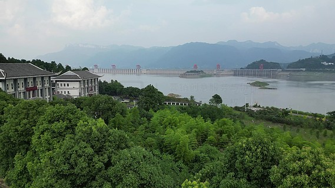
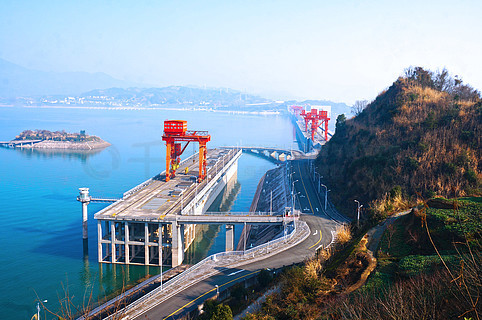
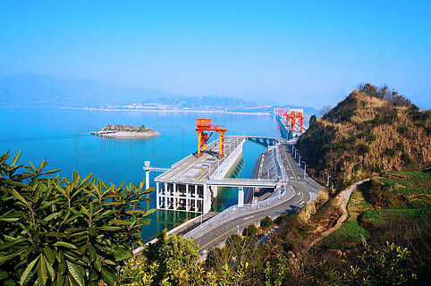
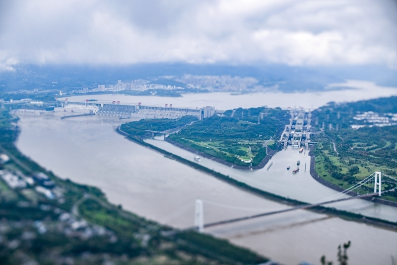

# 三峡大坝旅游区 🏗️

## 🌊 开篇：截断巫山云雨，高峡出平湖

"更立西江石壁，截断巫山云雨，高峡出平湖。神女应无恙，当惊世界殊。"

1956年，毛泽东在武汉畅游长江的时候，写下了这首《水调歌头·游泳》。那时候，三峡大坝还只是一个梦想。半个世纪后，这个梦想变成了现实——一座长2309米、高185米的巨型大坝，横亘在长江之上，成为了世界上最大的水利枢纽工程。

三峡大坝不仅仅是一座水坝。它是人类水利工程史上的奇迹，是中华民族百年梦想的实现，是几代中国人心血和智慧的结晶。它的背后，有一百多万移民的牺牲，有几十万建设者的奋斗，有无数科学家的心血。

站在坛子岭上，俯瞰这座人类历史上最伟大的水利工程，看着宽阔的江面，看着一艘艘巨轮通过船闸，你会感受到一种强烈的民族自豪感。这种感觉，只有站在三峡大坝面前，才能真正体会到。

这就是三峡大坝。它是一座工程的丰碑，也是一个民族的梦想。

## 📜 历史与文化：百年梦想，世纪工程

**1919年 孙中山的设想**
最早提出建设三峡大坝的，是孙中山先生。他在《建国方略》里写道："当以水闸堰其水，使舟得以溯流而行，而又可资其水力。"那时候，这只是一个伟大的设想，没有人知道它什么时候能够实现。

**1950年代 毛泽东的决心**
新中国成立后，长江水患依然严重。1954年的大洪水，给武汉和长江中下游人民带来了巨大的灾难。毛泽东下定决心，要治理长江。他三次畅游长江，写下了"高峡出平湖"的著名诗句，表达了建设三峡工程的决心。

**1992年 全国人大通过决议**
经过几十年的论证和争论，1992年4月3日，第七届全国人民代表大会第五次会议通过了《关于兴建长江三峡工程的决议》。这是新中国历史上，唯一一个由全国人大投票决定的工程。争议很大，但是最终，历史选择了建设。

**1994年 正式开工**
1994年12月14日，三峡工程正式开工。十几万建设者从全国各地来到三峡，在这片工地上奋斗了十几年。他们中的很多人，把自己的青春甚至生命，都献给了这项伟大的工程。

**2006年 大坝全线建成**
2006年5月20日，三峡大坝全线建成。那一刻，全中国都在欢呼。从孙中山提出设想，到大坝建成，整整过去了87年。几代中国人的梦想，终于实现了。

**2020年 整体竣工验收**
2020年11月1日，三峡工程整体竣工验收合格。这标志着这项世纪工程，从规划、论证、建设到运行，全部圆满完成。百年梦想，终于画上了一个完美的句号。

## 🌟 核心景点详解

### 📍 坛子岭：俯瞰大坝的最佳地点

这是三峡大坝的最佳观景点——坛子岭。照片中这个像一个倒扣的坛子的小山，海拔262.48米，是整个三峡大坝景区的最高点。站在这里，整个三峡大坝尽收眼底。

**坛子岭名字的由来**：
因为这座山的形状像一个倒扣的坛子，所以叫坛子岭。传说当年大禹治水的时候，曾经在这里倒过一坛酒，祭祀江神，保佑治水成功。

**站在坛子岭上你能看到**：
- **三峡大坝全景**：2309米长的大坝，像一条巨龙横卧在长江上
- **双线五级船闸**：世界上最大的内河船闸，船舶通过这里需要3个多小时
- **高峡平湖**：大坝上游，原来的峡谷变成了一个平静的大湖
- **下游长江**：大坝下游，长江依然浩浩荡荡向东流去

**坛子岭上的纪念物**：
- **万年江底石**：从长江江底挖出来的，有7亿年历史的大石头
- **大江截流石**：截流的时候用的四面体，每个重达28吨
- **坝址基石**：三峡大坝坝址的岩芯样本

> 💡 **游览贴士**：
> 坛子岭是每个游客必到的地方。最好上午去，阳光从东面照过来，拍照的时候不会逆光。另外，坛子岭上有免费的讲解，一定要听，讲解员会给你讲很多关于三峡工程的故事，非常有意思。

---

### 📍 185平台：与大坝齐平的震撼

在三峡大坝的上游，有一个185平台——因为它的海拔是185米，和大坝的坝顶一样高，所以叫185平台。照片中这个平台，是离大坝最近的地方，站在这里，你可以近距离感受大坝的雄伟。

**站在185平台的感受**：
站在185平台上，你和大坝的坝顶一样高。大坝就在你的眼前，185米高的坝体，像一座巨大的山一样横在你面前。上游的水面平静如镜，下游的江水奔腾而下。那种强烈的对比，那种巨大的视觉冲击力，会让你久久不能平静。

**为什么185米这个数字很重要**：
三峡大坝的坝顶高程是185米，正常蓄水位是175米。也就是说，大坝上游的水位最高可以到175米，比下游的江面高出113米。这113米的落差，蕴含着巨大的能量，每年可以发出1000多亿度电。

**最适合拍照的角度**：
185平台是拍大坝侧面最好的地方。你可以把整个大坝的高度拍出来，也可以拍到大坝和上游湖水的对比。如果是夏天泄洪的时候来，还能拍到洪水从泄洪口喷出来的壮观景象。

> 💡 **拍照建议**：
> 一定要用广角镜头！只有广角才能拍到大坝的雄伟。如果是用手机拍，尽量往后退，站在平台的最西边，往东边拍，这样可以把大坝拍得更全。另外，一定要注意安全，不要翻越栏杆。

---

### 📍 泄洪景观：万马奔腾的震撼

这是三峡大坝最壮观的景象——泄洪。照片中，洪水从大坝的泄洪口喷涌而出，像一条条黄色的巨龙，气势磅礴，万马奔腾。那种震撼，用语言无法形容。

**泄洪的原理**：
三峡大坝有54个泄洪深孔和22个表孔。汛期的时候，当上游来水量超过了发电机组的用水量，就需要打开泄洪孔，把多余的水放下去。这样可以保证上游的水位不超过警戒线，也可以保证大坝的安全。

**泄洪的壮观景象**：
- **高度**：水流从泄洪口喷出来，可以达到几十米高
- **声音**：几公里外就能听到轰隆隆的声音，震耳欲聋
- **水雾**：水流砸进下游的江里，激起几十米高的水雾，在阳光下会形成彩虹
- **气势**：那种万马奔腾的气势，会让你觉得人类在大自然面前是多么渺小

**什么时候能看到泄洪**：
一般是每年的6-9月，长江汛期的时候。如果上游有大洪水，泄洪的规模就会很大。最壮观的时候，几十个泄洪口同时打开，那场面，一辈子都忘不了。

> 💡 **观看建议**：
> 如果想看泄洪，出发之前一定要查一下三峡大坝的泄洪公告，或者问一下景区的工作人员。不是每天都泄洪的。另外，泄洪的时候水雾很大，最好带一件雨衣，手机相机也要做好防水。

---

### 📍 截流纪念园：建设者的丰碑

在三峡大坝的下游，有一座截流纪念园。这是为了纪念1997年大江截流成功而建的。照片中这些巨大的工程车和截流石，见证了当年截流的壮观场面。

**大江截流的故事**：
1997年11月8日，三峡工程实现了大江截流。那天，几百辆巨型自卸卡车，排着几公里长的队，源源不断地把石头倒进长江里。长江的水流很急，但是在人类的力量面前，它不得不改道。最后，龙口合龙的那一刻，现场所有的人都欢呼起来，很多人都哭了。

**纪念园里你能看到**：
- **自卸卡车**：当年截流用的卡特777B自卸卡车，每个轮子比人还高
- **装载机**：巨大的装载机，一铲就能装十几吨石头
- **截流四面体**：每个重达28吨，就是靠这些石头堵住了长江
- **截流过程展示**：通过图片和视频，还原当年截流的壮观场面

**最让人感动的地方**：
纪念园里有一面墙，上面刻着所有三峡工程建设者的名字。十几万建设者，他们的名字都刻在了这面墙上。他们中的很多人，在三峡工地上干了十几年，把自己最美好的青春都献给了这项工程。

> 💡 **游览贴士**：
> 很多游客逛完坛子岭和185平台就走了，错过了截流纪念园，非常可惜。一定要来看看！这里是整个景区最有人文气息的地方，是真正能够感受到三峡工程伟大的地方。看着那些巨大的工程车，你才能想象到当年建设的时候是多么的壮观。

---

## 🎯 游览实用指南

### 🚗 交通指南
- **高铁**：宜昌东站下车，有直达三峡大坝的旅游大巴，车程约1小时
- **自驾**：从宜昌市区出发，走三峡专用公路，全程约40分钟
- **景区交通**：景区内有观光车，35元/人，各个景点之间都有车

### 🎫 门票信息（2025年参考）
- **门票**：免费！是的，三峡大坝景区是免费的，只需要买35元的观光车票
- **游船**：如果想坐游船游三峡，船票另买，大约150-200元
- **升船机体验**：想体验坐电梯过大坝的，需要单独买票，198元/人

### ⏰ 开放时间
- **旺季（3-11月）**：8:00-17:30
- **淡季（12-2月）**：8:30-17:00
- **建议游览时长**：半天（3-4小时）

### 🗺️ 经典游览路线

**半日精华游**：
游客中心 → 坐观光车到坛子岭（1小时） → 185平台（40分钟） → 截流纪念园（1小时） → 返程

**一日深度游**：
上午：三峡大坝景区（坛子岭、185平台、截流纪念园）
下午：屈原故里景区 → 三峡人家 → 返程

**升船机体验游**：
上午：三峡大坝景区
下午：坐游船，体验三峡升船机（坐电梯过大坝）

### 🍜 美食推荐
- **长江肥鱼**：三峡特色，肉质鲜嫩，用清水煮就很好吃
- **宜昌萝卜饺子**：宜昌特色小吃，外酥里嫩，非常好吃
- **凉拌鱼腥草**：当地人最爱，但是外地人可能吃不惯
- **炕土豆**：宜昌大街小巷都有的小吃，香糯可口

## 💫 结语：一项工程，一个民族的成长

三峡工程是一个充满争议的工程。

从孙中山提出设想，到全国人大投票，从建设到运行，争议从来没有停止过。有人说它好，有人说它不好。有人说它利在千秋，有人说它遗患无穷。

但是，不管你怎么看，你都不能否认，三峡工程是人类水利工程史上的奇迹。它解决了长江中下游的水患问题，它每年发出1000多亿度清洁的水电，它让万吨巨轮可以从上海直达重庆。它给这个国家和人民带来的好处，是实实在在的。

更重要的是，三峡工程见证了一个民族的成长。从最初的梦想，到漫长的论证，到艰苦的建设，到今天的平稳运行。几代中国人，为了这个梦想，付出了太多太多。

站在三峡大坝面前，你会明白，任何伟大的成就，都不是轻而易举就能得到的。它需要时间，需要耐心，需要牺牲，需要奋斗。一个人是这样，一个国家也是这样。

三峡大坝不是完美的，但是它是伟大的。它是一座工程的丰碑，更是一个民族的精神丰碑。

> 📌 **旅行感悟**：
> 我们这一代人，有幸见证了很多伟大的工程——三峡大坝、青藏铁路、港珠澳大桥。这些工程不仅仅是钢筋混凝土，它们是一个国家实力的象征，是一个民族精神的体现。它们告诉我们：只要有梦想，只要肯奋斗，就没有什么是不可能的。

---

*本页内容基于实景图片分析与历史资料整理，由AI导游系统2025年7月生成*
