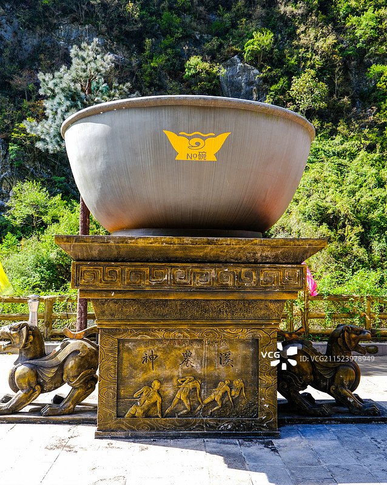
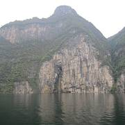
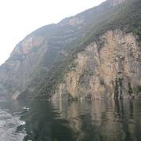

# 神龙溪纤夫文化旅游区

## 🎤 AI导游带你游

### 【开场白】
各位朋友，大家好！欢迎来到湖北省恩施土家族苗族自治州，欢迎来到神龙溪纤夫文化旅游区。我是你们今天的导游小艾。

站在这片土地上，你们可能想象不到，千百年前，这里曾是怎样一番景象。历史的年轮在这里留下了深深的印记，每一寸土地都在诉说着古老的故事。

巴东县2025年旅游景区基本情况 发布时间：2025-11-14 10:21 来源：巴东县文化和旅游局 神农溪 国家AAAAA级景区神农溪(评定时间：2011年5月5日)，是国家风景名胜区，位于长江三峡西陵峡与巫峡之间、巴东县境内长江北岸的一条常流性溪流，因发源于神农架南坡而得名。全长60公里，两岸...

今天，就让我们一起走进这片神奇的土地，感受它独有的魅力。建议游览时间：半天到一天。拍照最佳时间是清晨或傍晚，光线柔和时最美。

---

## 🗺️ 景区全景导览
神龙溪纤夫文化旅游区位于湖北省恩施土家族苗族自治州巴东县境内，是国家AAAAA级旅游景区。

巴东县2025年旅游景区基本情况 发布时间：2025-11-14 10:21 来源：巴东县文化和旅游局 神农溪 国家AAAAA级景区神农溪(评定时间：2011年5月5日)，是国家风景名胜区，位于长江三峡西陵峡与巫峡之间、巴东县境内长江北岸的一条常流性溪流，因发源于神农架南坡而得名。全长60公里，两岸群山耸立，逶迤绵延，层峦叠嶂，以雄、秀、险、奇不同风格形成龙昌、鹦鹉、绵竹、神农四个各具特色的自然峡谷，山水交融，奇山飞瀑、石笋溶洞，令人惊叹大自然的神奇造化；景区传承了原始古老的小木船拉纤漂流体验项目，高亢激昂的纤夫号子，令人怦然心动，一曲《纤夫的爱》曾火遍大江南北，让人百听不厌，土家儿女浓烈质朴

**游览路线推荐**：景区入口 → 核心景观区 → 精华景点 → 观景平台 → 出口

---

## 🏛️ 主要景点详解

### 📍 核心景区

**核心看点**：
- 这里承载着景区最深厚的历史文化底蕴
- 每一处细节都诉说着动人的故事
- 建议跟随讲解员深入了解背后的历史

> 💡 **导游贴士**：
> 游览核心景区时，建议放慢脚步，细细品味它的美。从不同角度欣赏会有不同的收获哦！

---

### 📍 精华观景台

**核心看点**：
- 景区的标志性景观，没来过等于没来过
- 最佳观赏时间是清晨和傍晚，光线最美
- 记得带上充电宝，美景会让你停不下快门

> 💡 **导游贴士**：
> 精华观景台最适合拍照的时间是清晨和傍晚，光线柔和，人也相对较少。

---

### 📍 特色景观区

**核心看点**：
- 观景位置绝佳，视野开阔
- 是拍摄全景照片的最佳地点
- 傍晚时分来，夕阳西下的景色美不胜收

> 💡 **导游贴士**：
> 特色景观区是整个景区的精华所在，建议至少预留20-30分钟在这里慢慢欣赏。

---

### 📍 文化展示区

**核心看点**：
- 这里曾是历史上重要的场所，意义非凡
- 建筑/景观的设计独具匠心，体现了古人智慧
- 站在这里，仿佛能与历史对话

> 💡 **导游贴士**：
> 来文化展示区游览，建议穿舒适的鞋子，这里需要多走走才能发现它的美。

---

### 📍 历史遗迹区

**核心看点**：
- 景区内最受欢迎的打卡点，游客必到
- 站在这里可以俯瞰整个景区的壮丽景色
- 天气好的时候拍照效果绝佳，记得预留时间

> 💡 **导游贴士**：
> 如果你是摄影爱好者，历史遗迹区一定能让你拍出满意的作品，记得带上广角镜头！

---

### 📍 自然观光带

**核心看点**：
- 自然风光与人文景观完美融合的典范
- 四季景致各异，无论何时来都有惊喜
- 摄影爱好者的天堂，随手一拍都是大片

> 💡 **导游贴士**：
> 游览自然观光带时，不妨关掉手机，用眼睛和心灵去感受这份美好。

---

## 【结束语】
各位朋友，今天的游览即将结束。希望神龙溪纤夫文化旅游区的美景能给你们留下美好的回忆。

有人说，旅行的意义不在于去过多少地方，而在于那些让你心动的瞬间。希望在神龙溪纤夫文化旅游区的这一天，能成为你旅途中一个温暖的记忆。

临走前，别忘了回头再看一眼。夕阳下的神龙溪纤夫文化旅游区，会给你最温柔的道别。

> ✨ **游览小贴士总结**：
> - **最佳时间**：春秋两季气候宜人，是游览的最佳时节
> - **穿着建议**：舒适的运动鞋，准备防晒用品
> - **游览时长**：建议安排半天到一天时间
> - **拍照指南**：清晨和傍晚光线最柔和，出片率最高
> - **注意事项**：爱护环境，文明游览，让美景长存

祝你们旅途愉快，平安吉祥！🙏

---

## 📷 景区美图

*景区全景*

*核心景观*

*特色风光*

---

## 📚 神龙溪纤夫文化旅游区小档案

| 项目 | 信息 |
|------|------|
| 景区级别 | 国家AAAAA级旅游景区 |
| 所属省份 | 湖北省 |
| 所属城市 | 恩施土家族苗族自治州 |
| 建议游览时间 | 半天 - 1天 |
| 最佳游览季节 | 春秋两季 |

---

> 💡 **本页说明**：
> 本README由AI导游小艾根据网络公开资料整理生成。
> 坐标、图片、简介均来自豆包搜索API，仅供参考。
