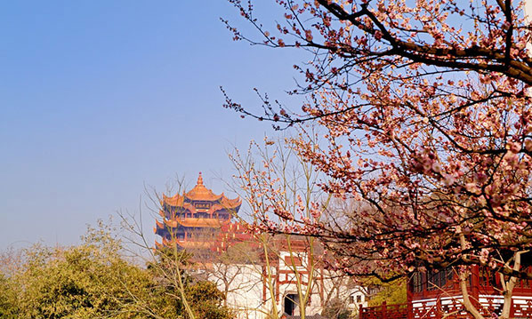
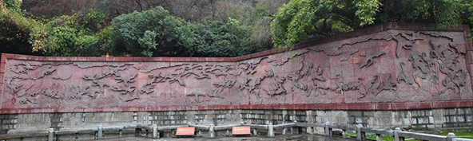
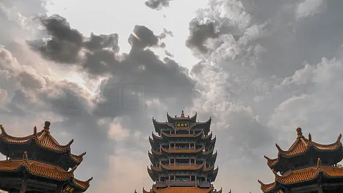
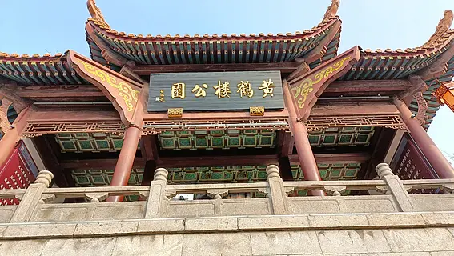

# 黄鹤楼公园 🦢

## 🌉 开篇：一座楼，一座城

"昔人已乘黄鹤去，此地空余黄鹤楼。黄鹤一去不复返，白云千载空悠悠。"

当你站在蛇山之巅，望着脚下浩浩荡荡的长江，你就会明白，为什么黄鹤楼能成为"天下江山第一楼"。它不只是一座古建筑，它是武汉的灵魂，是中国人的文化乡愁。

黄鹤楼的故事，就是武汉的故事。从三国时期的军事瞭望楼，到唐代成为天下名楼，从两宋的繁华到明清的重建，再到1985年这座新楼的落成。一千八百年来，黄鹤楼屡建屡毁，屡毁屡建，就像这座城市一样，历经磨难，却永远屹立不倒。

2020年，这座城市经历了前所未有的考验。当武汉重启的那一刻，黄鹤楼的灯光重新亮起，照亮了这座英雄城市的夜空。那一刻，黄鹤楼不再只是一座楼，它是希望，是信念，是一座城市的精神图腾。

登黄鹤楼吧，望大江东去，看白云千载，感受这座城市生生不息的脉搏。

## 📜 历史与文化：一千八百年的楼与诗

**公元223年 三国始建**
黄鹤楼始建于三国吴黄武二年。最初它只是一座军事瞭望楼，站在楼上可以俯瞰长江，监视敌军的动向。谁能想到，这座军事用途的建筑，会在日后成为中华文化最耀眼的地标之一。

**公元730年 李白的送别**
"故人西辞黄鹤楼，烟花三月下扬州。"李白的这一句诗，让黄鹤楼名扬天下。在此之前，崔颢已经写下了"昔人已乘黄鹤去"的千古名篇。据说李白登上黄鹤楼，看到崔颢的题诗，感叹道："眼前有景道不得，崔颢题诗在上头。"

**明清两代 屡建屡毁**
明清两代，黄鹤楼先后被毁了七次，又重建了七次。最后一座清代黄鹤楼毁于1884年的一场大火。此后整整一百年，黄鹤楼只存在于人们的记忆中和老照片里。

**1985年 涅槃重生**
经过四年的建设，新的黄鹤楼在蛇山之巅落成。虽然不是原来的位置，也不是原来的形制，但黄鹤楼的精神回来了。今天的黄鹤楼，高51.4米，五层飞檐，金碧辉煌，是无数游客来到武汉必到的第一站。

## 🌟 核心景点详解

### 📍 黄鹤楼主楼：天下江山第一楼

这就是中国人心中最著名的那座楼——黄鹤楼。照片中这座金碧辉煌的建筑，矗立在蛇山之巅，俯视着脚下的万里长江。它是武汉的标志，是湖北的骄傲，是中华文化的象征。

**建筑细节**：
- **高度**：51.4米，相当于17层楼
- **层数**：外观5层，内部实际上有9层，寓意"九五至尊"
- **飞檐**：60个翘角层层向外伸展，像一只展翅欲飞的黄鹤
- **屋面**：10万多块黄色琉璃瓦，在阳光下熠熠生辉

**每层楼的看点**：
- **一楼**：大型壁画《白云黄鹤》，讲述费祎驾鹤成仙的传说
- **二楼**：黄鹤楼历史沿革，唐宋元明清各代黄鹤楼模型
- **三楼**：历代诗人壁画，李白、杜甫、白居易、王维都在这里
- **四楼**：当代书画作品展示，可以盖纪念章
- **五楼**：360度观景大厅，这是整个黄鹤楼的精华

**你不知道的冷知识**：
现在的黄鹤楼距离原址大约有1公里。因为修建武汉长江大桥的时候，原址被占用了。但是站在新的黄鹤楼上看长江大桥，反而比原址看的更清楚。

> 💡 **导游贴士**：
> 不要直接坐电梯到五楼！一定要一层一层走上去。每一层都有惊喜，每上一层，视野就开阔一分。等到了五楼，推开窗户的那一刻，大江东去的壮阔景象会让你震撼得说不出话。

---

### 📍 五楼观景台：大江东去的豪情

站在黄鹤楼五楼的观景台上，你眼前就是这幅景象。万里长江从脚下奔流而过，武汉长江大桥飞架南北，龟蛇二山隔江相望。这一刻，你会真正理解什么叫"天造地设"。

**从这里你能看到**：
- **武汉长江大桥**：万里长江第一桥，1957年建成通车
- **龟山电视塔**：江对岸的龟山顶上，曾经的亚洲第一高塔
- **鹦鹉洲长江大桥**：远处那座橘红色的悬索桥
- **汉口江滩**：江对面那片灯火辉煌的地方，就是老汉口

**最佳登楼时间**：
- **傍晚日落前**：夕阳把长江染成金色，是摄影的黄金时间
- **晚上亮灯后**：黄鹤楼夜景非常漂亮，还能看武汉的城市灯火
- **雪后初晴**：雪后的黄鹤楼银装素裹，美到令人窒息

> 💡 **摄影技巧**：
> 拍黄鹤楼全景，最好的位置不在黄鹤楼公园里面！出了公园，走到长江大桥上，回头看黄鹤楼，那才是最佳角度。或者到对岸的龟山电视塔下，拍黄鹤楼和长江大桥的合影，那才叫经典。

---

### 📍 千禧吉祥钟：千年一撞的祝福

黄鹤楼脚下的这座大钟，就是千禧吉祥钟。照片中这口重达21吨的青铜大钟，是为了迎接千禧年而铸造的。它是目前中国最大的青铜钟之一。

**大钟的故事**：
- **重量**：21吨，寓意21世纪
- **高度**：3.4米，直径2.1米
- **铸造**：2000年铸成，敲响了千禧年的第一声钟声
- **撞钟**：花10块钱可以撞三下，祈福平安

**撞钟的讲究**：
第一下福，第二下禄，第三下寿。撞三下就够了，不要多撞。撞钟的时候，钟声越悠长越好，说明你的祝福传得越远。

> 💡 **祈福建议**：
> 撞完钟，记得在旁边的祈愿牌上写下你的心愿。很多人在这里写了祝福，挂在栏杆上，风吹过的时候，叮铃作响。据说，在这里许的愿特别灵验。

---

### 📍 岳飞铜像：精忠报国的悲壮

在黄鹤楼公园南区，矗立着这座8米高的岳飞铜像。很多游客不知道，岳飞曾经在武汉驻守了七年。在这里，他写下了那首气壮山河的《满江红》。

**岳飞与武汉的故事**：
- **绍兴四年（1134年）**：岳飞收复襄阳六郡，移师鄂州（今武汉）
- **驻守七年**：在武汉期间，岳飞厉兵秣马，准备北伐中原
- **写下《满江红》**："怒发冲冠，凭栏处、潇潇雨歇"就是在黄鹤楼上写的
- **绍兴十一年（1141年）**：岳飞被召回临安，以"莫须有"的罪名被害

**铜像细节**：
岳飞按剑而立，面向北方，眼神中充满了悲愤和不甘。他还在望着那片沦陷的中原大地，还在想着"待从头、收拾旧山河"。

> 💡 **导游贴士**：
> 很多游客逛到主楼就返程了，错过了南区的岳飞景区。一定要往南走！那里人少安静，岳飞铜像旁边的"岳武穆遗像亭"非常值得一看，还有历代书法家书写的《满江红》碑刻。

---

## 🎯 游览实用指南

### 🚇 交通指南
- **地铁**：5号线司门口黄鹤楼站B出口，出来就是
- **公交**：14路、15路、521路、530路、572路、573路、717路
- **轮渡**：中华路码头坐轮渡到对岸，体验"万里长江第一渡"
- **自驾**：停车位紧张，建议公共交通前往

### 🎫 门票信息（2025年参考）
- **成人票**：70元
- **学生票**：35元（凭学生证）
- **65岁以上**：免费
- **武汉年卡**：免费入园

### ⏰ 开放时间
- **旺季（4-10月）**：8:00-18:30
- **淡季（11-3月）**：8:00-17:30
- **夜游**：每年4-10月有夜游活动，具体时间关注官方通知
- **建议游览时长**：2-3小时

### 🗺️ 经典游览路线

**精华游（2小时）**：
南门 → 鹅池 → 诗碑廊 → 岳飞铜像 → 黄鹤楼主楼 → 千禧钟 → 白云阁 → 北门出

**深度游（3小时）**：
在精华路线基础上增加：
- 落梅轩看编钟表演（免费，每整点一场）
- 毛泽东词亭
- 百步亭
- 跨鹤亭

### 🍜 餐饮服务
- **户部巷**：出了北门就是户部巷，武汉小吃聚集地
- **推荐美食**：热干面、豆皮、汤包、面窝、武昌鱼
- **喝的**：一定要试试武汉的"蛋酒"，米酒冲鸡蛋，香甜可口

## 💫 结语：一座永远屹立的精神丰碑

黄鹤楼从来就不是一座普通的楼。

它是李白送别孟浩然的地方，是岳飞凭栏北望的地方，是无数文人墨客登高远眺的地方。它见证了王朝更迭，见证了战火纷飞，也见证了和平年代的万家灯火。

一千八百年来，这座楼毁了又建，建了又毁，但黄鹤楼的精神从来没有消失过。就像这座城市，经历过洪水，经历过疫情，经历过无数磨难，却永远那么热气腾腾，永远那么充满生命力。

当你站在黄鹤楼上，看着大江东去，看着这座英雄的城市，你会突然明白：人生就像这长江水，一路向东，永不回头。重要的不是你来自哪里，而是你要去向何方；重要的不是你拥有什么，而是你留下了什么。

黄鹤一去不复返，但黄鹤楼永远在这里。

> 📌 **旅行感悟**：
> 人生就像登黄鹤楼，每上一层，视野就开阔一分。等到了顶楼，你才会发现，原来那些曾经困扰你的人和事，在大江大河面前，都是那么微不足道。

---

*本页内容基于实景图片分析与历史资料整理，由AI导游系统2025年7月生成*
