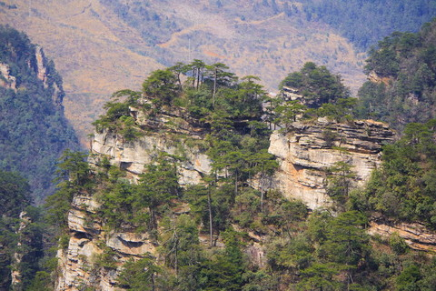
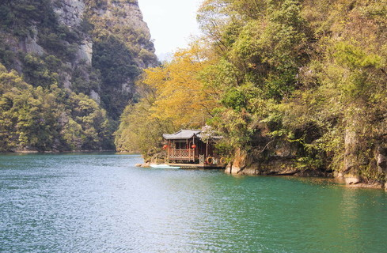

# 张家界武陵源 ✨

## 🏔️ 开篇：上帝打翻的盆景

三亿八千万年前，这里还是一片大海。

海底的石英砂岩，一层一层地沉积，堆积了五百多米厚。
然后，地壳抬升，海水退去，流水侵蚀，重力崩塌。
亿万年的时光，把一整块平整的砂岩，雕刻成了三千多根拔地而起的石柱。

于是，就有了张家界。

这是地球上独一无二的景观。
全世界没有第二个地方，有这么多、这么高、这么奇的石英砂岩峰林。
1982年，这里成为了中国第一个国家森林公园。
1992年，联合国教科文组织把它列入《世界自然遗产名录》。
2009年，卡梅隆在这里拍出了《阿凡达》，
全世界的人都认识了这座"哈利路亚山"。

站在天子山顶，看着脚下三千奇峰依次排开，
云雾在山谷间流动，阳光在峰林间穿梭。
你会突然明白：
原来中国的山水画，不是画家凭空想象出来的。
原来大自然，真的可以这么美。

## 📜 从"养在深闺"到世界闻名

**公元1979年 被发现的秘境**
张家界一直藏在武陵山脉的深处，鲜为人知。
直到画家吴冠中先生来到这里，
他被眼前的景象惊呆了，
写下了那篇著名的《养在深闺人未识》。
从此，张家界，这个名字，开始被世人知晓。

**1982年 中国第一个国家森林公园**
张家界国家森林公园正式成立。
这是中国第一个、也是最有名的国家森林公园。

**1992年 世界自然遗产**
联合国教科文组织的专家来考察，
他们站在天子山上，看着眼前的三千奇峰，
说了一句话：
"这是上帝的盆景，是地球的纪念碑。"

**2010年 因为一部电影火遍全球**
《阿凡达》上映了。
全世界的观众都在问：电影里那些悬浮在空中的山，是真的存在吗？
答案是：是的，它们就在张家界。
从此以后，张家界多了一个名字——
"潘多拉星球的现实版"。

---

## 🌟 核心景观详解

### 📍 石英砂岩峰林：三千奇峰拔地起

这就是张家界最经典的画面。
一根又一根几十米、几百米高的石柱，
像从地里长出来一样，直插云霄。
山顶上，居然还长着松树。
它们就在那里，站了亿万年。

**你不知道的地质奇迹**：
- **高度**：最高的石柱有300多米高，相当于100层楼
- **数量**：一共有3103根这样的石柱，所以叫"奇峰三千"
- **材质**：全部是石英砂岩，硬度高，不容易风化，所以才能站这么久
- **年龄**：这些山峰的形成，用了三亿八千万年

**为什么张家界的山这么特别**：
桂林的山，是石灰岩的，圆圆的，胖胖的；
黄山的山，是花岗岩的，一坨一坨的；
只有张家界的山，是一根根的，像柱子一样，直上直下。
这就是"张家界地貌"，是全世界独一份的。

**最佳观赏时间**：
- **雨过天晴**：有云雾的时候最美，山峰在云雾里若隐若现，像仙境一样
- **清晨日出**：阳光洒在金色的岩壁上，特别震撼
- **冬天雪后**：雪后的张家界，是另一个世界

> 💡 **导游贴士**：
> 看峰林最好的地方，不是黄石寨，也不是金鞭溪。
> 是天子山的西海石林。
> 站在观景台上，脚下是白茫茫的云海，
> 几百根石柱从云海里冒出来，
> 那个时候，你真的会觉得，
> 自己站在天宫的南天门。

---

### 📍 宝峰湖：山顶上的翡翠

如果说张家界的山是男人的阳刚，
那宝峰湖就是女人的温柔。

这是一个挂在山顶上的湖。
四周是高耸的山峰，中间是一潭碧绿的湖水。
乘一艘小船，在湖面上慢慢划，
两岸的山峰倒映在水里，
你会分不清，哪里是天，哪里是水，哪里是山。

**宝峰湖的特别之处**：
- **位置**：它不是在山谷里，是在半山腰上，像一块翡翠嵌在群山之中
- **水质**：水是那种不透明的绿松石色，特别好看
- **安静**：比起其他景区的热闹，这里特别安静，只能听到鸟鸣和水声

> 💡 **乘船游览**：
> 一定要坐宝峰湖的游船！
> 船行在湖面上，山峰从两边依次掠过，
> 船老大偶尔会唱一首土家山歌，
> 歌声在山谷里回荡，
> 那个瞬间，你会觉得，
> 什么烦恼都没有了。

---

### 📍 必看的几处奇观

**金鞭溪**：
"不到金鞭溪，枉到张家界。"
这条7.5公里长的峡谷，被称为"中国最美的峡谷"。
溪水清澈见底，两边是高耸的山峰，
沿着溪水走，就像走在一幅山水画里。
《西游记》里的花果山，就是在这里拍的。

**袁家界**：
阿凡达的"哈利路亚山"就在这里。
站在迷魂台，看着眼前那根巨大的"乾坤柱"，
你会明白为什么卡梅隆会选这里作为潘多拉星球的原型。

**天子山**：
"看了天子山，不看天下山。"
这是张家界看峰林最好的地方。
西海石林的壮观，是任何语言都无法形容的。
你必须亲自站在那里，才能体会那种震撼。

**天门山**：
世界上最高的天然穿山溶洞，
还有那条挂在悬崖上的玻璃栈道，
现在已经成了网红打卡地。
敢走完全程的，都是勇士。

---

## ☁️ 张家界的正确打开方式

很多人来张家界，
就是赶赶赶，
一天跑好几个景点，
拍几张打卡照就走了。

但张家界不是这么玩的。

**张家界最美的，不是某个具体的景点。**
**是光影，是云雾，是四季的变化。**

同一座山，
晴天看是一个样子，
阴天看是一个样子，
有云雾的时候又是另一个样子。
早上看，中午看，傍晚看，
都不一样。

所以来张家界，
不要赶。
找一个观景台，
安安静静地坐一个小时，
看云雾在山谷间飘来飘去，
看阳光在山峰上移动，
看光影一点点变化。

你会发现，
原来山，也是活的。

---

## 🎯 游览实用指南

### 🚗 交通指南
张家界的交通现在很方便了。

**飞机**：
- 张家界荷花机场，全国主要城市都有直飞
- 机场到武陵源景区约40分钟车程，打车约100元

**高铁**：
- 张家界西站，高铁站
- 长沙→张家界：约2.5小时
- 贵阳→张家界：约3小时
- 重庆→张家界：约3.5小时
- 出站后有直达武陵源景区的大巴，约1小时

**自驾**：
- 长沙→张家界：约4小时
- 重庆→张家界：约6小时
- 景区停车场很大，20元/天

**景区内交通**：
- 环保车：免费！买了门票就可以无限次坐，非常方便
- 索道/电梯：需要另外买票，建议买，不然爬山会累死

### 🎫 门票信息（2025年参考）
- **武陵源核心景区门票**：225元，连续4天有效！（良心价！）
- **百龙天梯**：72元（单程），世界上最高的户外电梯，一定要坐！
- **天子山索道**：72元（单程）
- **黄石寨索道**：68元（单程）
- **宝峰湖**：96元（含船票）
- **天门山国家森林公园**：278元（含索道），需要另外买，不在武陵源门票里
- **半价票**：学生、60-69岁老人
- **免票**：70岁以上、军人、残疾人、记者
- **预约**：关注"张家界旅游"公众号预约，节假日建议提前约

> 划重点：武陵源门票可以用4天！4天！4天！
> 所以真的不用赶，慢慢玩。

### ⏰ 最佳游览时间
- **4-5月、9-10月**：天气最好，雨水不多，容易看到云海
- **6-8月**：雨季，雨水多，但是雨后的云海特别美，就是有点热
- **12-2月**：冬天，人最少，雪景特别美，而且门票便宜
- **建议游览时长**：3天2夜是标配，4天2夜最舒服

### 🗺️ 推荐路线
**经典3日游**：
- **第一天**：到达张家界，住武陵源区，休息调整
- **第二天**：森林公园门票站进 → 金鞭溪 → 百龙天梯上山 → 袁家界（阿凡达山）→ 天子山 → 天子山索道下山
- **第三天**：吴家峪门票站进 → 十里画廊 → 天子山 → 点将台 → 神堂湾 → 返程

**深度4日游**：
在3日游基础上，增加：
- 第四天：宝峰湖 + 黄龙洞，或者去天门山

> 💡 路线建议：
> 山上玩一天，山下玩一天，
> 不要上上下下跑，很浪费时间。
> 最好是住山上一晚，
> 可以看日落，看日出，
> 体验感完全不一样。

### 🏨 住宿建议
三个选择，各有优缺点：

**住武陵源区**：
- ✅ 选择多，从几十到几千都有
- ✅ 吃饭方便，各种馆子都有
- ❌ 离景区还有几公里，每天要坐车进出

**住森林公园门口**：
- ✅ 离景区近，走路就到
- ❌ 住宿选择少，条件一般
- ❌ 吃饭不太方便

**住山上**：
- ✅ 不用每天上下山，省时间省索道钱
- ✅ 可以看日落日出，人少的时候体验感爆棚
- ❌ 住宿条件比较一般，不要期望太高
- ❌ 吃饭比较贵

> 个人建议：如果时间充裕，一定要在山上住一晚！
> 傍晚游客都走了，整个山都是你的。

### 🍜 张家界美食
- **三下锅**：张家界第一名菜！肥肠、猪肚、核桃肉炖一锅，又辣又香
- **土家腊肉**：熏得香香的，炒蒜苗特别好吃
- **枞菌炖鸡**：山里的野菌子炖土鸡，汤鲜得能把舌头吞下去
- **葛根粉**：当地特产，清热解毒，夏天吃最好
- **猕猴桃**：张家界的猕猴桃特别甜，一定要买

### ⚠️ 避坑指南（非常重要！）
1. ❌ 不要相信火车站/汽车站拉客的"100块钱玩三天"，都是坑
2. ❌ 不要买路边的"野生天麻""野生灵芝"，几乎都是假的
3. ✅ 不要在景区门口的饭馆吃饭，又贵又难吃，去市区或者武陵源城区吃
4. ✅ 山上的物价比较贵，可以自己带点水和零食上去
5. ❌ 不要雨天去玻璃栈道，什么都看不到，白花钱
6. ✅ 带件外套！山上比山下低5-10度，哪怕是夏天也很凉

## 💫 结语：站在亿万年的时光面前

站在天子山的观景台上，
看着眼前这三千座已经站了三亿八千万年的山峰，
你会突然觉得，
人类真的太渺小了。

我们的一生，不过短短几十年。
而这些山，已经在这里站了几亿年。
它们见过恐龙，见过冰川，见过沧海桑田，
它们还会在这里，继续站上几亿年。

所有的烦恼，所有的焦虑，
在这些亿万年的山峰面前，
突然就变得不重要了。

这就是大自然的力量。
它不需要说话，
就安安静静地站在那里，
就已经治愈了一切。

所以来一次张家界吧。
不是为了打卡，
不是为了发朋友圈。
是为了站在这亿万年的时光面前，
好好地看一看，
这个星球，到底有多美。

> 📌 **旅行感悟**：
> 吴冠中先生说：
> "张家界是一幅画，
> 一种不寻常的美，
> 一种惊心动魄的美。
> 它的美，
> 是时间的力量，
> 是自然的奇迹。"

---

*本页内容基于实景图片分析与张家界地貌研究整理，由AI导游系统2025年6月生成*
