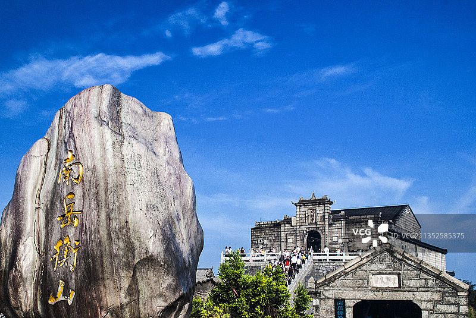
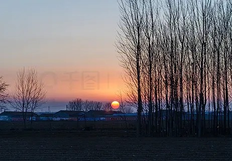
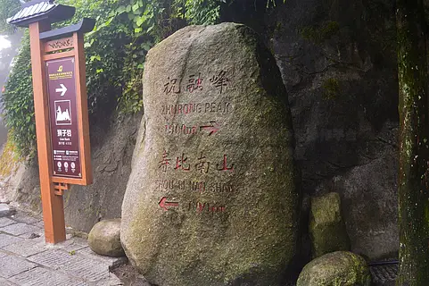
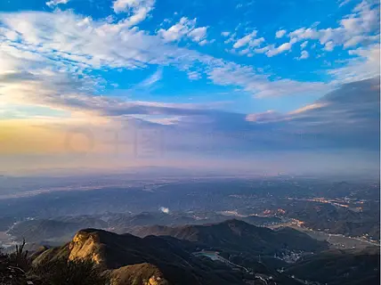

# 南岳衡山旅游区 ⛰️

## ☀️ 开篇：五岳独秀，中华寿岳

"恒山如行，岱山如坐，华山如立，嵩山如卧，唯有南岳独如飞。"

当你站在南岳衡山脚下，仰望这座海拔1300米的名山，你会明白为什么古人说南岳"如飞"。它不像其他四岳那样雄伟险峻，却有着一种独特的灵秀之气。七十二峰逶迤盘旋，像一只展翅欲飞的朱雀，在湘江之畔翱翔了亿万年。

衡山是五岳中唯一位于南方的山，也是五岳中最"年轻"的一座。这里气候温暖，植被茂密，森林覆盖率高达90%以上。春天看花海，夏天看云海，秋天看日出，冬天看雾凇——衡山的四季，各有各的精彩。

但衡山最珍贵的，不是它的风景，而是它的香火。作为中国南方最著名的佛教圣地，南岳衡山的香火已经延续了一千五百年。每天天不亮，就有成千上万的香客背着香包，沿着石阶一步一步向上攀登。他们来自湖南、广东、广西，甚至更远的地方。他们来了，烧香，祈福，然后心满意足地离开。

这就是南岳衡山。它是一座山，也是一种信仰。

## 📜 历史与文化：一千五百年的香火传承

**先秦两汉 舜帝南巡**
早在远古时期，衡山就已经是中华名山。《尚书》记载，舜帝南巡，"五月南巡狩，至于南岳"。秦始皇统一中国后，祭祀天下名山，衡山就是其中之一。汉武帝时期，衡山正式被列为"南岳"，成为五岳之一。

**魏晋南北朝 佛教传入**
佛教传入衡山始于西晋。慧思大师来到衡山，建立了般若寺（今福严寺），开创了天台宗的南岳法系。此后，衡山寺庙林立，高僧辈出，成为中国南方的佛教中心。

**唐代 香火鼎盛**
唐代是衡山的黄金时代。怀让大师在衡山传授禅宗，创立了"南岳系"，后来衍生出临济宗和沩仰宗两大宗派。"马祖建道场，百丈立清规"——中国禅宗的基本制度，就是在衡山奠定的。

**宋元明清 历代加封**
历代皇帝不断给衡山加封。唐玄宗封南岳神为"司天王"，宋真宗加封为"司天昭圣帝"，元明清三代沿袭。南岳大庙的规格越来越高，规模越来越大，成为了"江南第一庙"。

**1937-1945年 抗战名山**
抗战时期，衡山成为了抗战的重要据点。蒋介石在这里召开了四次南岳军事会议，国共合作在南岳创办了"南岳游击干部训练班"，叶剑英担任副教育长。这座千年名山，在民族危亡的时刻，挺身而出，承担起了它的历史使命。

## 🌟 核心景点详解

### 📍 祝融峰：观日出，摘星辰

这是衡山最著名的景观——祝融峰日出。照片中，一轮红日从云海中冉冉升起，把整个天空染成了金红色。站在衡山之巅，你会感觉自己离天空特别近，仿佛伸手就能摘到星星。

**祝融峰的数字**：
- **海拔**：1300.2米，衡山七十二峰的最高峰
- **名字由来**：祝融是神话中的火神，据说他死后葬在衡山之巅
- **观日台**：祝融峰旁边的观日台，是中国南方最佳的日出观赏点
- **望月台**：中秋之夜，这里是赏月的绝佳地点

**看日出的正确姿势**：
- **提前住山上**：想看日出，必须住在山顶的上封寺或者望日台附近的宾馆
- **凌晨四点起床**：夏天日出早，四点就要出发
- **多穿衣服**：山顶温度比山下低8-10度，即使夏天也要带外套
- **选好天气**：雨过天晴的第二天，看到云海日出的概率最大

**你不知道的冷知识**：
祝融峰上的"祝融峰"三个字，是国民党元老于右任先生题写的。文革期间，红卫兵要砸掉这块匾。当地老百姓连夜把匾摘下来，藏在山洞里，才保住了这件文物。

> 💡 **导游贴士**：
> 不要只在观日台看日出！看完日出后，往回走到上封寺门口，那里有一块"望乡台"。站在那里俯瞰，整个南岳区尽收眼底，清晨的薄雾笼罩着村庄，那景色比日出本身还要美。

---

### 📍 南岳大庙：江南第一庙

这是南方最大的宫殿式古建筑群——南岳大庙。照片中这条长长的中轴线，就是大庙的核心。九进院落，层层递进，红墙黄瓦，金碧辉煌，人称"小故宫"。

**大庙的建筑格局**：
- **中轴线**：九进院落，代表九五至尊
- **东八观**：东边是八座道教宫观
- **西八寺**：西边是八座佛教寺院
- **总面积**：98500平方米，是江南最大的古建筑群

**最神奇的是**：
南岳大庙是中国唯一的佛道共存的庙宇。中轴线是皇家祭祀的场所，东边是道观，西边是佛寺。和尚和道士做邻居，一起守护着这座大庙，一做就是一千年。这在全国都是独一无二的。

**烧香的讲究**：
- **先拜庙**：进庙先拜主神，然后按照顺时针方向拜
- **烧香数量**：三支香代表佛法僧，不要烧一大把
- **许愿还愿**：许愿的时候要说清楚"如果实现了我会怎么还愿"
- **心诚则灵**：最重要的是诚心，不是烧多少钱的香

> 💡 **烧香贴士**：
> 不要在庙门口买那些几百块的"发财香"！自己带香进去，或者在庙里请普通的香就可以了。南岳圣帝灵验，是因为心诚，不是因为香贵。记住：烧香不在多，三支清香足矣。

---

### 📍 藏经殿：山花遍野的仙境

这是衡山最秀美的地方——藏经殿。照片中这片被原始森林环绕的山谷，就是"藏经殿之秀"的所在地。很多游客只知道去祝融峰，却错过了这里，实在可惜。

**藏经殿的故事**：
- **得名由来**：南朝陈光大二年，慧思大师在这里建寺，明太祖赐《大藏经》一部，因此得名
- **植物王国**：这里有500多种植物，很多都是珍稀树种
- **摇钱树**：殿前有一棵青钱柳，果实像铜钱，人称"摇钱树"
- **连理枝**：两棵树的枝干长在一起，象征爱情

**四季皆景**：
- **春天**：满山遍野的映山红，是衡山最美的季节
- **夏天**：清凉无比，是天然的避暑胜地
- **秋天**：层林尽染，红叶满山
- **冬天**：雾凇奇观，宛如冰雪世界

> 💡 **导游贴士**：
> 如果只给我推荐衡山一个地方，我一定推荐藏经殿。从半山亭往西走，一路下坡，大约一个小时就能到。这条路线游客很少，风景绝美。一路上你会经过磨镜台、传法院，这些都是禅宗史上著名的地方。相信我，这会是你衡山之行最难忘的一段路。

---

### 📍 衡山雾凇：南国的冰雪奇缘

这是衡山冬天最震撼的景观——雾凇。很多人以为只有东北才有雾凇，其实衡山的雾凇更美。照片中这片银装素裹的世界，就出现在北纬27度的南中国。

**衡山雾凇的特点**：
- **出现时间**：每年12月到次年2月
- **形成条件**：气温低于0度，湿度大，有雾
- **持续时间**：每次寒流来袭，能持续3-5天
- **最佳观赏点**：南天门到祝融峰一带

**为什么衡山会有雾凇**：
衡山虽然海拔只有1300米，但它矗立在湘江河谷之上，相对高度很大。北方的寒流南下，遇到衡山阻挡，沿着山坡爬升，遇冷凝结，就形成了壮观的雾凇。

**冬天登山注意事项**：
- **穿防滑鞋**：路面结冰，非常滑，一定要穿防滑的登山鞋
- **买冰爪**：山下10块钱一副的冰爪，关键时刻能救命
- **戴手套帽子**：山顶风大，冻得刺骨
- **慢慢走**：结冰的台阶很滑，一步一步走，不要急

> 💡 **摄影技巧**：
> 拍雾凇最好用逆光。阳光透过冰晶，会产生梦幻般的光晕。带一块黑色的布做背景，可以拍出冰晶晶莹剔透的效果。当然，更重要的是保护好你的相机，山上水汽大，注意防寒防潮。

---

## 🎯 游览实用指南

### 🚗 交通指南
- **高铁**：京广高铁到衡山西站，出站后有直达景区的大巴，车程20分钟
- **自驾**：从长沙出发，走京港澳高速，全程约1.5小时
- **飞机**：到衡阳南岳机场，打车到景区约1小时

### 🎫 门票信息（2025年参考）
- **景区大门票**：旺季（5-10月）120元，淡季（11-4月）80元
- **南岳大庙**：旺季60元，淡季40元
- **景区交通车**：78元（山下到南天门往返，中途可上下）
- **索道**：上行70元，下行60元（只在半山亭到南天门之间运行）

### ⏰ 最佳旅游时间
- **12月-次年2月**：看雾凇，冰雪衡山
- **4-5月**：漫山遍野的杜鹃花
- **7-8月**：避暑胜地，看云海
- **10-11月**：秋高气爽，看日出概率最高

### 🗺️ 经典游览路线

**一日精华游（体力好）**：
游客中心 → 坐景区车到半山亭 → 步行经南天门到祝融峰（3小时） → 步行下山到半山亭（2小时） → 返程

**一日休闲游（坐索道）**：
游客中心 → 景区车到半山亭 → 索道到南天门 → 步行到祝融峰 → 索道下山 → 返程

**两日深度游（推荐）**：
Day1：上午南岳大庙烧香 → 下午景区车上山 → 磨镜台 → 藏经殿 → 住山顶
Day2：祝融峰看日出 → 下山 → 水帘洞 → 返程

### ⚠️ 烧香注意事项
- **环保香**：景区推广环保香，不要买那种大高香
- **不要被骗**：路边的"导游"说可以带你走小道免票，都是骗子
- **注意安全**：烧香的时候注意防火，不要用手接别人的香

## 💫 结语：一座有求必应的山

有人说，南岳衡山是五岳中最不雄伟的一座。但我要说，衡山是五岳中最有烟火气、最有人情味的一座。

它不像泰山那样威严，不像华山那样险峻，不像嵩山那样厚重，不像恒山那样苍茫。它就是一座秀美的山，一座慈祥的山，一座有求必应的山。

一千五百年来，无数人来到这里，背着香包，带着心愿，一步一步登上山顶。他们中有达官贵人，有平民百姓，有商人，有农民，有学生。他们说着不同的方言，有着不同的烦恼，但他们来到这里，都是为了同一件事——祈求平安，祈求幸福，祈求一个更好的明天。

这就是南岳衡山的力量。它不说教，不张扬，就静静地矗立在那里，接纳每一个前来的人，倾听他们的心愿，给他们希望和力量。

如果你累了，如果你迷茫了，如果你需要一个地方安放你的心事，请来衡山。在这里，点一炷香，许一个愿，然后沿着石阶慢慢往下走。下山的时候你会发现，那些曾经让你烦恼的人和事，其实都没有那么重要。

生活还在继续，希望永远都在。

> 📌 **旅行感悟**：
> 人生就像登衡山，有上坡也有下坡，有晴天也有雨天。重要的不是你爬得多快，而是你有没有欣赏沿途的风景。当你爬到山顶，你会明白：所有的努力都是值得的，因为最美的风景，永远在最高处。

---

*本页内容基于实景图片分析与历史资料整理，由AI导游系统2025年7月生成*
