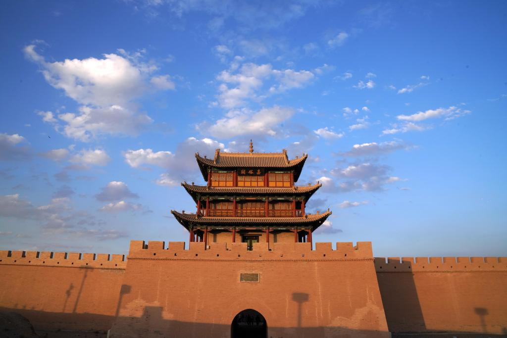
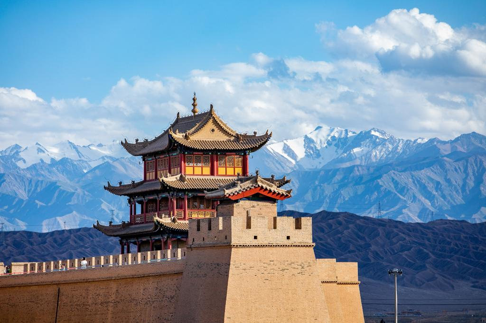
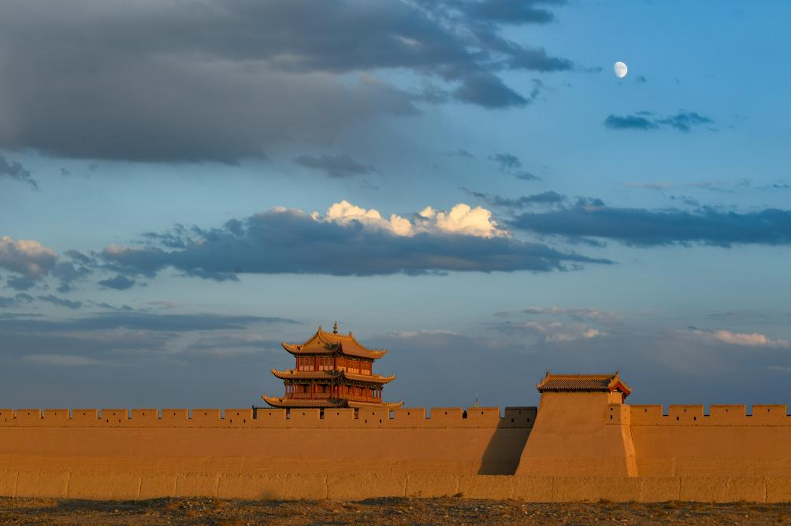
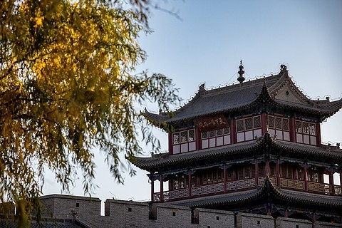

# 嘉峪关文物景区 🏯

## 🌅 开篇：西出阳关无故人

"长城饮马寒宵月，古戍盘雕大漠风。"

当你站在嘉峪关的城楼上，看着西边的太阳一点点沉入祁连山后的戈壁，你会真正读懂这句诗。嘉峪关，万里长城的西起点，这座被称为"天下第一雄关"的边塞城池，六百多年来，就像一个孤独的巨人，站在戈壁滩上，守护着河西走廊的咽喉。

这里没有江南的烟雨，没有中原的繁华，只有戈壁、长风、雪山和落日。但是这里的每一块砖，都浸透着历史的沧桑；每一阵风，都带着古人的叹息。张骞从这里出使西域，玄奘从这里西去取经，林则徐从这里被贬出关，左宗棠抬着棺材从这里出征新疆。

嘉峪关不是一个打卡的景点，它是一段凝固的历史，是一个民族的集体记忆。站在城楼上，看着远处的祁连山雪，看着一望无际的戈壁，你会突然明白什么叫"家国"，什么叫"边关"，什么叫"西出阳关无故人"。

来嘉峪关吧。来听听六百年的风声，来感受一下那种大漠孤烟、长河落日的苍凉与悲壮。

## 📜 历史与文化：一座关城，半部边塞史

**明洪武五年（1372年） 冯胜建关**
明朝开国大将冯胜西征，击败了元朝残余势力，在河西走廊最狭窄的地方——东有酒泉，西有玉门，北有黑山，南有祁连山——选中了这个"一夫当关，万夫莫开"的地方，开始修建关城。这就是嘉峪关的开始。那一年，朱元璋刚刚当上皇帝五年，整个大明帝国还在百废待兴。

**明弘治八年（1495年） 修建罗城**
弘治年间，吐鲁番势力崛起，多次侵犯河西走廊。为了加强防御，嘉峪关兵备道李端澄主持修建了西罗城和关楼，也就是我们今天看到的"天下第一雄关"城楼。从此，嘉峪关的防御体系基本成型。

**明嘉靖十八年（1539年） 长城连接**
尚书翟銮巡视边防，下令从嘉峪关开始，修建明长城，一直修到了山海关。从此，嘉峪关真正成为了万里长城的西起点。那一年，戚继光11岁，还在山东登州的老家读书，他不会想到，几十年后，他会成为万里长城东段的守护者。

**清同治年间 左宗棠出关**
同治年间，阿古柏在新疆叛乱，左宗棠抬着棺材出征，从嘉峪关出关，收复了新疆。他在嘉峪关城楼上题写了"天下第一雄关"的匾额，还下令整修了关城和附近的长城。现在嘉峪关城楼上的那块匾额，就是左宗棠当年题写的。

**1949年以后 从军事要塞到旅游景区**
新中国成立后，嘉峪关失去了军事意义，慢慢变成了一个旅游景区。1961年，嘉峪关被列为全国重点文物保护单位。1987年，长城被列入世界文化遗产名录。2007年，嘉峪关景区被评为国家5A级旅游景区。现在，每年有超过两百万游客来到这里，参观这座六百多年的雄关。

## 🌟 核心景点详解

### 📍 嘉峪关关城：天下第一雄关

这就是嘉峪关的核心——关城。照片中这座宏伟的城池，有三重城郭，多道防线，城内有城，城外有壕，形成了重城并守的格局。它是明代长城沿线保存最完整、规模最壮观的一座关城。

**关城的布局**：
- **内城**：关城的核心，有东西两门，东门叫"光化门"，西门叫"柔远门"
- **瓮城**：内城东西各有一个瓮城，分别叫"朝宗门"和"会极门"
- **罗城**：西边的外城，是主要的防御线，"天下第一雄关"的匾额就在这里
- **箭楼**：罗城上的箭楼，是关城的标志，也是拍婚纱照最热门的地方
- **游击将军府**：内城里面，是当年守关将领的办公和居住的地方

**最神奇的是"定城砖"**：
在西瓮城阁楼的后檐台上，放着一块孤零零的砖。传说当年修关城的时候，工匠计算特别精确，最后完工的时候就多了这一块砖。监工想以此为借口责罚工匠，工匠说这是神仙放在那里的定城砖，谁要是动了，整个城就会塌掉。从此，这块砖就一直放在那里，一放就是六百多年。

**站在城楼上的感受**：
站在西边的城楼上，面朝戈壁，祁连山就在你的右手边，连绵的雪山在阳光下闪闪发光。左手边是一望无际的戈壁滩，没有一棵树，没有一户人家。风从西边吹过来，带着沙子打在你的脸上。那一刻，你会觉得自己就是一个守关的士兵，六百多年的时光一下子就重叠了。

> 💡 **游览贴士**：
> 一定要请一个讲解员！嘉峪关的故事都在那些看不见的细节里，没有讲解，你只会看到一堆城墙和房子。另外，最好下午晚一点去，快关门的时候人最少，夕阳照在城墙上的颜色最好看，也最有感觉。

---

### 📍 悬壁长城：倒挂在山脊上的长城

在嘉峪关城北8公里的黑山上，有一段长城倒挂在陡峭的山脊上，这就是悬壁长城。照片中这段长城，坡度超过45度，从山上一直垂到山脚，像一条巨龙从山上下来喝水，所以也叫"西部八达岭"。

**悬壁长城的特别之处**：
- **陡峭**：最陡的地方坡度超过60度，需要手脚并用才能爬上去
- **短**：只有750米长，是明长城中最短的一段
- **原始**：大部分是原汁原味的明代长城，没有过度修复
- **风景好**：站在长城顶上，可以看到整个嘉峪关市和远处的祁连山

**爬长城的感受**：
悬壁长城不长，但是特别陡，爬的时候会有点害怕。但是当你爬到顶，坐在长城的墩台上，吹着风，看着山下的戈壁和远处的城市，那种感觉特别好。尤其是秋天的时候，山上的草都黄了，长城在夕阳下变成金色，特别美。

**你不知道的冷知识**：
悬壁长城旁边，有一个"丝绸之路"雕塑群，刻着张骞、班超、玄奘、马可波罗这些曾经走过河西走廊的人。很多游客都错过了，非常可惜。那个雕塑群做得特别好，每个人物都栩栩如生，站在那里，你会觉得两千多年的时光就在你眼前流过。

> 💡 **拍照建议**：
> 拍悬壁长城最好的角度是在山脚下往上拍，这样能拍出它的陡峭和险峻。另外，长城上有一个拐角，是拍人像最好的地方，站在那里，长城从你的身后延伸到山顶，特别有感觉。

---

### 📍 长城第一墩：万里长城从这里开始

万里长城的第一座烽火台，就是这里——长城第一墩。照片中这个矗立在讨赖河边悬崖上的土墩，就是明长城最西端的起点。它看起来不起眼，但是意义重大——万里长城就是从这里开始，一路向东，翻山越岭，一直到渤海之滨的山海关。

**第一墩的历史**：
它建于明嘉靖十八年（1539年），是兵备道李涵主持修建的。原来的墩台高约10米，是一个方形的烽火台。几百年来，它经历了无数次的战火，经历了无数次的风吹雨打，现在只剩下了一个土堆。但是就是这个土堆，标志着万里长城的起点。

**最震撼的是讨赖河峡谷**：
第一墩下面，就是讨赖河峡谷，深约百米，两岸都是陡峭的悬崖。河水在谷底流过，像一条蓝色的带子。站在悬崖边的玻璃观景台上往下看，你会觉得腿软。古代的士兵，就是站在这里，守着河西走廊的南大门。

**你不知道的故事**：
第一墩旁边，有一个"醉卧沙场"雕塑群，刻着古代士兵出征前喝酒告别的场景。"醉卧沙场君莫笑，古来征战几人回"。站在那里，看着那些雕塑，看着远处的戈壁，你会突然读懂这首诗。古代的士兵，不知道能不能活着回来，但是他们还是来了。这就是中国人的家国情怀。

> 💡 **游览贴士**：
> 一定要走到那个玻璃观景台！虽然有点吓人，但是站在那里，你才能真正感受到第一墩的险峻，才能真正理解为什么要把长城的起点建在这里。另外，景区里还有一个仿建的古代兵营，可以进去看看，体验一下古代士兵的生活。

---

### 📍 长城博物馆：了解长城最好的地方

在嘉峪关关城的旁边，有中国第一座长城博物馆。这里不是很大，但是非常值得一看。照片中这个博物馆，用大量的文物、图片和模型，给你讲述了整个长城的历史。

**博物馆里最值得看的**：
- **长城全图**：一幅巨大的地图，标出了明长城的每一个关隘和烽火台
- **出土文物**：从嘉峪关附近出土的古代武器、生活用品，还有士兵的家书
- **修建场景**：用模型还原了当年修建长城的场景，非常震撼
- **名人蜡像**：冯胜、左宗棠、林则徐这些和嘉峪关有关的历史人物

**最让人感动的展品**：
博物馆里有一面墙，上面刻着所有参与过长城修建的工匠的名字。那些名字，大部分都很普通，有的甚至连名字都没有，只刻了一个姓。但是就是这些普通人，用他们的双手，一砖一瓦地修建了这座万里长城。他们没有在历史上留下什么事迹，但是他们修建的长城，却成了整个民族的象征。

> 💡 **游览建议**：
> 先逛博物馆，再去逛关城。这样，你逛关城的时候，就不是在看一堆石头，而是在看一段有血有肉的历史。博物馆是免费的，凭身份证就可以进，建议至少留出一个小时慢慢看。

---

## 🎯 游览实用指南

### 🚗 交通指南
- **从嘉峪关市区出发**：可以坐4路公交车到关城，也可以打车，大约20元
- **景区之间**：关城、悬壁长城、第一墩三个景点之间距离比较远，建议包车，一天大约150元
- **自驾**：从酒泉出发，走酒嘉快速路，全程约25公里，半小时就能到

### 🎫 门票信息（2025年参考）
- **联票**：110元/人，包含关城、悬壁长城、长城第一墩，两天有效
- **单独门票**：关城60元，悬壁长城30元，长城第一墩30元
- **讲解**：关城讲解100元/次，非常建议请

### ⏰ 最佳旅游时间
- **5-6月**：春天，戈壁上的骆驼刺都绿了，天气不热
- **9-10月**：秋天，秋高气爽，能见度高，是最好的旅游季节
- **避开**：7-8月夏天，特别晒，气温能到40度；12-2月冬天，特别冷，风特别大

### 🗺️ 经典游览路线

**半日精华游**：
嘉峪关关城（2小时） → 长城博物馆（1小时） → 返程

**一日深度游**：
上午：长城第一墩（1.5小时） → 悬壁长城（1小时）
中午：市区吃饭
下午：嘉峪关关城（2小时） → 长城博物馆（1小时） → 返程

**两日游**：
在一日游基础上，增加七一冰川（需要一整天）或者魏晋墓（半天）

### 🍜 美食推荐
- **嘉峪关烤肉**：西北最好吃的烤肉，羊肉特别嫩，一定要尝
- **驴肉黄面**：敦煌传过来的特色，黄面配驴肉，味道独特
- **搓鱼面**：张掖特色，面像小鱼一样，炒着吃或者汤着吃都好吃
- **杏皮水**：当地特色饮料，用杏子皮熬的，酸甜解暑

## 💫 结语：一座关城，六百年的守望

站在嘉峪关的城楼上，我一直在想：六百多年，二十多万个日日夜夜，这座关城到底见过了什么？

它见过冯胜将军率领大军西征的雄壮，见过吐鲁番骑兵攻城的硝烟，见过林则徐被贬出关时落寞的背影，见过左宗棠抬着棺材出征的决绝，见过解放军和平解放新疆时老百姓的欢呼。

它见过无数的商人从这里走过，驮着茶叶和丝绸去往西域；见过无数的僧人从这里走过，去往印度取经；见过无数的士兵，年轻的脸庞，穿着盔甲，手握长矛，站在城楼上守望。

六百年了，那些人都不在了，那些故事也慢慢被人遗忘了。只有这座关城，还在那里，还在守望，还在见证。

现在，没有战争了，没有士兵了，也不需要守关了。嘉峪关变成了一个旅游景区，每天都有成千上万的游客来这里参观，拍照，打卡。但是我总觉得，我们来这里，不应该只是为了拍一张照片。

我们应该站在城楼上，静静地待一会儿，听听风的声音，感受一下那种穿越六百年的沧桑。我们应该记住，我们今天的和平生活，是多少人用生命和鲜血换来的。

这就是嘉峪关的意义。它不是一个摆设，不是一个赚钱的工具，它是一个民族的记忆，是一段历史的见证。

来嘉峪关吧。来看看这座六百年的雄关，来听听那些被风沙掩埋的故事，来感受一下那种大漠孤烟、长河落日的苍凉与悲壮。

> 📌 **旅行感悟**：
> 我们总是在寻找诗和远方，但是远方到底在哪里？当你站在嘉峪关的城楼上，看着一望无际的戈壁，看着远处的祁连山雪，你会明白：远方不在地图上，不在攻略里，它在你的心里。当你真正站在那里，感受到那种穿越时空的震撼，你就找到了属于你的诗和远方。

---

*本页内容基于实景图片分析与历史资料整理，由AI导游系统2025年7月生成*
