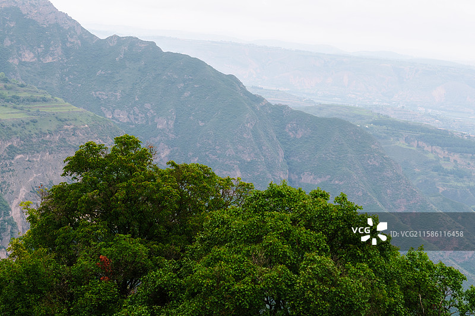
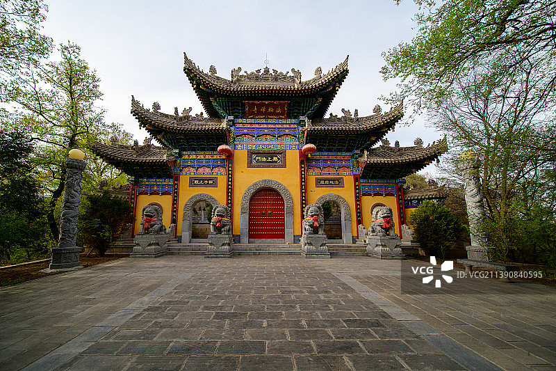
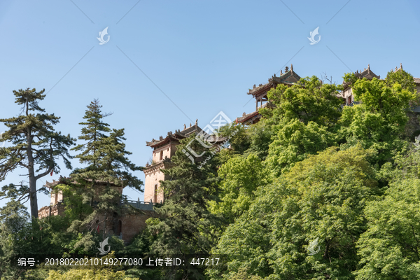
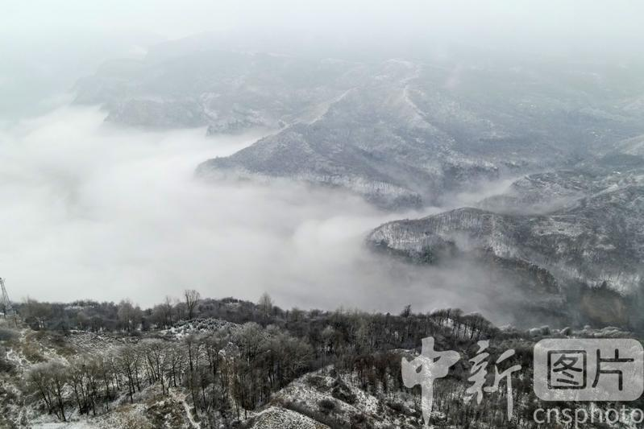

# 崆峒山风景名胜区 ⛰️

## 🌄 开篇：黄帝问道处，道源崆峒山

"崆峒访道至湘湖，万卷诗书看转愚。踏破铁鞋无觅处，得来全不费工夫。"

这首大家都熟悉的诗，说的就是崆峒山。作为中国道教的发源地之一，崆峒山的名字，已经和"道"紧紧绑在了一起。两千多年前，黄帝在这里向广成子问道，求长生不老之术，求治国安民之道。从此，崆峒山就成了"天下道教第一山"。

崆峒山不是那种特别高特别险的山，它的海拔只有2123米。但是它的特别之处在于，它是一座真正的"仙山"。漫山遍野的古柏树，掩映着一座座道观寺院；云雾缭绕的时候，你走在山路上，真的会有一种成仙了的感觉。

更特别的是，崆峒山是一个儒释道三教共存的地方。山顶上，道教的太和宫、佛教的香山寺、儒家的孔庙，挨在一起，和谐共存了上千年。这在中国的名山里，是非常少见的。

来崆峒山吧。不为求仙问道，只为在这片有灵性的山水里，让自己的心静下来，慢下来，感受一下那种"采菊东篱下，悠然见南山"的闲适。

## 📜 历史与文化：一座山，两千年的道统传承

**远古时期 黄帝问道**
这是崆峒山最早也最重要的故事。传说中的黄帝，统一华夏之后，听说崆峒山上有一个仙人叫广成子，活了一千二百岁，掌握着天地运行的规律和长生不老之术。于是黄帝就来到崆峒山，向广成子问道。广成子告诉黄帝："无视无听，抱神以静，形将自正。必静必清，无劳汝形，无摇汝精，乃可以长生。"黄帝听完之后，大彻大悟，后来成了中华民族的人文始祖。

**秦汉时期 帝王登临**
秦始皇统一中国之后，曾经登临崆峒山，祭祀广成子。汉武帝也曾经来过崆峒山，在这里举行封禅仪式。司马迁在《史记》里专门提到过崆峒山，说"余尝西至空桐，北过涿鹿，东渐于海，南浮江淮矣"。可以说，崆峒山是中国最早被历史记载的名山之一。

**魏晋南北朝 道教兴起**
魏晋时期，道教开始在崆峒山兴盛起来。道士们开始在山上修建道观，修炼丹药，传授道法。到了唐代，崆峒山已经成为了全国道教的中心之一，山上有大小道观几十座，道士数百人。唐太宗李世民还曾经下令，在崆峒山修建了轩辕宫，专门祭祀黄帝和广成子。

**宋元明清 三教融合**
宋代以后，佛教和儒家也慢慢进入了崆峒山。山上开始修建寺院和文庙，形成了三教共存的局面。最盛的时候，山上有"八台九宫十二院四十二座建筑群七十二处石府洞天"，道士、和尚、儒生，在这座山上和谐共处，一起守护着这片灵性的山水。

**近现代 从衰落到重生**
民国时期，因为战乱，崆峒山慢慢衰落了，很多建筑都毁于战火。文革期间，又遭到了进一步的破坏。改革开放以后，政府开始重新整修崆峒山，很多道观寺院都被重建了。2007年，崆峒山被评为国家5A级旅游景区。现在，每年有上百万游客来到这里，问道崆峒，感受仙山的灵气。

## 🌟 核心景点详解

### 📍 中台：崆峒山的心脏

这是崆峒山的中心——中台，海拔1900米，是整个崆峒山游客最多的地方，也是所有游览路线的交汇点。照片中这块平坦的台地，四周被群山环抱，古树参天，寺庙林立，就像一个天然的世外桃源。

**中台的建筑**：
- **法轮寺**：中台最主要的建筑，是一座佛教寺院，里面有大雄宝殿和藏经楼
- **崆峒山博物馆**：不大，但是里面有很多关于崆峒山历史和道教文化的文物
- **塔院**：有好几座明清时期的古塔，其中最有名的是明代的凌空塔
- **客栈和饭馆**：山上唯一可以住宿和吃饭的地方，条件虽然简陋，但是特别有感觉

**最神奇的是那棵"定山神针"**：
在中台的法轮寺门口，有一棵几百年的古柏树，长得特别直，特别高，像一根针一样插在那里。当地人叫它"定山神针"，说它是广成子插在这里的，用来镇住山里的妖魔鬼怪。据说绕着这棵树走三圈，许的愿望就会实现。

**住在中台的感觉**：
如果时间允许，一定要在中台住一晚。晚上游客都走了，整个山都安静下来，只有风声和鸟叫声。清晨起来，看着云雾从山谷里慢慢升起来，阳光透过树叶洒在院子里，那种感觉，真的像在仙境一样。

> 💡 **游览贴士**：
> 中台是整个崆峒山游览的枢纽，不管你是坐索道上来还是爬上来，都会到这里。建议先在这里休息一下，喝点水，然后再决定去哪里。另外，中台的饭馆味道一般，但是价格不算贵，可以尝尝当地的山野小菜。

---

### 📍 皇城：道教的圣地

这是崆峒山的最高点——皇城，也叫太和宫，海拔2123米。照片中这座建在山顶的道观群，是整个崆峒山道教建筑的精华，也是西北地区保存最完整的明代道教建筑群之一。

**皇城的布局**：
- **三天门**：进入皇城的大门，有三座门，分别叫天门、地门、人门
- **太和宫**：主殿，供奉着真武大帝，也就是道教里的玄武大帝
- **老君殿**：供奉着太上老君，也就是老子
- **黄帝问道宫**：供奉着黄帝和广成子，是整个崆峒山最有意义的地方
- **献殿**：道士做法事的地方

**最震撼的是壁画**：
太和宫的墙壁上，有大量的明代壁画，画的是道教的神仙故事。虽然经历了几百年的风雨，颜色已经有些脱落了，但是依然能看出当年的精美。那些神仙的表情，栩栩如生，仿佛要从墙上走下来一样。

**站在皇城边上的感觉**：
皇城的西边，有一个悬崖，叫"舍身崖"。站在悬崖边往下看，是几百米深的山谷，对面是连绵的群山。风从山谷里吹上来，吹得你衣服猎猎作响。那一刻，你会觉得自己离天特别近，离凡尘特别远。

> 💡 **拍照建议**：
> 拍皇城最好的角度是在对面的棋盘山上，从那里可以拍到整个皇城建在山顶的壮观景象。另外，清晨和傍晚的时候，阳光照在皇城的黄墙上，颜色特别好看，拍出来的照片像油画一样。

---

### 📍 香山寺：崆峒山最高的地方

在皇城的后面，还有一个更高的山峰，叫香山，山顶上有一座香山寺。这是崆峒山最高的地方，海拔2123米。虽然寺不大，但是风景特别好。

**香山寺的特别之处**：
- **最高**：是整个崆峒山的最高点，"会当凌绝顶，一览众山小"的感觉在这里最明显
- **安静**：大部分游客到了皇城就往回走了，很少有人来香山寺，所以这里特别安静
- **观音像**：寺里有一尊巨大的观音像，是用整块汉白玉雕成的，非常精美
- **观景台**：寺门口有一个观景台，是整个崆峒山看风景最好的地方

**看云海的最佳地点**：
雨后初晴的时候，香山寺是看云海最好的地方。整个山谷都被云海填满，只有远处的山峰露出一点点，像大海里的小岛。那种感觉，真的像在天宫一样。

**你不知道的冷知识**：
香山寺原来叫"马鬃山"，因为山顶的形状像马的鬃毛。后来因为这里经常开满了黄色的野菊花，像香山的红叶一样，所以改名叫香山。秋天的时候，满山遍野的野菊花，特别美。

> 💡 **游览贴士**：
> 从皇城到香山寺，大约需要走20分钟，路很好走，都是平路。虽然有点远，但是非常值得去。很多游客都错过了这个地方，非常可惜。如果你时间充裕，一定要去看看，站在崆峒山的最高点，感受一下那种"山高人为峰"的感觉。

---

### 📍 雷声峰：崆峒第一险峰

这是崆峒山最险的地方——雷声峰。照片中这座像刀刃一样的山峰，三面临空，只有一条窄窄的石阶路通往峰顶，最窄的地方只能容一个人侧身通过。因为下雨打雷的时候，雷声在山谷里回响，就像从这座峰里发出来的一样，所以叫雷声峰。

**爬雷声峰的感受**：
爬雷声峰的时候，你会觉得腿软。一边是陡峭的岩壁，一边是几百米深的悬崖，石阶路就在刀刃上。风大的时候，你甚至会觉得整座山都在晃。但是当你爬到峰顶，坐在那块大石头上，看着脚下的山谷，看着远处的群山，你会觉得所有的恐惧都是值得的。

**最有名的是"黄帝问道处"**：
雷声峰的半山腰，有一块石碑，上面写着"黄帝问道处"。传说当年黄帝就是在这里向广成子问道的。站在那块石碑前，你会忍不住想：两千多年前，黄帝是不是也站在我现在站的这个地方，听广成子给他讲"至道之精，窈窈冥冥；至道之极，昏昏默默"？

**你不知道的故事**：
雷声峰上原来有一座道观，叫"雷声观"，是明代建的。文革的时候被毁了，现在只剩下了一些残垣断壁。但是正是这些残垣断壁，给雷声峰增添了很多沧桑感。坐在那些旧石头上，看着远处的夕阳，你会觉得时间在这里都停止了。

> 💡 **安全提示**：
> 爬雷声峰一定要注意安全！不要穿拖鞋，不要在上面打闹，不要靠悬崖太近。下雨或者路滑的时候不要上去。另外，恐高的朋友就不要勉强了，在下面看看就好，风景也一样很美。

---

## 🎯 游览实用指南

### 🚗 交通指南
- **从平凉市区出发**：可以坐13路公交车到崆峒山游客中心，车程约40分钟，车票2元
- **打车**：从市区打车到游客中心，大约30元
- **自驾**：从兰州出发，走青兰高速，全程约300公里，3.5小时就能到

### 🎫 门票信息（2025年参考）
- **门票**：110元/人，两天有效
- **索道**：单程60元，往返100元，从游客中心到中台
- **观光车**：30元/人，从游客中心到前山山脚
- **讲解**：100元/次，建议请一个，崆峒山的故事太多了

### ⏰ 最佳旅游时间
- **4-5月**：春天，山上的桃花、杏花、梨花都开了，漫山遍野都是花，特别美
- **9-10月**：秋天，层林尽染，是看云海的最佳季节
- **7-8月**：夏天，山里特别凉快，是避暑的好地方
- **避开**：冬天，路滑，而且很多景点都封闭了

### 🗺️ 经典游览路线

**半日精华游**：
游客中心 → 坐索道到中台 → 皇城 → 雷声峰 → 坐索道下山 → 返程

**一日深度游**：
上午：游客中心 → 前山爬山（3小时） → 中台 → 雷声峰
中午：中台吃饭休息
下午：皇城 → 香山寺 → 坐索道下山 → 返程

**两日休闲游**：
Day1：下午上山 → 逛中台和附近的寺庙 → 住中台
Day2：清晨看日出云海 → 皇城 → 雷声峰 → 香山寺 → 下午下山 → 返程

### 🍜 美食推荐
- **平凉红牛宴**：平凉的红牛特别有名，全牛宴更是当地特色
- **平凉羊肉泡馍**：和西安的不一样，平凉的泡馍汤更清，肉更嫩
- **荞面饸饹**：用荞麦做的面条，凉拌或者浇汤都好吃
- **静宁烧鸡**：平凉静宁县的烧鸡，全国有名，特别香

## 💫 结语：道在心中，不在山中

爬崆峒山的时候，我一直在想：黄帝当年在这里问道，他到底问出了什么？广成子告诉他的"至道"，到底是什么？

后来，我在中台的一棵古柏树下坐了很久。看着树叶在风中摇晃，听着远处道观里传来的钟声，我好像突然明白了。

其实，"道"不在什么经书里，不在什么神仙那里，也不在这座山里。道在我们每个人的心里。道就是自然，就是平静，就是接受，就是好好活着。

我们总是在寻找，总是在赶路，总是想要得到更多的东西。但是我们忘了，最珍贵的东西，其实一直都在我们身边。清新的空气，温暖的阳光，健康的身体，家人的陪伴——这些才是真正的道。

崆峒山是一座很特别的山。它不像华山那样逼你思考生死，不像泰山那样让你敬畏历史，不像黄山那样让你赞叹自然。它就像一个慈祥的老人，静静地坐在那里，等你来，等你坐下来，等你把心放慢，等你自己想明白那些人生的道理。

这就是崆峒山的魅力。它不会给你什么震撼，不会给你什么惊喜，但是它会让你安静下来，会让你慢下来，会让你重新思考你的人生。

所以，如果你累了，如果你迷茫了，如果你觉得生活压力太大了，就来崆峒山住几天吧。不用爬太多的景点，不用拍太多的照片，就在中台上坐一坐，在山路上走一走，听听风的声音，看看云的变化。

相信我，你会找到你想要的答案。

> 📌 **旅行感悟**：
> 人生就像爬山。我们总是急着爬到山顶，总是想要看到最好的风景。但是慢慢你会发现，最好的风景不在山顶，而在爬山的路上；最珍贵的不是你看到了什么，而是你感受到了什么。道在心中，不在山中。

---

*本页内容基于实景图片分析与历史资料整理，由AI导游系统2025年7月生成*
