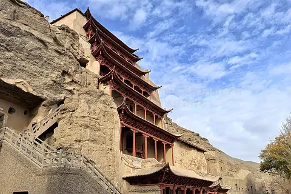
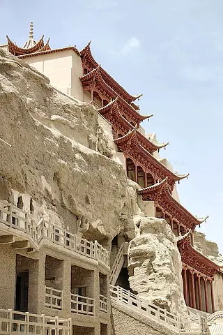

# 敦煌莫高窟 ✨

## 🏜️ 开篇：沙漠中的美术馆

在河西走廊的最西端，在鸣沙山东麓的断崖上，有一片绵延1600米的石窟群。在这片年降水量只有42毫米、蒸发量高达2500毫米的极端干旱之地，人类创造了文明史上最不可思议的奇迹。

公元366年，一位名叫乐僔的僧人路过这里，忽见三危山上金光万道，状有千佛。他停下脚步，在崖壁上凿下了第一个洞窟。

此后的一千年，从十六国到元朝，十个朝代的人们前赴后继，在这片黄色的岩壁上凿出了735个洞窟，绘制了45000平方米的壁画，塑造了2400多身彩塑。

于是，这片寸草不生的沙漠，变成了世界上最伟大的艺术殿堂。

1987年，莫高窟被列入《世界文化遗产名录》。世界遗产委员会的评价只有一句话："莫高窟是东西方文明在丝绸之路上一个最杰出的交汇点。"

## 📜 一千年的开凿：十个朝代的接力

**公元366年 第一个洞窟**
乐僔和尚开凿了莫高窟的第一个洞窟。他不会想到，自己这一锤，开启了整整一千年的造窟史。

**北朝 乱世中的信仰**
十六国和南北朝是中国历史上最混乱的时期。战乱越频繁，人们对信仰的渴望就越强烈。这一时期的洞窟，佛像的眼神总是悲悯的，仿佛在注视着这苦难的人间。

**唐代 黄金时代**
唐代是莫高窟的鼎盛时期。将近一半的洞窟都是唐代开凿的。这一时期的佛像丰满、圆润、安详，壁画色彩艳丽、线条飞扬，你能从中感受到一个盛世的自信与从容。

**公元1036年 被遗忘的宝藏**
西夏占领敦煌后，莫高窟渐渐被世人遗忘。1900年，王圆箓道士在清理积沙时，意外发现了藏经洞——那个封存在第17窟里的、装满了5万多件从公元4世纪到11世纪珍贵文献的密室。

**1943年 守护的开始**
敦煌艺术研究所成立，常书鸿、段文杰、樊锦诗……一代又一代的"敦煌人"来到这片沙漠，把自己的一生都献给了这些洞窟。他们把这个过程叫做"面壁"。

---

## 🌟 核心洞窟详解

### 📍 第96窟 九层楼：莫高窟的标志

这是每一个来到莫高窟的人看到的第一个画面。这座依山而建的红色木构建筑，高45米，从崖壁上拔地而起，在周围土黄色的映衬下，显得格外庄严、格外震撼。

这就是第96窟，俗称"九层楼"，莫高窟的第1窟。

里面供奉的是世界上最大的室内弥勒佛像——高35.5米，一个手指就有2米长。这尊佛像建于武周证圣元年（695年），武则天称帝的第五年。据说佛像的面容，就是按照武则天的样貌塑造的。

**仰望大佛的感受**：
站在洞窟里向上仰望，你会觉得自己特别渺小。佛像低垂的目光穿越了1300年的时光，静静地注视着每一个来访者。那种感觉，不是震撼两个字可以形容的。

**最佳拍摄时间**：
- **上午9-11点**：阳光正好照到九层楼的正面，红色的木构在蓝天下特别鲜艳
- **下午4-6点**：夕阳把岩壁染成金色，是拍九层楼剪影的最佳时间

> 💡 **注意！**
> 九层楼里面是不能拍照的。所有的洞窟里面都不允许拍照——闪光灯会对壁画造成不可逆的伤害。把眼睛当成最好的相机，把感动记在心里。

---

### 📍 崖壁长廊：历史的纵深感

这张照片完美展现了莫高窟的尺度感。从北魏到元朝，十个朝代的工匠在这面崖壁上上下下，凿出了700多个洞窟。你站在这些栈道上，脚下踩的不是木头，而是一千年的时光。

**你不知道的莫高窟**：
- **洞窟编号**：从南到北，从上到下，一共735个洞窟，编号到1000多号（中间有空号）
- **南区 vs 北区**：南区的492个洞窟是有壁画和彩塑的"艺术窟"，北区的200多个洞窟是僧人们居住修行的"生活窟"
- **栈道**：古代的栈道是木头做的，很多都毁了。现在的栈道都是后来重修的，为了保护洞窟
- **为什么不开更多洞窟**：壁画太脆弱了，游客的呼吸、水汽、温度变化，都会对它造成伤害。现在每天开放的洞窟都不一样，轮流"休息"

**游览建议**：
不要急着赶下一个洞窟。就在这栈道上站一会儿，吹吹沙漠里的风，看看远处的三危山。你会突然明白，为什么一千年前的人们会选择在这个地方修行——这里离尘世很远，离佛很近。

---

### 📍 藏经洞（第17窟）：世界学术的伤心地
1900年5月26日，王圆箓道士在清理第16窟甬道的积沙时，意外发现了一扇隐藏的门。门后面，是一个长宽各2.6米、高3米的密室——里面堆满了从公元4世纪到11世纪的5万多件经卷、文书、织绣、画像。

这就是震惊世界的藏经洞。

但发现，却是一场浩劫的开始。

1907年，斯坦因来了，用200两银子骗走了7000多件最精美的经卷和绘画；
1908年，伯希和来了，用500两银子挑走了剩下的精华；
1910年，清政府终于下令把剩下的经卷运往北京——运到北京的时候，又被各级官员偷走了一大半。

今天，藏经洞里的文物，散落在全世界十几个国家的博物馆里。

陈寅恪先生说："敦煌者，吾国学术之伤心史也。"

---

## 🎨 莫高窟的艺术：墙壁上的博物馆

很多人问：莫高窟的壁画，到底好在哪里？

它好在**一千年的时间跨度**。从北魏的粗犷，到隋代的华丽，到唐代的飞扬，到宋代的细腻，到元代的苍茫——你在这一面面墙上，能看到整整一千年的审美变迁。

它好在**东西方的融合**。这里有希腊的艺术、波斯的纹样、印度的佛教、中国的神仙——丝绸之路上所有文明的精华，都汇聚在了这面墙上。

它好在**对美的极致追求**。那些画工们没有留下名字，他们不是什么"大师"，只是普通的工匠。但他们把自己对佛的理解、对美的理解，一笔一笔画在了墙上。一千年过去了，那些线条依然在飞扬，那些颜色依然在发光。

**必须看的几幅壁画**：
- **第257窟 九色鹿**：北魏壁画的代表作，连环画的鼻祖，配色高级到不可思议
- **第217窟 化城喻品**：唐代山水画的巅峰，比《富春山居图》早了600年
- **第158窟 涅槃像**：全世界最美的卧佛，佛的表情安详得让人想哭
- **第3窟 千手千眼观音**：元代密宗绘画的巅峰，每一只手都画得清清楚楚

## 🎯 游览实用指南

### 🚗 交通指南
- **飞机**：北京/上海/兰州/西安 → 敦煌机场，机场到市区20分钟，到莫高窟30分钟
- **火车**：兰州 → 敦煌，旅游专列12小时，睡一觉就到
- **市区到莫高窟**：有直达公交，也可以打车，约30元
- **数字展示中心**：所有游客必须先到数字中心看电影，然后坐景区大巴去窟区

### 🎫 门票信息（2025年参考）
- **A类票（推荐）**：238元，看8个实体洞窟+2场电影+讲解，每天限量6000张
- **B类票**：100元，看4个实体洞窟，没有数字电影，不限量
- **特窟**：每个150-200元，需要另外预约，每天开放的特窟不一样
- **预约**：至少提前7天在"莫高窟参观预约网"预约！旺季（7-8月）提前15天！

### ⏰ 最佳游览时间
- **5-6月、9-10月**：天气最好，游客相对较少
- **7-8月**：最热，但也是暑假，人最多
- **11-4月**：淡季，人少，门票便宜，体验最好！
- **建议游览时长**：半天（A类票约4.5小时）

### 📝 参观小贴士（非常重要！）
1. ❌ **绝对不能拍照**：所有洞窟内禁止拍照，手机也不行，会有工作人员盯着
2. ✅ **带外套**：洞窟里比外面低5-10度，夏天也凉
3. ✅ **穿舒服的鞋**：要走很多路，还要爬很多台阶
4. ✅ **认真听讲解**：没有讲解，你看到的只是一面面墙。跟紧讲解员，你会看到一个全新的世界
5. ❌ **不要摸墙壁**：手上的油脂会对壁画造成伤害
6. ✅ **淡季去！**：人少，看得细，体验好10倍

## 💫 结语：我们为什么要去敦煌

很多人从莫高窟回来，说的第一句话都是："我看不懂，但我大受震撼。"

是的。你可能看不懂那些佛经故事，可能看不懂那些复杂的纹饰，可能分不清哪个朝代的佛像。但你一定会被那种穿越千年的力量所震撼。

你会想：一千年啊。十个朝代。那么多人，把自己的一生，都花在了这面岩壁上。他们有的是虔诚的僧人，有的是逃难的工匠，有的是出资的富商，有的是驻守的士兵。他们没有留下名字，他们只是在这黑暗的洞窟里，一笔一笔地画，一锤一锤地凿。

一千年过去了，王朝覆灭了，军队消失了，那些人的名字也被风沙吹散了。但这些画，这些佛像，还在。

这就是文明的力量。它比任何王朝都长寿，比任何战争都强大。

所以，去一次敦煌吧。不是为了"打卡"，不是为了"到此一游"。

是为了站在那片黄色的崖壁下，亲身体会一下——
什么是，一眼千年。

> 📌 **旅行感悟**：
> 季羡林先生说："世界上历史悠久、地域广阔、自成体系、影响深远的文化体系只有四个：中国、印度、希腊、伊斯兰，再没有第五个。而这四个文化体系汇流的地方只有一个，就是中国的敦煌和新疆地区，再没有第二个。"
>
> 这就是敦煌的意义——它不是一个景点，它是整个人类文明的骄傲。

---

*本页内容基于实景图片分析与敦煌学研究整理，由AI导游系统2025年6月生成*
