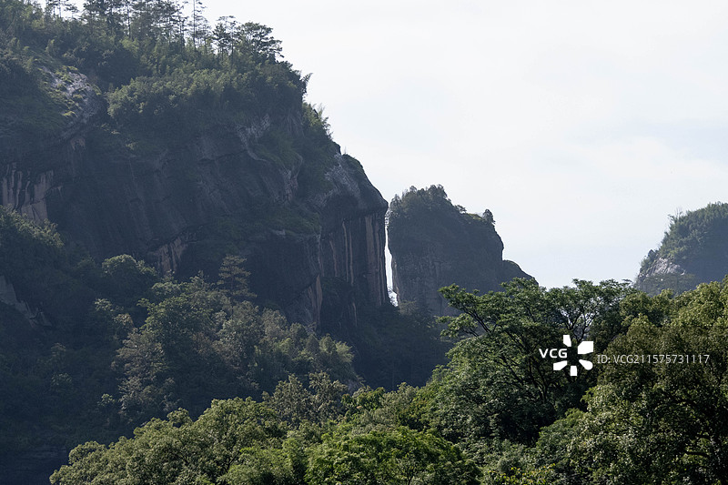
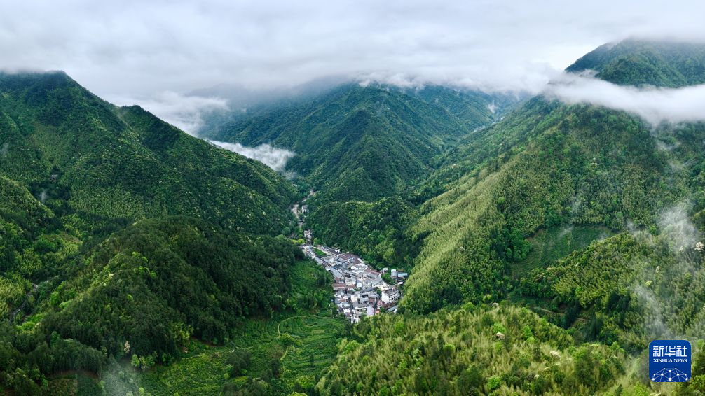

# 武夷山 ✨

## 🏔️ 开篇：活着的中国山水画

如果说中国的山水画有一个原型，那一定是武夷山。

在福建与江西的交界处，有这样一片山——红色的砂砾岩被亿万年的流水切割，形成了三十六峰、七十二洞、九十九岩。丹山傍着碧水，云雾绕着茶园，随便按下一次快门，就是一幅现成的水墨画。

但武夷山又不仅仅是一座山。

它是世界自然与文化双重遗产——全中国只有4个。

它是乌龙茶的故乡、大红袍的祖庭——全世界的乌龙茶都源自这里。

它是朱熹讲学四十余年的地方——"东周出孔丘，南宋有朱熹。中国古文化，泰山与武夷。"

它是绵延了两千年的古茶道起点——晋商从这里出发，把茶叶运到俄罗斯，走出了一条堪比丝绸之路的"万里茶路"。

一座山，改变了整个世界的喝茶习惯。

这就是武夷山。

## 🍵 山与茶：千年的约定

**公元8世纪 陆羽与武夷茶**
茶圣陆羽在《茶经》中写道："岭南，生福州、建州、韶州、象州……往往得之，其味极佳。"其中的建州，就是今天的武夷山一带。这是武夷茶在历史上的第一次登场。

**宋代 北苑贡茶**
宋代是武夷茶的第一个黄金时代。当时建州的"北苑贡茶"是皇家专属，一斤团茶价值黄金二两。文人雅士们为了喝到一口正宗的武夷茶，不惜千里迢迢来到武夷山。

**17世纪 影响世界**
荷兰人把武夷茶带到欧洲，从此"茶"成为了风靡全世界的饮料。在英语里，茶叫"tea"——这个发音就来自武夷山方言的"茶"。

**18世纪 大红袍诞生**
武夷山天心永乐禅寺的僧人，在九龙窠的岩壁上种下了6棵茶树。谁也没想到，这6棵茶树后来会成为全世界最昂贵的茶叶——它们就是"大红袍"的母树。

今天，这6棵母树已经停止采摘，作为文物被永久保护了起来。

---

## 🌟 核心景点详解

### 📍 九曲溪丹霞：水墨画的实景版

这就是最典型的武夷山——红色的砂砾岩被流水切割了亿万年，形成了这刀削斧劈一般的峭壁。你看那岩壁上一道道纵向的水痕，那不是画出来的，是几千万年的雨水一滴一滴冲刷出来的。

**武夷山的特别之处**：
- **丹霞地貌的教科书**：发育最完整、最典型的中国丹霞
- **"三三六六"**：九曲清溪绕着三十六峰，每一曲都有不一样的风景
- **植物王国**：2500多种植物，很多是武夷山独有的
- **蛇的王国**：50多种蛇，是中国蛇类最密集的地方之一（不用怕，都在深山中）

**最佳观景时间**：
- **清晨5-7点**：山间云雾缭绕，是拍"水墨武夷山"的最佳时间
- **雨后初晴**：空气通透，远山的层次最丰富
- **傍晚日落**：夕阳把岩壁染成金色，"晚对峰"因此得名

> 💡 **导游贴士**：
> 看武夷山不要只看"景点"。找一个高处，就静静地坐着，看云在山间飘，看光线在岩壁上移动。看半小时，你就会明白——为什么中国的山水画，画的都是这样的山。

---

### 📍 白云深处有人家：山谷中的茶村

这张航拍照片，完美展现了武夷山最真实的样子——绿色的山峦连绵起伏，山谷中间，藏着小小的村庄。村子的周围，一圈一圈的全是茶园。

这就是武夷山人的生活：开门见山，出门是茶。

**武夷山的茶村**：
- **星村镇**：九曲溪漂流的起点，也是武夷岩茶最大的集散地
- **天心村**："正宗岩茶出天心"，离核心景区最近的村子
- **桐木村**：正山小种的发源地，全世界红茶的鼻祖
- **下梅村**：万里茶路的起点，晋商曾经从这里把茶叶运到俄罗斯

**来武夷山一定要做的事**：
找一户茶农家，坐下来喝一杯茶。不需要是昂贵的"大红袍"，就喝茶农自己喝的"肉桂"或者"水仙"。用山泉水泡，一杯入口，你会尝到阳光的味道、岩石的味道、云雾的味道——那就是武夷山的味道。

> 💡 **喝茶提醒**：
> 不要在景区门口买茶！也不要相信什么"百年老树大红袍"。真正的好茶都在茶农家里，不贵，而且正宗。记住：喝茶，喝的是自己喜欢的味道，不是价格标签。

---

### 📍 九曲溪漂流：中国最美的溪流

"不坐竹筏，枉到武夷。"

九曲溪是武夷山的灵魂。全长9.5公里，蜿蜒曲折地穿过三十六峰之间。坐一张竹筏，从九曲顺流而下到一曲——这是全世界独一无二的体验。

**九曲溪的正确打开方式**：
1. **不要说话**：静静地坐，听溪水声、撑杆声、鸟鸣声
2. **不要拍照**：把手机收起来，用眼睛看。照片拍不出那种身临其境的感觉
3. **低头看水**：水清澈得可以看到水底的鹅卵石和小鱼
4. **抬头看山**：从水里看山，山是倒过来的，别有一番味道

"溪流九曲泻云液，山光倒浸清涟漪。"
——这是800多年前朱熹写的九曲棹歌。今天你坐竹筏的时候，看到的风景，和朱熹看到的，几乎一模一样。

---

## 🍃 武夷岩茶：一杯茶的哲学

很多人说，武夷岩茶是"茶中君子"。

为什么？因为它生长在岩石的缝隙里。武夷山的茶农说："岩岩有茶，非岩不茶。"真正的好岩茶，都是长在岩壁的缝隙里，吸收了岩石的矿物质，才有了那种独一无二的"岩韵"。

就像中国人常说的："宝剑锋从磨砺出，梅花香自苦寒来。"

环境越恶劣，茶的味道反而越醇厚。

这哪里是在喝茶——这是在喝一种人生哲学啊。

**武夷岩茶的四大名丛**：
- **大红袍**：茶中之王，香气霸道，回甘持久
- **白鸡冠**：汤色清淡，香气清雅，像一位白衣书生
- **铁罗汉**：茶汤厚重，滋味浓烈，像一位江湖侠士
- **水金龟**：香气悠长，滋味醇和，像一位得道高僧

> 喝茶的时候，不要问"这茶多少钱一斤"。
> 闭上眼睛，去感受那杯茶在你嘴里的变化——从苦到甜，从涩到润。
> 那就是时间的味道，是山的味道，是人生的味道。

---

## 🎯 游览实用指南

### 🚗 交通指南
- **高铁**：福州/厦门 → 武夷山北站/南平市站，车程1-1.5小时
- **飞机**：北京/上海/广州 → 武夷山机场，机场就在景区旁边
- **景区内交通**：门票包含观光车，可以无限次乘坐，非常方便
- **出租车**：起步价不贵，但景区之间距离较远，建议坐观光车

### 🎫 门票信息（2025年参考）
- **三日票**：225元（包含门票+观光车，3天内有效，强烈推荐！）
- **一日票**：140元
- **九曲溪竹筏**：130元（必须单独买，一定要提前预约！）
- **《印象大红袍》演出**：218元起（张艺谋导演，非常推荐）
- **预约**：关注"武夷山"公众号，可以提前10天预约竹筏，旺季一定要提前！

### ⏰ 最佳游览时间
- **4-5月**：春天，满山新绿，是喝茶的最佳季节
- **9-11月**：秋天，天气凉爽，游客相对较少
- **6-8月**：夏天，可以漂流，但比较热，注意防晒
- **建议游览时长**：2天1晚是基础，3天2晚最佳，住一晚才能感受到武夷山的静

### 🗺️ 推荐路线
**经典三日游**：
- **第一天**：九曲溪竹筏 → 武夷宫 → 晚上看《印象大红袍》
- **第二天**：天游峰（不登天游，等于白游）→ 桃源洞 → 晚上去茶农家喝茶
- **第三天**：虎啸岩 → 一线天 → 大红袍母树 → 返程

**懒人两日游**：
- **第一天**：九曲溪竹筏 → 武夷宫 → 晚上看演出
- **第二天**：天游峰 → 大红袍 → 返程

### 🍜 武夷山美食
- **武夷熏鹅**：武夷山第一名菜，又香又辣，回味无穷
- **红眼鱼**：九曲溪里的鱼，肉质细嫩，清蒸最好
- **笋干烧肉**：武夷山的笋，全国最好的笋之一
- **猫爪菇**：武夷山特产的蘑菇，口感脆脆的
- **紫溪粉**：当地人的早餐，一定要试试

## 💫 结语：武夷山，来了就不想走

很多地方，你去一次就够了。但武夷山不是。

第一次来，你看的是风景——看山看水看九曲溪。
第二次来，你喝的是茶——坐在茶农家，一下午一下午地喝。
第三次来，你什么都不做——就找个地方坐着，看云，发呆。

武夷山不是那种让你惊叹"哇好美"然后拍照走人的景区。
它是那种让你慢下来的地方——慢到你能听到风吹过茶叶的声音，慢到你能感受到时间在山里流淌的速度。

很多人来了武夷山，就再也不想走了。

因为这里的山，这里的水，这里的茶，这里的慢——
会让你突然明白：
原来，人生不需要那么快。

原来，最好的生活，就是在一座山里，有一杯好茶。

> 📌 **旅行感悟**：
> 山还是那座山，茶还是那杯茶。
> 一千年前朱熹看到的风景，今天你也能看到。
> 一千年后，还会有人来到这里，看着同样的山，喝着同样的茶。
>
> 原来，人这一辈子，能有一座山、一杯茶，就足够了。

---

*本页内容基于实景图片分析与武夷茶文化整理，由AI导游系统2025年6月生成*
