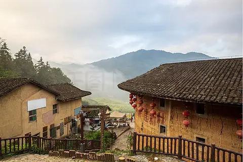
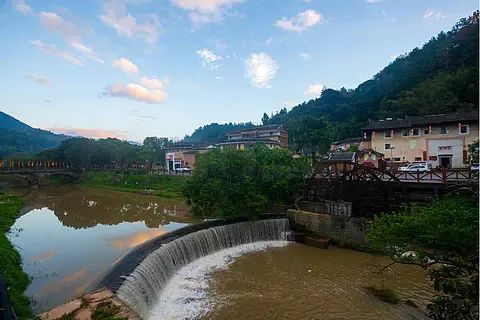

# 福建土楼 ✨

## 🏠 开篇：来自东方的神秘圆环

在闽西南的崇山峻岭之间，散落着成千上万座像飞碟一样的环形建筑。几百年来，它们就这样静静地伫立在那里，与青山绿水为伴，过着与世隔绝的生活。

直到上世纪六七十年代，美国的侦察卫星在太空拍下了这些神秘的圆环。情报人员吓了一跳——他们以为这是中国秘密建造的"核导弹发射井"！这个误会直到80年代才被解开，全世界也因此发现了这颗隐藏在中国深山中的建筑瑰宝。

这就是福建土楼——世界上独一无二的、用生土夯筑而成的巨型民居建筑。

2008年，福建土楼被列入《世界文化遗产名录》。联合国教科文组织的评语是："土楼是世界上独一无二的、神话般的山区建筑模式。"

## 📜 五百年的家园：聚族而居的智慧

**唐宋 从中原到闽南**
土楼的建造者，是历史上几次"衣冠南渡"中从中原迁徙到南方的客家人。为了躲避战乱，他们深入闽西南的崇山峻岭，聚族而居，建造了这种既可以防御、又适合大家族居住的建筑形式。

**明清 土楼的黄金时代**
我们今天看到的土楼，大多建于明清时期。当时闽南地区匪患严重，客家人便建造了这种像城堡一样坚固的建筑——厚厚的土墙，只留一个大门，里面有水井、有粮仓、有几百间房间，就算被围几个月，里面的人照样生活。

**振成楼 土楼王子**
建于1912年的振成楼，是土楼建筑艺术的巅峰。它的设计者洪坑村的林氏兄弟，借鉴了《易经》中的八卦原理，把一座土楼建成了"外土内洋"的神奇建筑——外墙是传统的生土墙，里面却是中西合璧的砖木结构。

## 🌟 核心建筑详解

### 📍 初溪土楼群：大山深处的飞碟群

这是福建土楼最经典的画面——黄土墙、黑瓦顶、大红灯笼，背景是连绵的青山和缭绕的晨雾。站在观景台上向下望去，几十座大小不一的圆形、方形土楼散落在山谷之间，就像外星人遗落在人间的飞碟。

**初溪土楼群的特别之处**：
- **年代久远**：最古老的集庆楼建于1419年，距今已经600多年
- **布局奇特**：所有土楼都坐南朝北，背靠大山，面朝溪流
- **原汁原味**：这里游客相对较少，还保留着土楼原本的生活气息
- **姓氏单一**：整个村子的人都姓徐，都是一个祖先的后代

**最佳拍摄时间**：
- **清晨6-8点**：晨雾缭绕，炊烟袅袅，是拍摄土楼的黄金时间
- **傍晚5-6点**：夕阳把土黄色的墙面染成金色，温暖而厚重
- **雨后初晴**：空气通透，远山如黛，层次感最强

> 💡 **导游贴士**：
> 不要只在观景台上拍！一定要走进村子里，踩一踩那些被几百年的脚步磨得发亮的鹅卵石路，摸一摸那些夯土墙——墙上的每一道裂痕，都是时间留下的痕迹。

---

### 📍 云水谣：溪流边的诗意栖居

这张照片里的地方，有一个很美的名字——云水谣。

一条清澈的溪流从村子中间缓缓流过，溪岸边是十几棵几百年的大榕树，最长的一棵已经600多岁了。溪上有两座古老的水车，慢悠悠地转着，转出了几百年的田园诗。

2005年，电影《云水谣》在这里取景，让这个原本叫"长教村"的地方被全国人知道。后来，村子干脆改名叫"云水谣村"。

**云水谣的正确打开方式**：
- **清晨**：在游客到来之前，沿着溪边慢慢走，看当地村民在溪边洗衣、挑水
- **午后**：找一棵大榕树，在树下的茶馆坐一下午，喝一杯客家土茶
- **傍晚**：看夕阳穿过树叶，在地上投下斑驳的光影
- **夜晚**：听溪水声，看满天繁星——这里的星空，是城市里看不到的

> 💡 **住一晚！**
> 云水谣最棒的体验是住一晚土楼民宿。晚上所有游客都走了，整个村子安静下来，只有溪水声和虫鸣声。那一刻，你才能真正懂什么叫"诗意栖居"。

---

### 📍 承启楼：土楼之王

承启楼是福建最大的圆形土楼，直径73米，四环同心圆，一共400个房间。鼎盛时期，这里住了80多户、600多人。

1986年，中国发行了一套"中国民居"邮票，其中福建民居那张，画的就是承启楼。

**你不知道的土楼冷知识**：
- **墙有多厚**：底层的土墙厚达1.5米，比城墙还厚，子弹打不透
- **怎么夯墙**：用生土、石灰、沙子、糯米汤混合，一层层夯上去，越夯越结实
- **为什么不倒**：土墙下面有大石基，整个楼的地基非常牢固，地震都不怕
- **冬暖夏凉**：厚厚的土墙是天然的空调，夏天比外面低5度，冬天高5度

---

## 🍵 客家生活：土楼里的人间烟火

很多人以为土楼是博物馆、是景点。但其实，直到今天，还有很多土楼里住着人。

清晨，第一缕阳光照进土楼的天井，主妇们开始生火做饭，烟囱里冒出袅袅炊烟；
白天，老人们坐在天井的竹椅上晒太阳、喝茶、聊天，孩子们在环形的走廊上追逐打闹；
傍晚，整个家族的人聚在一起吃饭，几百人在同一个屋檐下生活，热热闹闹的。

这种聚族而居的生活方式，在全世界都已经很少见了。

**土楼里的客家美食**：
- **客家盐酒鸡**：用客家米酒和盐腌制的鸡肉，酒香浓郁
- **梅菜扣肉**：客家人的家常菜，肥而不腻
- **客家酿豆腐**：把肉馅塞进豆腐里，是客家菜的代表
- **永定牛肉丸**：Q弹有劲，汤鲜味美
- **客家土茶**：土楼里自己种的茶，虽然不是什么名茶，但喝的是那份感觉

## 🎯 游览实用指南

### 🚗 交通指南
- **高铁**：厦门北站 → 南靖站，车程40分钟，出站后坐公交或打车到土楼
- **自驾**：厦门到土楼约150公里，车程2.5小时，路况良好
- **景区交通**：土楼各个景点之间距离较远，建议自驾或包车
- **景区大巴**：各景区之间有接驳车，但班次不多

### 🎫 门票信息（2025年参考）
- **永定土楼（洪坑土楼群）**：90元
- **永定土楼（初溪土楼群）**：70元
- **南靖土楼（田螺坑+云水谣）**：90元
- **承启楼**：50元
- **建议**：买联票比较划算，但不要贪多，一天看1-2个点足够

### ⏰ 最佳游览时间
- **3-5月**：春天，春雨绵绵，土楼在烟雨中最有感觉
- **9-11月**：秋天，天气凉爽，游客相对较少
- **春节前后**：可以体验客家年俗，非常热闹
- **建议游览时长**：2天1晚是最佳，住一晚土楼民宿

### 🗺️ 推荐路线
**经典两日游**：
- **第一天**：厦门出发 → 田螺坑"四菜一汤" → 裕昌楼（东倒西歪楼）→ 塔下村 → 住云水谣
- **第二天**：云水谣清晨散步 → 和贵楼 → 怀远楼 → 返回厦门

### ⚠️ 避坑指南
1. ❌ 不要跟"一日游"低价团，很多会强制购物
2. ✅ 一定要住一晚！白天的土楼是景点，夜晚的土楼才是生活
3. ❌ 不要在景区门口买所谓的"土楼特产"，又贵又假
4. ✅ 进土楼后可以跟当地老人家聊聊天，他们会给你讲很多土楼的故事

## 💫 结语：什么才是真正的家

今天的我们，住在钢筋水泥的楼房里，邻居是谁都不知道。

但在土楼里，几百人住在同一个屋檐下，同一个大门进出，同一个天井晒太阳。谁家做了好吃的，会端一碗给邻居；谁家孩子没人看，全楼的人都会帮忙照顾；谁家有红白喜事，全楼的人都来帮忙。

这就是客家人的"家"——不是一个封闭的小房间，而是一个几百人的大家族。

站在土楼中央的天井里，抬头望着那一圈圆形的天空，你会突然明白：

原来，最好的建筑，不是用最贵的材料做的。
最好的建筑，是能装下生活、装下亲情、装下几百年烟火气的地方。

这就是土楼的魅力。它不是什么"世界奇观"，它只是一个——家。

> 📌 **旅行感悟**：
> 我们看土楼，看的不是建筑的奇特。
> 我们看的，是一种已经快要消失的生活方式——那种邻里之间亲如一家、整个家族守望相助的温暖。
>
> 毕竟，建筑会老，墙会开裂，瓦会脱落。
> 但只要有人在，有家在，土楼就永远活着。

---

*本页内容基于实景图片分析与客家文化历史整理，由AI导游系统2025年6月生成*
