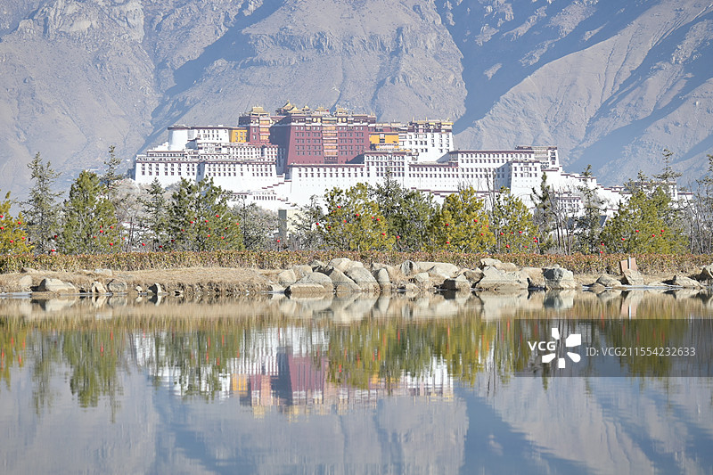
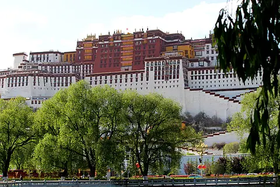

# 布达拉宫 ✨

## 🏔️ 开篇：海拔3700米的信仰

在拉萨市中心的红山上，有一座建筑。

它不是世界上最高的建筑，但它可能是世界上"最高"的建筑——不是海拔的高度，而是在人们心中的高度。

它是布达拉宫。

每一个来到拉萨的人，做的第一件事都是一样的：远远地望着它，然后发呆。
不知道为什么，就是想望着它。
望着那座红白相间的建筑，在蓝天和白云的映衬下，安安静静地立在那里。
你会突然想哭。
不是因为悲伤，不是因为感动。
就是一种很奇怪的、很平静的、想哭的感觉。

很多人说，那是灵魂找到了归宿的感觉。

1994年，布达拉宫被列入《世界文化遗产名录》。联合国教科文组织说："布达拉宫是世界上最杰出的建筑群之一，它的历史、文化和艺术价值，超越了时空的界限。"

## 📜 一千三百年的故事

**公元641年 故事的开始**
松赞干布为了迎娶文成公主，在红山上修建了一座宫殿。那是布达拉宫最早的样子。

那一年，文成公主16岁。
她从长安出发，走了整整三年，才走到拉萨。
她带去了释迦牟尼十二岁等身像，带去了丝绸、茶叶、造纸术、酿酒术。
她改变了整个西藏的历史。

**公元1645年 五世达赖的重建**
原来的宫殿在战火中被毁了大半。五世达赖喇嘛决定重建布达拉宫。
这一建，就是半个世纪。
无数的工匠、无数的信徒，用了整整五十年的时间，才建成了今天我们看到的这座宫殿。

**1959年 从宫殿到博物馆**
十四世达赖喇嘛出走印度。布达拉宫不再是政教合一的权力中心。
它变成了一座博物馆，向全世界开放。

**1989年 第一次大修**
国家投入了5300万元，对布达拉宫进行了历史上最大规模的维修。
那一次，光金顶就用了30公斤黄金。

今天的布达拉宫，已经1300多岁了。
它见过了太多的王朝更迭，见过了太多的生离死别，见过了太多的世事变迁。
但它还是安安静静地立在那里。
看着日升月落，看着人来人往。

---

## 🌟 布达拉宫的秘密

### 📍 倒影中的圣殿

这是布达拉宫最经典的拍照角度——从南面的药王山望过去，布达拉宫倒映在平静的湖面上。蓝天、白云、红山、白宫、红宫，完美地对称在水中。

很多人不知道，这个角度，就是50元人民币背面的那个图案。

**你不知道的布达拉宫数字**：
- **海拔3756米**：是世界上海拔最高的古代宫殿
- **高117米**：从山脚到金顶，一共13层
- **房间数量**：没有人知道准确数字，有人说1000间，有人说999间
- **墙厚**：最厚的地方有5米，最薄的地方也有1米
- **黄金**：整个布达拉宫用了大约30吨黄金，光金顶就用了近10吨

**最佳拍摄时间**：
- **早上8-10点**：太阳从东边照过来，布达拉宫正面被照亮
- **傍晚6-8点**：夕阳把布达拉宫染成金色，是拍夜景的最佳时间
- **晚上9点以后**：所有的灯都亮起来了，布达拉宫变成了一座金色的宫殿

> 💡 **拍照小贴士**：
> 不要只在布达拉宫广场拍！
> 过马路，去对面的药王山观景台。那是50元人民币的同款角度，是拍布达拉宫的最佳位置。
> 早一点去，人少。

---

### 📍 仰视角的震撼

这张照片是从正面往上拍的。你看，白色的白宫，红色的红宫，金色的金顶。一层一层，像台阶一样，直插云霄。

站在布达拉宫的脚下向上望，你会觉得自己特别渺小。
那是一种很奇怪的感觉——你明明知道它只有117米高，比很多高楼都矮，但你就是觉得它高不可攀。

这就是布达拉宫的魔力。
它的高度，不是用尺子量的。
是用人心量的。

**白宫和红宫的区别**：
- **白宫**：白色的部分，是达赖喇嘛生活起居和处理政务的地方
- **红宫**：红色的部分，是供奉佛像和进行宗教活动的地方
- **黄色**：黄色的房间是最重要的，只有佛殿和达赖的寝宫才能用黄色

**那些墙为什么这么白？**
布达拉宫的墙，每年都要刷一次。
用的是牛奶、白糖、蜂蜜，还有藏红花。
所以布达拉宫的墙，是甜的。
每年雪顿节之后，都会有信众自愿来刷墙。
他们说，能给布达拉宫刷墙，是积德行善。

---

### 📍 金顶群：黄金铸就的天空

布达拉宫的顶上，有七座金顶。
都是用黄金包裹的。
在阳光下闪闪发光，几公里外都能看到。

金顶下面，是历代达赖喇嘛的灵塔。
五世达赖的灵塔最大，用了11万两黄金，上面镶嵌了两万多颗宝石。
有人算过，那一座灵塔的价值，相当于半个世界。

但布达拉宫最珍贵的，不是黄金。
是那些经书，那些佛像，那些一千三百年留下来的、看不见摸不着的、信仰的力量。

---

## 🙏 布达拉宫的正确打开方式

很多人上布达拉宫，跟着导游走，一个殿接一个殿地看，看完就忘了。

布达拉宫不是这样看的。

布达拉宫是要"感受"的。

你不需要记住每个殿的名字，不需要记住每个佛的故事。
你只要安安静静地走，安安静静地看。
看那些磕长头的人，看那些转经的老人，看那些酥油灯的火苗，看那些在空气中浮动的尘埃。

把手机收起来。
把嘴闭上。
把心打开。

你会听到的。
听到那些穿越了一千年的、诵经的声音。

**一定要做的几件事**：
1. 围着布达拉宫转一圈经（走一圈大约40分钟）
2. 在药王山拍一张50元人民币同款照片
3. 晚上在广场看一次布达拉宫的夜景
4. 早上看一次信徒们磕长头
5. 什么也不做，就坐在广场上，发一小时的呆

---

## 🎯 游览实用指南

### 🚗 交通指南
布达拉宫就在拉萨市中心，去哪里都方便。

**怎么到布达拉宫**：
- **从火车站**：坐13路公交，或者打车，约30元
- **从机场**：坐机场大巴到民航局，下车步行10分钟就到
- **市内**：打车起步价10元，几乎哪里到布达拉宫都是10块钱
- **步行**：住在大昭寺附近的话，走路20分钟就到

### 🎫 门票信息（2025年参考）
这是全中国最难预约的门票，没有之一。

- **旺季（5-10月）**：200元，每天限流5000人
- **淡季（11-4月）**：100元，相对好约
- **预约方式**：关注"布达拉宫票务预订系统"微信小程序，每天早上7点放票
- **重要提示**：旺季一定要提前7天预约！当天约是肯定约不到的！
- **讲解**：官方讲解100元/次，强烈建议请！没有讲解，你看的就是一堆房子
- **注意**：门票分预约票和参观票，预约票只能到门口，进去还要买参观票

### ⏰ 最佳游览时间
- **早上9点之前**：人最少，光线最好
- **建议游览时长**：2-3小时，不要赶时间，慢慢看
- **参观时间限制**：1小时（从进入白宫开始算，所以不要在一个地方待太久）

**最佳季节**：
- 首选：5-6月，9-10月，天气好，人相对少
- 次选：7-8月，暑假，人最多，但也是西藏最美的时候
- 冬季：11-3月，人特别少，门票便宜，体验感最好

### 🗺️ 参观路线
布达拉宫的路线是单向的，不走回头路：
南门进 → 无字碑 → 白宫 → 红宫 → 山顶 → 西门出

**参观顺序**：
1. 提前1小时到南门，凭预约票进入
2. 爬台阶到白宫门口（这段是免费的，很多人在这里拍照）
3. 买参观票，进入白宫
4. 依次参观白宫、红宫、各个殿
5. 从西门出来，下山

### ⚠️ 非常重要的注意事项
1. ❌ **不能戴帽子**，不能戴墨镜，不能穿短裙短裤
2. ❌ **殿内绝对不能拍照**，抓到会被罚款，严重的会被拘留
3. ✅ **可以带水**，但不能带氧气瓶（里面不缺氧）
4. ✅ **慢慢走**，不要跑跳，海拔3700米，很容易高反
5. ❌ **不要踩门槛**，藏传佛教里门槛是佛的肩膀
6. ✅ **顺时针走**，所有地方都是顺时针，不要逆行

### 🏨 住宿建议
一定要住在能看到布达拉宫的房间！
虽然贵一点，但绝对值。

早上醒来，拉开窗帘，第一眼就能看到布达拉宫。
那种感觉，是多少钱都买不来的。

**推荐区域**：
- 北京中路：正对布达拉宫，看景最佳
- 大昭寺附近：生活方便，逛吃方便
- 仙足岛：比较安静，适合休息

### 🍜 拉萨美食
- **藏面**：藏式面条，硬硬的，配着牦牛肉汤吃
- **酥油茶**：咸的，很多人喝不习惯，但抗高反效果一流
- **甜茶**：甜的，类似奶茶，很好喝，一壶10块钱
- **牦牛肉火锅**：来西藏一定要吃一次
- **酸奶**：特别酸，要加很多糖，但很好吃

### ⛰️ 高反注意事项
这是所有人最关心的问题：
1. 刚来的前三天，不要洗澡，不要洗头，不要剧烈运动
2. 多喝水，多休息，少说话
3. 不要喝酒，不要抽烟
4. 高反是正常的，头痛、失眠都是正常的，不要害怕
5. 实在难受去医院，不要硬扛
6. 不要有心理负担，心理作用比生理作用更大

## 💫 结语：每个人心中都有一座布达拉

很多人问我："布达拉宫值不值得去？"

我说："值得。"

不是因为它有多宏伟，不是因为它有多珍贵。
是因为当你站在布达拉宫的脚下，看着那些一步一磕头的信徒，看着那些手摇转经筒嘴里念念有词的老人，看着那些从几千公里外磕长头磕到拉萨的人——
你会突然明白：
人这一辈子，总该相信点什么。

我们生活在一个什么都不相信的时代。
我们不相信爱情，不相信理想，不相信永恒。
我们只相信钱，只相信自己，只相信看得见摸得着的东西。

但在拉萨，在布达拉宫，你会看到另一种生活方式。
你会看到有人为了一个看不见摸不着的信仰，愿意用几年的时间，磕几万公里的长头。
你会看到有人把一辈子的积蓄，都捐给寺庙。
你会看到有人什么都不求，只是日复一日地转经、磕长头。

那是一种我们已经忘记了的、最纯粹的快乐。

所以来一次布达拉宫吧。
不是为了打卡，不是为了发朋友圈。
是为了在这个海拔3700米的地方，找一找自己的灵魂。

> 📌 **旅行感悟**：
> 有人说，到了拉萨，身体在地狱，眼睛在天堂，灵魂在故乡。
>
> 这句话是对的。
>
> 布达拉宫从来都不是一个景点。
> 它是一种信仰，一种归宿，一种灵魂的安放。
>
> 每个人的心里，都应该有一座布达拉宫。

---

*本页内容基于实景图片分析与西藏文化研究整理，由AI导游系统2025年6月生成*
