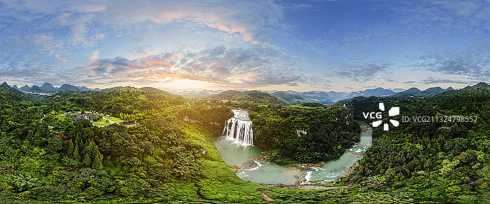
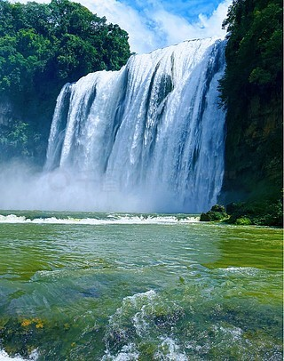
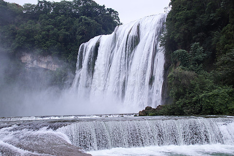
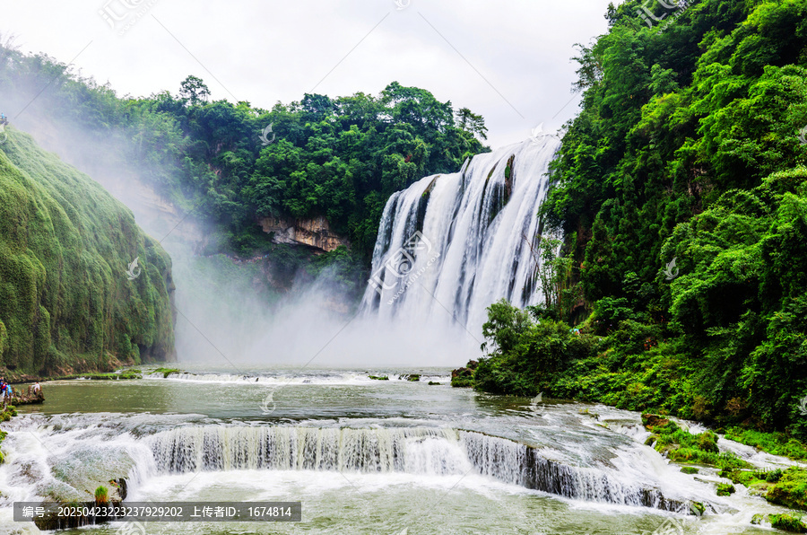

# 黄果树大瀑布景区 💦

## 🌊 开篇：中华第一瀑

"捣珠崩玉，飞沫反涌，如烟雾腾空，势甚雄厉。"

三百多年前，徐霞客在他的游记里写下了这段话。那是中国人第一次用文字记录下黄果树大瀑布的震撼。三百年后，这座高77.8米、宽101米的大瀑布，已经成为了中国最著名的瀑布，是贵州旅游的第一张名片。

黄果树瀑布不是一座孤立的瀑布，它是一个瀑布群。在它周围163平方公里的土地上，分布着18个大小不同、风格各异的瀑布。有宽缓的陡坡塘瀑布，有秀美的银链坠潭瀑布，有险峻的滴水滩瀑布……它们像一串珍珠，散落在贵州的喀斯特群山之中。

但是黄果树最特别的，是它的声音。离瀑布还有几公里，你就能听到它的轰鸣。越往前走，声音越大，直到你站在瀑布脚下，那声音会震得你耳膜发麻。那是水流从七十多米高处砸下来的声音，是大自然最原始、最有力量的呐喊。

来黄果树吧。不是为了拍一张打卡照，而是为了感受那种被大自然的力量震撼的感觉。那种感觉，你在任何地方都体会不到。

## 📜 历史与文化：从深山秘境到世界闻名

**明崇祯十一年（1638年） 徐霞客的发现**
徐霞客是第一个详细记录黄果树瀑布的人。他在游记里写道："透陇隙南顾，则路左一溪悬捣，万练飞空，溪上石如莲叶下覆，中剜三门，水由叶上漫顶而下，如鲛绡万幅，横罩门外，直下者不可以丈数计。"正是因为徐霞客的记录，这座藏在深山里的瀑布才开始被外界知道。

**清代 文人的吟咏**
清代有很多文人墨客来到黄果树，留下了不少诗词。其中最有名的是诗人田雯的《白水河放歌》："匡庐瀑布天下称奇绝，何如白水河灌犀牛潭。银汉倒倾三叠而后下，玉虹饮涧百丈那可探。"他认为黄果树瀑布比庐山瀑布还要美。

**1940年代 第一次拍照**
中国旅行社的摄影师胡崇峻来到黄果树，拍下了第一张黄果树瀑布的照片。这张照片被刊登在《旅行杂志》上，让全国人民第一次看到了黄果树瀑布的真容。

**1980年代 旅游开发**
改革开放后，黄果树开始进行旅游开发。1982年，黄果树被列为第一批国家重点风景名胜区。1999年，黄果树被吉尼斯世界纪录评为世界上最大的瀑布群。

**2007年 5A级景区**
黄果树景区被评为国家5A级旅游景区。现在，每年有超过一千万游客来到这里，只为一睹中华第一瀑的风采。

**你不知道的冷知识**：
黄果树瀑布的名字，来源于当地的一种树——黄桷树。因为当地人发音的问题，"黄桷"慢慢变成了"黄果"。其实，黄果就是橙子，当地盛产橙子，所以也叫黄果树。

## 🌟 核心景点详解

### 📍 黄果树主瀑布：银河落九天

这就是黄果树主瀑布——全中国最著名的瀑布。照片中这道巨大的水幕，从77.8米的高处倾泻而下，砸进下面的犀牛潭，发出震耳欲聋的轰鸣。

**瀑布的数据**：
- **高度**：77.8米，相当于26层楼那么高
- **宽度**：101米，丰水期最宽可达110米
- **平均流量**：每秒16立方米，丰水期可达每秒1000立方米
- **犀牛潭**：瀑布下面的水潭，深17米，因为传说有神犀藏在里面而得名

**四季不同的瀑布**：
- **夏季（6-8月）**：水量最大，瀑布最壮观，震撼人心
- **秋季（9-11月）**：水量适中，水清见底，最适合拍照
- **冬季（12-2月）**：水量最小，瀑布变得秀气，像珠帘一样
- **春季（3-5月）**：水量逐渐增大，两岸杜鹃花盛开

**最佳观赏角度**：
- **观瀑台**：正面看瀑布，最经典的角度
- **犀牛潭边**：站在水潭边，感受水雾扑面而来
- **半山腰**：侧面看瀑布，可以看到瀑布的全貌
- **对面山上**：远眺瀑布，看它嵌在群山之中

> 💡 **导游贴士**：
> 一定要带雨衣！不管什么季节，只要离瀑布近一点，就会被水雾淋湿。景区门口卖的5块钱一件的一次性雨衣就很好用。另外，夏天来的话最好穿凉鞋，因为很多地方会有水，穿凉鞋会舒服很多。

---

### 📍 水帘洞：从瀑布后面看世界

黄果树瀑布最神奇的地方，就是你可以走到瀑布的后面去——这就是水帘洞。照片中这条藏在瀑布后面的栈道，让你可以从里面看瀑布，体验那种"飞流直下三千尺"的感觉。

**水帘洞的特点**：
- **长度**：134米，横穿整个瀑布
- **六个洞窗**：有六个洞口可以看到外面的瀑布
- **五股洞泉**：洞里有五处泉水从洞顶滴下来
- **摸瀑台**：有一个平台，你可以伸手摸到瀑布的水流

**走水帘洞的体验**：
刚进去的时候，你只能听到轰隆隆的水声。然后，从洞窗往外看，你会看到一道巨大的水幕就在你面前，离你只有几米远。阳光照进来的时候，会在洞口形成彩虹，非常漂亮。最特别的是摸瀑台，你可以伸手去触摸瀑布，感受那冰凉的水流从你的指缝间流过。

**你不知道的故事**：
86版《西游记》的水帘洞就是在这里拍的。当年剧组来到黄果树，一眼就看中了这个地方。孙悟空从瀑布飞进去的那个镜头，就是在这里拍的。现在，水帘洞门口还有孙悟空的雕像。

> 💡 **游览建议**：
> 水帘洞是单向通行的，进去了就不能回头。一定要穿雨衣，因为会被淋得很湿。手机相机一定要做好防水措施。另外，水帘洞里的路比较滑，一定要注意安全，慢慢走。

---

### 📍 陡坡塘瀑布：西游记的片头曲

在黄果树主瀑布上游一公里的地方，有这座陡坡塘瀑布。它虽然没有主瀑布高，但是比主瀑布还要宽——宽105米，是黄果树瀑布群中最宽的瀑布。

**陡坡塘瀑布的特点**：
- **高度**：只有21米，但是很宽
- **坡度缓**：瀑布的坡度比较缓，所以水流不是直泻而下，而是铺在整个岩面上流淌
- **吼声**：瀑布下面有一个溶洞，水流经过的时候会发出低沉的吼声，所以也叫"吼瀑"
- **西游记片头曲**：86版《西游记》的片头曲，唐僧师徒四人走在瀑布上面的那个镜头，就是在这里拍的

**为什么叫陡坡塘**：
"塘"就是水潭的意思。陡坡塘瀑布下面有一个很大的水潭，因为瀑布是从一个陡坡上流下来的，所以叫陡坡塘。

**最佳拍照时间**：
上午的时候，阳光从东面照过来，瀑布的水会闪闪发光。如果运气好，还能看到彩虹。陡坡塘瀑布拍照最好看的时候，不是水量最大的时候，而是水量适中的时候——这时候水流像一层透明的薄纱，非常美。

> 💡 **导游贴士**：
> 很多游客看完主瀑布就走了，错过了陡坡塘，非常可惜。一定要来看看！这里人比主瀑布少很多，可以安安静静地看瀑布，拍照也不会有人抢位置。而且，对于看着《西游记》长大的人来说，来到这里会有一种特别的亲切感。

---

### 📍 银链坠潭瀑布：最美的瀑布

在黄果树瀑布群里，有一座瀑布被公认为"最美的瀑布"——这就是银链坠潭瀑布。照片中，水流像无数条银色的链子，从漏斗形的喀斯特潭上滑落，然后掉进下面的深潭里。那种美，用语言无法形容。

**银链坠潭瀑布的特别之处**：
- **形状**：潭面是漏斗形的，像一个巨大的碗
- **水流**：水流不是直泻而下，而是沿着潭面的岩石一点点往下滑，像银链子一样
- **声音**：水流的声音不是轰鸣，而是清脆悦耳的叮咚声
- **位置**：藏在天星桥景区的最深处，很多游客都错过了

**为什么这么美**：
因为银链坠潭瀑布的岩石是可溶性的喀斯特石灰岩，经过几百万年的水流溶蚀，形成了这种独特的漏斗形状。水流从上面漫下来，被岩石上的纹理分割成无数条细流，在阳光的照射下闪闪发光，像无数条银链子坠向潭底，故名"银链坠潭"。

**徐霞客的评价**：
当年徐霞客来到这里，赞叹道："所谓珠帘钩不卷，匹练挂遥峰，俱不足以拟其壮也。"他认为，银链坠潭瀑布的美，是任何珠帘、白练都比不上的。

> 💡 **游览贴士**：
> 银链坠潭瀑布在天星桥景区的下半段。很多游客走到天星桥的高老庄就往回走了，错过了最美的风景。一定要继续往前走！走过高老庄，再走大约20分钟，你就能看到银链坠潭瀑布了。相信我，那20分钟的路，绝对值得。

---

## 🎯 游览实用指南

### 🚗 交通指南
- **高铁**：沪昆高铁到关岭站，出站后有直达景区的大巴，车程约30分钟
- **飞机**：黄果树机场，到景区车程约40分钟
- **自驾**：从贵阳出发，走沪昆高速转都兴高速，全程约1.5小时
- **景区交通**：景区很大，必须坐观光车，50元/人，两天有效

### 🎫 门票信息（2025年参考）
- **旺季（3-11月）**：160元/人，观光车50元
- **淡季（12-2月）**：150元/人，观光车50元
- **门票有效期**：两天，可以分两天游览
- **优待政策**：学生半价，60岁以上免费

### ⏰ 开放时间
- **旺季**：7:00-18:00
- **淡季**：7:30-17:30
- **建议游览时长**：一整天（三个景区都逛的话需要6-8小时）

### 🗺️ 经典游览路线

**一日精华游（最推荐）**：
上午：陡坡塘瀑布（1小时） → 黄果树主瀑布（2小时，包括水帘洞）
中午：景区内吃饭
下午：天星桥景区（3小时，一定要走到银链坠潭） → 返程

**两日深度游**：
Day1：陡坡塘 → 黄果树主瀑布 → 住黄果树镇
Day2：天星桥 → 滴水滩瀑布 → 石头寨 → 返程

### 🍜 美食推荐
- **花江狗肉**：贵州特色，味道鲜美，但是不吃狗肉的朋友可以跳过
- **安顺裹卷**：类似春卷，但是是用米皮卷的，里面有各种蔬菜和酱料，非常好吃
- **酸汤鱼**：贵州的招牌菜，用西红柿发酵的酸汤煮的鱼，开胃又好吃
- **丝娃娃**：贵阳特色，一张小面皮包各种蔬菜丝，蘸着酸汤吃

## 💫 结语：大自然的力量与美

黄果树瀑布是一个很特别的地方。

它不像黄山那样秀美，不像九寨沟那样梦幻，不像长城那样厚重。它的美，是最原始、最直接、最有力量的美。是水的力量，是大自然的力量。

站在瀑布脚下，看着那道巨大的水幕从天上倾泻而下，听着那震耳欲聋的轰鸣，感受着水雾扑面而来的清凉，你会突然觉得自己很渺小。在大自然面前，人类是多么的渺小，人类的那些烦恼是多么的微不足道。

这就是黄果树瀑布的魔力。它不仅能让你看到最美的风景，还能让你重新认识自己，重新思考人生。

很多人说，黄果树瀑布看一眼就够了，没什么好玩的。但是我觉得，黄果树不是用来看的，是用来感受的。你需要站在那里，闭上眼睛，用心去听，用心去感受，才能真正体会到它的美，它的力量。

来黄果树吧。让这道中华第一瀑，洗去你所有的烦恼，给你满满的力量。

> 📌 **旅行感悟**：
> 人生就像一条河，一路向前，永不回头。有时候我们是平缓的溪流，有时候我们是奔腾的瀑布。重要的不是我们是什么样子，而是我们一直在流动，一直在向前。就像黄果树瀑布一样，不管遇到什么阻碍，都要勇敢地跳下去，绽放出最美丽的水花。

---

*本页内容基于实景图片分析与历史资料整理，由AI导游系统2025年7月生成*
