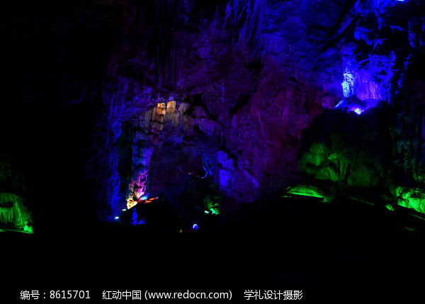
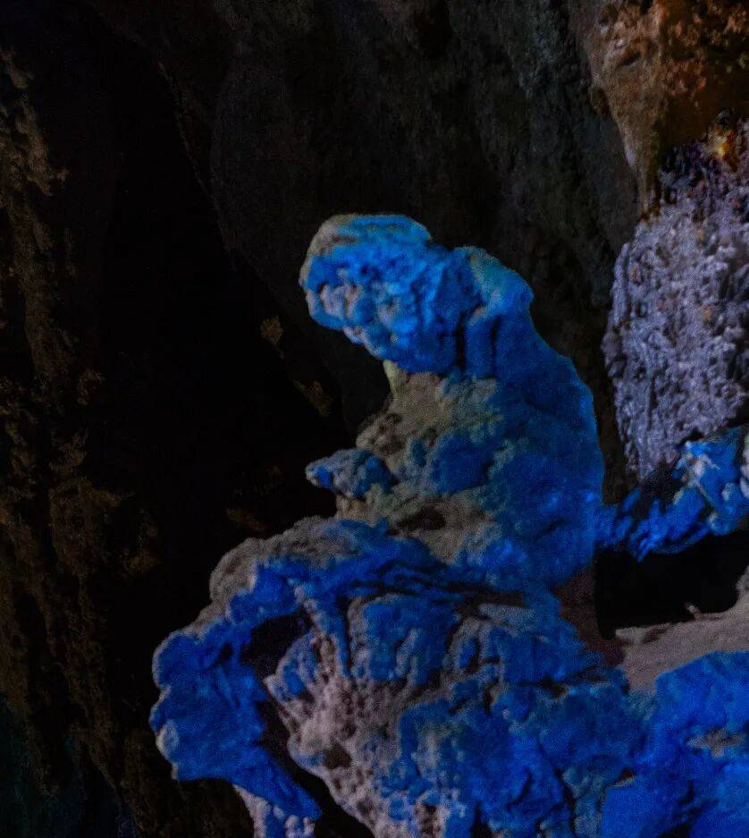

# 龙宫景区 🐉

## 💧 开篇：地下漓江，天上迷宫

"黄山归来不看岳，龙宫归来不看洞。"

在贵州的喀斯特群山里，藏着一个神奇的地下世界——龙宫。这不是一个普通的溶洞，而是一个长达15公里的地下河溶洞群。在这里，你可以坐着小船，穿过漆黑的山洞，进入一个光怪陆离的地下世界。那种感觉，就像走进了一个神话故事里的龙宫。

龙宫的美，是那种神秘的、梦幻的、超出你想象的美。几亿年的流水溶蚀，在石灰岩里雕刻出了千姿百态的钟乳石、石笋、石柱。五颜六色的灯光打在这些石头上，你会觉得它们真的有了生命——有的像龙，有的像老虎，有的像菩萨，有的像仙女。每走一步，每转一个弯，你都会看到不一样的景象，都会忍不住发出惊叹。

但是龙宫最特别的，是它的水。这里的地下河，清澈得像一块碧玉，船行在上面，就像浮在空中一样。中国原子能科学院测定，龙宫是世界上天然辐射剂量最低的地方。在这里，你呼吸的每一口空气，都是最纯净的；你看到的每一处风景，都是几亿年时光的杰作。

来龙宫吧。来看看这个地球上最神奇的地下世界，来体验一下那种穿越地心的奇妙感觉。

## 📜 历史与文化：几亿年的时光雕刻

**两亿多年前 海洋变成了陆地**
大约两亿三千万年前，这里还是一片汪洋大海。海底沉积了厚厚的石灰岩。后来，地壳运动，海洋变成了陆地，这些石灰岩露出了地面。雨水和地下水，一点点地溶蚀着这些石头，经过了两亿多年的时间，终于形成了今天我们看到的这个巨大的溶洞系统。

**明代 旅行家的发现**
最早记录龙宫的是明代的《安顺府志》。但是那时候，没有人敢深入这个地下世界。当地人传说，洞里面有龙王居住，进去的人都会被龙王吃掉。所以，几百年来，龙宫一直是一个神秘的存在，没有人敢进去探索。

**1980年代 正式开发**
1982年，当地政府组织了一支探险队，第一次深入龙宫。他们划着小船，带着手电筒，在黑暗的地下河里走了整整三天，终于探明了龙宫的全貌。1984年，龙宫景区正式对外开放，这个隐藏了几亿年的地下世界，终于展现在了世人面前。

**2007年 国家5A级景区**
龙宫和黄果树瀑布一起，被评为国家5A级旅游景区。现在，每年有超过一百万游客来到这里，参观这个神奇的地下世界。龙宫也被誉为"中国最美的水溶洞"，"天下喀斯特，尽在龙宫"。

**你不知道的冷知识**：
龙宫现在探明的地下河有15公里长，但是现在只开发了前1.8公里。也就是说，还有十几公里的地下世界，从来没有人进去过。谁也不知道那里面还有什么神奇的景象，还有什么惊喜在等着我们。

## 🌟 核心景点详解

### 📍 一进龙宫：中国最长的水溶洞

这就是龙宫最经典的体验——坐着小船游地下河。照片中这条狭窄的地下河，就是一进龙宫，全长840米，是中国最长的水溶洞。你需要坐着小船，在船夫的操控下，慢慢驶入这个漆黑的山洞。

**乘船的体验**：
刚进去的时候，你会觉得特别黑，只有船头的一点点灯光。船在水里静静地滑行，没有一点声音，只有水滴从钟乳石上滴下来的叮咚声。然后，灯光亮起来，你会看到两边的钟乳石，有的从洞顶垂下来，有的从地上长出来，千姿百态，奇形怪状。

**最刺激的时刻**：
有的地方洞顶特别低，你需要低下头才能过去，感觉那些钟乳石就要碰到你的脸了。有的地方特别窄，船几乎是擦着两边的石壁过去的。那种感觉，既刺激又神秘，就像在探险一样。

**五进龙宫的传说**：
整个龙宫一共有五进，现在只开放了前两进。传说第五进龙宫里面，有一个巨大的地下湖，湖里住着真正的龙王。当然，这只是传说，但是也给龙宫增添了很多神秘的色彩。

> 💡 **游览贴士**：
> 坐船的时候，一定要听从船夫的指挥，该低头的时候一定要低头，不然真的会撞到脑袋。另外，不要用手去摸两边的钟乳石，第一是不安全，第二是钟乳石生长很慢，一百年才长一厘米，我们摸一下，可能就破坏了它几百年的生长。

---

### 📍 龙门飞瀑：中国最大的洞中瀑布

这是龙宫最震撼的景观——龙门飞瀑。照片中这个从山洞里奔涌而出的瀑布，高38米，宽26米，是中国最大的岩溶洞穴瀑布。还没走到洞口，你就能听到巨大的轰鸣声，感受到扑面而来的水汽。

**瀑布的形成**：
龙门飞瀑的水，是从上游的天池流过来的。天池是一个岩溶漏斗，水从池底的裂缝流下去，经过地下河道，从这个洞口喷薄而出，形成了这个壮观的瀑布。因为水是从洞里流出来的，所以叫"洞中瀑布"。

**最壮观的时候**：
夏天雨季的时候，水量最大，瀑布的宽度能达到30多米，水声震耳欲聋，几百米外就能听到。阳光照在瀑布溅起的水雾上，还会形成美丽的彩虹。

**你不知道的冷知识**：
这个瀑布的出水口，其实是一个天然的溶洞。以前，探险队就是从这个瀑布后面的洞口进去，才发现了后面的龙宫暗河。现在，那个洞口已经被封起来了，但是你站在瀑布前面，还是能感受到那种来自地下的神秘力量。

> 💡 **拍照建议**：
> 拍龙门飞瀑最好用慢快门，1/4秒或者更慢，这样拍出来的水流像丝绸一样顺滑。但是要注意，瀑布周围的水汽很大，相机很容易湿，最好带个防水套。另外，不要离瀑布太近，不然会被淋成落汤鸡。

---

### 📍 天池：天下第一水洞的入口

这就是龙宫的入口——天池，也叫龙潭。照片中这个椭圆形的湖泊，周围都是陡峭的悬崖，看起来就像一个巨大的井口。它的面积有一万多平方米，最深处有30多米，水是那种深邃的碧绿色，像一块巨大的翡翠。

**天池的神奇之处**：
这个湖看起来平静，但是其实它是一个地下河的天窗。湖底有很多裂缝，湖水从那些裂缝流下去，进入地下河道，然后从龙门飞瀑流出来。也就是说，你看到的这个平静的湖，下面是一个奔腾的地下世界。

**最神奇的是水的颜色**：
天池的水，会随着天气和光线的变化而变化。晴天的时候，是碧绿色的；阴天的时候，是深蓝色的；早上有雾的时候，是朦朦胧胧的灰绿色。不管是什么颜色，都特别纯净，特别好看。

**你不知道的传说**：
当地人说，天池里住着一条小黑龙，掌管着当地的风雨。以前干旱的时候，老百姓就会到天池边来求雨，据说非常灵验。现在虽然没有人求雨了，但是这个传说还是一直流传着。

> 💡 **游览建议**：
> 一定要绕着天池走一圈。从不同的角度看天池，会看到完全不同的景色。尤其是从龙门飞瀑那边往回看，天池嵌在悬崖之间，后面是青山，前面是瀑布，那种美，语言无法形容。

---

### 📍 观音洞：中国最大的洞中佛堂

在龙宫的旁边，有一个巨大的溶洞，叫观音洞。这是中国最大的洞中佛堂，整个寺庙都建在溶洞里面，不用一砖一瓦，天然形成。

**最神奇的地方**：
溶洞的正中间，有一个天然形成的钟乳石，形状特别像观音菩萨。当地人认为这是观音显灵，所以就在洞里建了寺庙，供奉观音。后来，又陆续建了大雄宝殿、弥勒殿、地藏殿，整个寺庙都在溶洞里面，冬暖夏凉，非常神奇。

**天然的回音壁**：
观音洞里面的声学效果特别好。在洞里诵经，声音会特别洪亮，而且会有回音，就像天然的音响一样。很多和尚都喜欢在这里念经，说在这里念经，功德会加倍。

**最让人感动的故事**：
这个寺庙的第一个和尚，是一个游方僧。他几十年前来到这里，看到这个天然的溶洞，觉得和佛有缘，就留了下来。他一个人，一点一点地修这个寺庙，修了几十年，才修成现在的样子。现在，他已经圆寂了，但是这个寺庙，还有他的故事，一直留了下来。

> 💡 **游览贴士**：
> 很多游客游完龙宫就走了，错过了观音洞，非常可惜。一定要去看看！这个建在山洞里的寺庙，和你见过的任何寺庙都不一样。进去拜一拜，不求什么升官发财，只求平平安安，心安理得。

---

## 🎯 游览实用指南

### 🚗 交通指南
- **从安顺出发**：安顺汽车西站有直达龙宫的大巴，车程约40分钟，车票约10元
- **从黄果树出发**：黄果树到龙宫有旅游专线，车程约1小时，车票约20元
- **从贵阳出发**：金阳客车站有直达龙宫的大巴，车程约2小时，车票约35元
- **自驾**：从贵阳出发，走沪昆高速，全程约110公里，1.5小时就能到

### 🎫 门票信息（2025年参考）
- **门票+船票**：130元/人，包含一进龙宫船票
- **观光车**：20元/人，景区很大，建议买
- **滑索**：30元/人，可以从天池滑到对面
- **升船机**：20元/人，体验坐船爬电梯的感觉

### ⏰ 最佳旅游时间
- **3-5月**：春天，山里的油菜花开了，田园风光特别美
- **9-11月**：秋天，雨水适中，溶洞里的水量刚好，不冷不热
- **6-8月**：夏天，水量大，龙门飞瀑最壮观，但是人也最多
- **避开**：冬天，枯水期，有时候地下河水位太低，不能坐船

### 🗺️ 经典游览路线

**半日精华游**：
景区入口 → 龙门飞瀑 → 天池 → 一进龙宫 → 虎穴洞 → 返程

**一日深度游**：
上午：龙门飞瀑 → 天池 → 一进龙宫 → 二进龙宫
中午：景区内吃饭
下午：观音洞 → 漩塘 → 田园风光 → 返程

### 🍜 美食推荐
- **花江狗肉**：安顺最有名的菜，味道鲜美，但是不吃狗肉的朋友可以跳过
- **安顺裹卷**：安顺特色小吃，米皮卷各种蔬菜和酱料，酸辣开胃
- **冰粉**：贵州特色甜品，夏天吃一碗，特别解暑
- **油炸粑稀饭**：安顺特色早餐，油炸的糯米粑粑泡在稀饭里，咸香可口

## 💫 结语：时光雕刻的奇迹

在龙宫游览的时候，我一直在想：几亿年是一个什么概念？

几亿年，足以让海洋变成陆地，足以让高山变成平地，足以让坚硬的石头，被一点点地溶蚀成现在这个样子。我们人类的历史，和这几亿年比起来，真的是太短暂了，短暂得就像一瞬间。

那些钟乳石，一百年才长一厘米。我们看到的一根一米高的石笋，就已经生长了一万年。一万年啊，人类的文明史，也不过就是这么长。

站在龙宫的地下河边，看着那些几亿年形成的钟乳石，看着那些还在往下滴的水，你会突然觉得，我们平时在意的那些事情——升职，加薪，买房，买车，人与人之间的那些矛盾和烦恼，真的都太渺小了，渺小得就像这洞里的一滴水。

大自然才是最伟大的艺术家，时间才是最伟大的雕刻家。它用几亿年的时间，给我们留下了这样一个神奇的地下世界。我们能做的，就是好好地保护它，好好地欣赏它，然后，把它完好地留给我们的后代。

来龙宫吧。来看看这个时光雕刻的奇迹，来感受一下人类在大自然面前的渺小，来获得一份内心的平静和通透。

> 📌 **旅行感悟**：
> 旅行的意义，不是你去了多少地方，拍了多少照片，而是你看到的那些风景，让你变成了一个不一样的人。当你看过了几亿年时光雕刻出来的奇迹，你就会明白，人生中没有什么坎是过不去的，没有什么烦恼是放不下的。

---

*本页内容基于实景图片分析与历史资料整理，由AI导游系统2025年7月生成*
