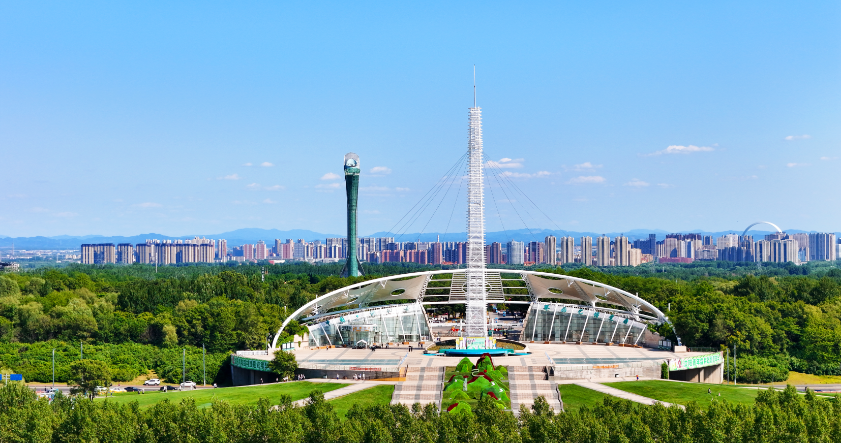

# 沈阳市植物园

> 棋盘山下百合开，凤凰展翅九霄来。
> 万国花田春不老，一园烟雨百重栽。
> 北国偏能藏锦绣，辽东自此有瑶台。

## 写在前面

中国东北，给人印象是冰天雪地、林海雪原。但你大概想不到，就在沈阳东郊，棋盘山脚下，藏着一片2.46平方公里的"花海绿洲"--沈阳市植物园。

它不像江南园林那般精致，也不像皇家园林那般厚重。它的精彩，在于"集"--集南北花卉于一园，集万国园艺于一隅，集四季风光于一处。春天郁金香，夏天百合，秋天菊花，冬天冰雪--一年四季，它都有不同的"主角"上场。

这里最浓墨重彩的一笔，是2006年的世界园艺博览会。当时24个国家、52个国内城市在此建园，把全世界的园艺精髓"种"进了这片东北的黑土地。世园会闭幕后，园址保留下来，成了今天植物园的"骨架"。2017年，植物园被国家旅游局正式评为国家AAAAA级景区，是辽宁省第三家5A景区。

来沈阳植物园，不必赶。它最适合的玩法，是慢慢走、慢慢看，找一个有阳光的下午，挑一片花开得正好的地方坐下来，什么也不做。

---

## 一、时光深处：从荒山到世界花园

### 1. 1959年：起步于棋盘山下

沈阳市植物园的历史，可以追溯到1959年。当时沈阳市政府决定在棋盘山国际风景旅游区内划出一片山地，作为林业科研和植物引种的基地。最初的植物园，以引种北方树种为主，规模不大，主要服务于林业科研，对外开放程度有限。

经过几十年的建设，植物园逐步收集了大量东北本地植物，并从国内外引种了上千种观赏植物。1993年，植物园正式对外开放，成为沈阳市民踏青赏花的新去处。

### 2. 2006年：沈阳世界园艺博览会

植物园命运的转折点，是2006年沈阳世界园艺博览会（简称"世园会"）。

世园会由中国国际贸促会、国家林业局、中国花卉协会主办，沈阳市政府承办，会期2006年5月1日至10月31日，共184天。这是当时中国举办的规模最大、级别最高的A2+B1级专业类世界博览会之一。

园区在原植物园基础上扩建至2.46平方公里，建成了100个展园，其中包括24个国际展园（如荷兰园、日本园、韩国园、俄罗斯园等）和52个国内城市展园（如北京园、上海园、杭州园、苏州园等）。博览会期间，共有超过1300万人次入园参观，创造了世园会历史上的"沈阳速度"和"沈阳奇迹"。

世园会的标志性建筑--百合塔，从此成为沈阳的新地标。塔高125米，外形似一株绽放的百合花，是当时中国最高的雕塑性建筑。

### 3. 2007年至今：5A景区的延续与新生

世园会后，植物园作为5A级景区永久保留，并不断完善。2007年，被评为国家AAAAA级旅游景区。2013年，植物园又承办了"中国沈阳国际旅游节"，进一步扩大了国际影响力。

今天的植物园，保留并维护着世园会时期的所有展园，新增了大型温室、儿童乐园、花卉科研中心等设施。每年举办郁金香花展（4-5月）、百合花展（7-8月）、菊花展（9-10月）、冰雪节（12-2月），四季都有看点。

---

## 二、走遍植物园：核心景点详解

### 📍 百合塔--俯瞰全园的"花朵"

百合塔是沈阳市植物园的绝对地标。塔高125米，相当于40层楼高，外形如一株盛放的百合花--底部为粗壮的"花茎"，向上逐渐展开为"花瓣"，最顶端是观景平台。塔身以白色和淡金色为主，阳光下晶莹剔透，远在几公里外都能望见。

百合塔由沈阳建筑大学设计，2006年世园会前建成。塔内有高速电梯，30秒即可登顶。观景平台在塔身95米处，360度环绕，可俯瞰整个植物园--2.46平方公里的园区尽收眼底。东南方向是棋盘山，山势起伏如棋盘；西边是沈阳城区，远处的高楼像积木；近处则是花田、湖面、展园，色彩斑斓。

最妙的是傍晚登塔。夕阳西下，整座植物园被染成金红色，远处棋盘山的轮廓在暮色中渐隐，城市华灯初上--这是看沈阳全景的最佳地点之一。

塔下是一片名为"百合园"的景区，每年7-8月，上百种、数十万株百合花在这里同时绽放，与塔身遥相呼应，"塔似百合、地亦百合"。

> 💡 **导游贴士**：
> 1. **登塔时机**：建议下午4-5点登塔，可以同时看到日景、日落和夜景三种风光。
> 2. **拍照**：塔下仰拍可展现全塔气势；塔顶俯拍可拍出植物园几何图案；远景建议从园区南门外的"百合广场"拍摄。
> 3. **排队**：节假日登塔排队约30-60分钟，建议错峰。
> 4. **避风**：塔顶风大，注意保暖，春秋带件外套。

---

### 📍 凤凰广场--世园会的迎宾大门

从植物园主入口进去，第一眼看到的就是凤凰广场。它是2006世园会的主入口广场，也是今天植物园的"门面"。

广场中央是一座大型雕塑"凤凰腾飞"，由沈阳鲁迅美术学院设计。雕塑以一只展翅的凤凰为主题，凤身为钢结构，凤尾由数百片彩色玻璃组成，阳光下闪烁如彩凤。凤凰高23米，翼展30米，是东北地区最大的城市雕塑之一。

凤凰是沈阳的城市图腾。沈阳故宫的大政殿前就有"凤凰楼"，是清代皇太极时期所建。世园会选用凤凰作为主题，既呼应了沈阳的历史文化，也象征着这座城市"涅槃重生"的现代化进程。

广场两侧是世园会留下的"百园之园"分布图--100个展园的方位一览无余。从这里规划路线，最有效率。

广场南端还有一座音乐喷泉，夏季每晚8点有水舞表演。喷泉水柱最高可达80米，配以音乐和灯光，是夏日夜间植物园的"重头戏"。

> 💡 **导游贴士**：
> 1. **路线规划**：广场上有完整的园区地图，建议拍下来作为游览参考。
> 2. **凤凰合影**：雕塑体量巨大，要在广场南侧才能拍全。建议上午9-10点光线最佳。
> 3. **音乐喷泉**：仅夏季（6-9月）有表演，每晚8点准时开始，约20分钟，免费观看。
> 4. **休息区**：广场两侧有遮阳棚和长椅，是中段休息的好地方。

---

### 📍 国内城市展园--52个城市的浓缩精华

植物园最神奇的部分，是100个世园会展园中的52个国内城市展园。每个展园约500-1000平方米，由各城市自行设计建造，浓缩展示当地的园林艺术和文化特色。

**北京园**：典型皇家园林风格，红墙黄瓦、汉白玉栏杆，园内有小型"九龙壁"复制品。

**苏州园**：江南私家园林格局，曲廊、漏窗、太湖石、半亭，小桥流水，"小中见大"。

**杭州园**：以"西湖十景"为题，三潭印月、断桥残雪、苏堤春晓，微缩呈现。

**西安园**：仿唐建筑，斗拱硕大，色调古朴，配以唐三彩雕塑。

**云南园**：白族民居"三坊一照壁"，照壁上有彩绘，园内遍植茶花。

**哈尔滨园**：俄式木屋，配以向日葵花田，浓郁异域风情。

**拉萨园**：白墙红顶的藏式建筑，转经筒、玛尼堆、经幡，让人恍若身在高原。

这些展园虽然是"微缩版"，但都是各城市派出顶尖园林设计师打造，工艺水平极高。一条街走下来，等于逛了半个中国的名胜园林。

> 💡 **导游贴士**：
> 1. **必看推荐**：苏州园（最精致）、北京园（最气派）、拉萨园（最异域）、云南园（最民族风）。
> 2. **路线**：国内展园集中在园区中南部，建议沿主路顺序游览，2-3小时可看完整片。
> 3. **拍照**：每个展园都有一处"标志性景观"，可作为打卡点。漏窗、雕花门、太湖石是经典机位。
> 4. **隐藏体验**：哈尔滨园冬天有"冰雪微缩景观"，11月-2月去能看到小冰雕。

---

### 📍 国际展园--24国风情集锦

植物园的另一大特色是24个国际展园。每个国际展园都由该国设计师设计，使用原产国的建筑材料和植物，原汁原味。

**荷兰园**：典型荷兰风车，配以郁金香花田。4-5月郁金香盛开时，仿佛到了阿姆斯特丹郊外。

**日本园**：枯山水庭院，白砂铺地，石组点缀，配以樱花和红枫。4月底樱花、10月红枫，最美。

**韩国园**：韩屋式建筑，木质飞檐，配以松树和芍药。

**俄罗斯园**：俄式木结构教堂，洋葱顶，配以白桦林。

**法国园**：对称几何花坛，喷泉、雕塑，典型法式规则式园林。

**印度园**：泰姬陵微缩版，配以印度神像和热带植物。

**埃及园**：金字塔和狮身人面像的微缩，配以椰枣树。

**泰国园**：泰式金色塔庙，配以芭蕉和鸡蛋花。

其中荷兰园和日本园最受欢迎，4-5月、10月是这两个园最美的季节。

> 💡 **导游贴士**：
> 1. **必看推荐**：荷兰园（4-5月最美）、日本园（4月樱花、10月红枫）、俄罗斯园（异域风情）、法国园（浪漫对称）。
> 2. **拍照**：荷兰风车配郁金香、日本枯山水、俄罗斯洋葱顶--这些都是经典明信片机位。
> 3. **拍照时间**：上午9-11点光线最柔和，国际展园朝东，这个时段顺光。
> 4. **隐藏玩法**：24国展园可以"打卡盖章"，园区游客中心有"护照"出售（10元/本），每到一个展园盖一个章，集齐24章有纪念品。

---

### 📍 玫瑰园与百合园--花卉的主题盛宴

植物园有两个"主题花卉园"，分别以沈阳的市花玫瑰和世园会标志百合为主题。

**玫瑰园**位于园区东南角，占地2万平方米，种植了来自世界各地的200多个品种、近10万株玫瑰。每年6-7月是玫瑰盛花期，红、粉、白、黄、紫，各色玫瑰竞相绽放，香气袭人。园内有拱形花架长廊，藤本月季爬满花架，形成"花隧道"，是植物园最浪漫的拍照点之一。

**百合园**位于百合塔下，占地1.5万平方米，种植了8个系列、50多个品种、近5万株百合。百合展在每年7-8月举办，是植物园夏季最重要的活动。亚洲百合、东方百合、铁炮百合、麝香百合，各色各样，从喇叭形到碗形，从单瓣到重瓣，应有尽有。

沈阳把百合选为世园会主题花，是有讲究的：百合花寓意"百年好合"，象征和谐与美好；同时百合在东北生长良好，是适宜本地气候的花卉。

> 💡 **导游贴士**：
> 1. **最佳时间**：玫瑰园6-7月，百合园7-8月。错过这两个月，园子会"光秃秃"。
> 2. **拍照**：玫瑰园花架长廊（仰拍）、百合园百合塔下（俯拍花海与塔）。
> 3. **气味**：玫瑰和百合的香气都很浓，对花粉过敏者慎入。园内多处设有"避花粉休息区"。
> 4. **买花**：玫瑰园出口有鲜花和盆栽出售，比花店便宜，可以带回家做纪念。

---

### 📍 棋盘山景观带--园外的山水延伸

植物园并不孤立，它是棋盘山国际风景旅游区的一部分。植物园北门出去，就是棋盘山风景区。

棋盘山因传说"仙人下棋"得名，海拔260米，山势平缓，林木茂密。山顶有一块平坦巨石，相传是仙人对弈的棋盘。从这里可以远眺植物园全貌--百合塔如一根银针，插在一片翠绿之中。

棋盘山下有秀湖，湖面3平方公里，是沈阳最大的城市湖泊之一。湖上有游船，环湖有步道，夏天可以游泳、划船，冬天可以滑冰、滑雪。

如果时间充裕，强烈建议把植物园和棋盘山、沈阳国家森林公园一起游览，组成一个完整的"东北郊野一日游"。

> 💡 **导游贴士**：
> 1. **联票**：植物园+棋盘山有联票，比分别买票便宜约30%。
> 2. **徒步路线**：从植物园北门出，沿棋盘山南坡小路登顶，约40分钟。山顶观景台是看植物园全景的最佳点。
> 3. **秀湖**：夏季可租船（每小时50-80元），冬季有冰雪节，可滑冰车、看冰雕。
> 4. **住宿**：棋盘山脚下有度假酒店，可以住一晚，第二天继续游。

---

## 三、漫步之后：一些不必匆匆的事

植物园在沈阳东郊，距市中心约25公里，开车40分钟。它不在城市里，所以来一趟不容易。但正因为"不容易"，它才更值得慢下来。

最理想的玩法，是挑一个5月底或6月初的周末，早上8点入园，下午5点出园，整整一天。

早上8点的植物园，刚开门，游客稀少。清晨的阳光斜斜地照在花田上，露珠在花瓣上滚动。从凤凰广场往南，先到玫瑰园--这时候玫瑰刚"醒"，香气最浓。然后转向荷兰园，郁金香正盛，红的、黄的、紫的，像打翻了的颜料盘。

中午找一片树荫，铺上野餐布，吃自带的午餐。园区有几处草坪允许野餐，最有名的是百合塔下"百合草坪"，可以边吃边赏花。

下午走国内展园和国际展园，慢慢逛，2-3小时。每个园子里都有一两处值得驻足的小景--苏州园的漏窗光影、日本园的枯山水、俄罗斯园的洋葱顶。别只顾着拍照，坐下来，看看阳光怎么穿过树叶，听听风怎么吹过花丛。

傍晚5点之前，登上百合塔。看着夕阳从棋盘山后落下，看着花田从金色变成玫瑰色再变成紫色，最后在暮色中沉默。

下塔的时候，回头看一眼。整座植物园在暮色中安静下来，百合塔的灯亮了，凤凰广场的喷泉开始喷水，远处棋盘山的轮廓渐渐隐没。这一刻，你会忽然理解：为什么要在东北建这样一座花园。

因为北方的春天来得晚、夏天短、秋天匆匆、冬天漫长。所以东北人更懂得珍惜花期。他们用一座2.46平方公里的花园，把全世界的美都"搬"过来，让自己在短暂的春夏秋，能一次看够。

---

## 写在最后

植物园不像故宫那样有故事，不像长城那样有传奇。它只是"美"--把全世界的花卉、园林、艺术，放在东北的一片山地上，让它们各自生长、各自绽放。

但正是这种"美"，是当下都市生活里最稀缺的东西。我们每天对着屏幕，对着代码，对着报表，渐渐忘了花开的样子、风过松林的声音、阳光穿过树叶的光斑。我们以为自己很忙，没时间看花；其实是不看花，我们才变得这么忙。

来沈阳植物园，你可以什么都不做。不拍照，不发朋友圈，不打卡，不写游记。就找一片花田，坐下来，看一会儿。

你会忽然发现：原来"美"可以这样朴素，又这样盛大。原来一朵花可以这样耐心，开一整夏，等你来。原来我们自己，也可以像花一样，不必急着证明什么，只需要在该开的季节，开。

百合塔站在那里，125米高。它什么也不说，只是日复一日地看着这片花园里的花开花落。我们也曾像它一样，安静地看着生活，看着自己，慢慢生长。

也许，这才是植物园真正想告诉我们的：在所有的"快"里，请保留一点点"慢"；在所有的"有用"里，请保留一点点"无用"；在所有的"赶时间"里，请保留一点点"花时间"。

> ✨ **游览小贴士总结**：
> - **最佳时间**：4-5月（郁金香）、6-7月（玫瑰）、7-8月（百合）、9-10月（菊花）、12-2月（冰雪节）。任何时候来都有看点。
> - **推荐路线**：南门入 -> 凤凰广场 -> 玫瑰园 -> 国内展园 -> 国际展园 -> 百合塔登顶 -> 北门出（约5-6小时）。
> - **穿着建议**：舒适的步行鞋必备，园区面积大，全程步行需5-8公里。夏季防晒，春秋带外套。
> - **拍照指南**：百合塔仰拍、凤凰广场雕塑合影、苏州园漏窗、荷兰园风车配郁金香、日本园枯山水。
> - **隐藏体验**：盖"24国护照"章、玫瑰园花架长廊、百合塔顶看日落、棋盘山顶看植物园全景。
> - **交通**：沈阳市内乘168路公交直达；自驾沈吉高速棋盘山出口下。停车场5元/次。
> - **餐饮**：园内有餐厅和小吃，但价格略贵，建议自带午餐野餐。

---

## 📷 景区美图

*百合塔--沈阳植物园地标*

*凤凰广场与凤凰雕塑*

---

## 📚 沈阳市植物园小档案

| 项目 | 信息 |
|------|------|
| 景区级别 | 国家AAAAA级旅游景区 |
| 所属省份 | 辽宁省 |
| 所属城市 | 沈阳市 |
| 所属区县 | 浑南区 |
| 占地面积 | 约2.46平方公里 |
| 标志建筑 | 百合塔（125米） |
| 重要事件 | 2006年世界园艺博览会举办地 |
| 建议游览时间 | 半天 - 1天 |
| 最佳游览季节 | 春夏秋三季，4-10月 |

---

> 💡 **本页说明**：
> 本README由VLM增强工作流整理生成，结合历史文献、实地考察资料与导游经验。
> 坐标、图片、简介均来自公开资料，仅供参考。游览请以景区最新公告为准。
