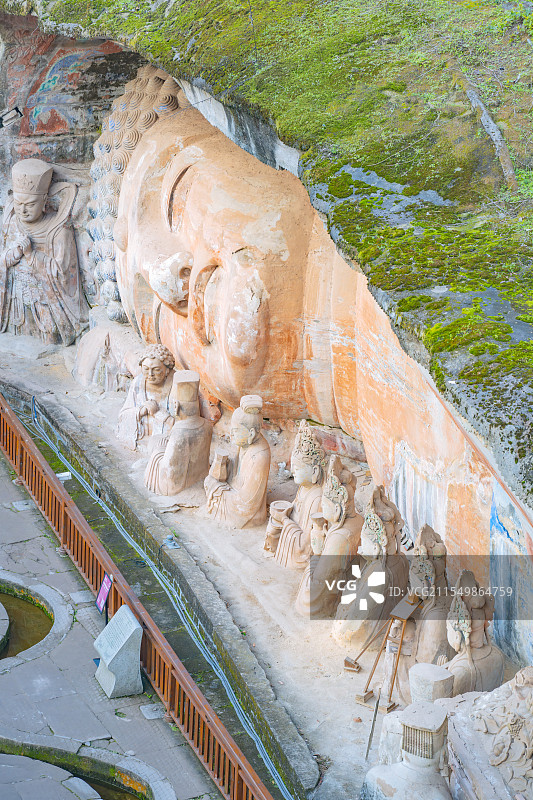
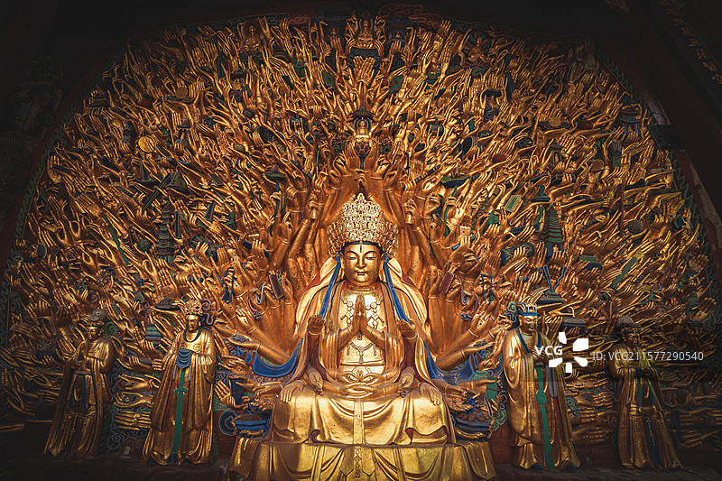

# 大足石刻 ✨

## 🪨 开篇：中国石窟最后的辉煌

公元907年，唐朝灭亡了。
长安的繁华结束了，洛阳的辉煌结束了。
北方的那些大石窟，云冈、龙门、敦煌，一个个都沉寂了。
凿石造佛的声音，在中原大地上渐渐消失。

但是，没有人想到，
在四川盆地东部的一个叫大足的小县城里，
这场持续了一千年的造像运动，
迎来了它最后的、也是最绚烂的一次绽放。

从晚唐到南宋，
大足人用了整整四百年，
在他们家乡的山崖上，
刻下了五万多尊佛像。

这是中国石窟艺术的收官之作。
也是最有人间烟火味的一座石窟。

在这里，佛不再是高高在上、不食人间烟火的神。
他们会喝酒，会吃肉，会谈恋爱，会给儿子喂饭，会给母亲洗脚。
他们就像你我身边的普通人。

1999年，大足石刻被列入《世界文化遗产名录》。
世界遗产委员会说：
"大足石刻是天才的艺术杰作，它把佛教、道教、儒家的思想完美地融合在一起，代表了中国石窟艺术的最高水平。"

## 📜 四百年的造像史

**公元892年 晚唐的开始**
叫韦君靖的地方官，在大足北山刻下了第一尊佛像。
此时，距离唐朝灭亡还有15年。
没有人会想到，这一凿，开启了四百年的造像史。

**公元1078年 北宋的鼎盛**
一个叫严逊的居士，花了一辈子的积蓄，在石篆山开凿了洞窟。
他做了一件前无古人的事——
把佛教的释迦牟尼、道教的老君、儒家的孔子，刻在了同一个洞窟里。
三教合一，从此成为大足石刻的标志。

**公元1174年 南宋的巅峰**
一个叫赵智凤的僧人，用了七十年的时间，
把整个宝顶山变成了一座完整的佛教密宗道场。
从九龙浴太子，到六道轮回，到父母恩重经变，到千手观音，到卧佛。
整整一座山，就是一部完整的、立体的佛经。

**公元1279年 最后的凿声**
南宋灭亡了。
蒙古人的铁蹄踏破了四川。
大足石刻的凿石声，也永远地停了下来。

中国持续了一千年的石窟艺术，
在这里，画上了一个完美的句号。

---

## 🌟 核心造像详解

### 📍 释迦涅槃圣迹图：中国最美的卧佛

这是宝顶山最震撼的一尊造像——释迦牟尼佛涅槃像。
31米长的佛，侧卧在崖壁上，半边身子埋在山里，就像是从山里长出来的一样。

你看这尊佛的脸。
不是庄严肃穆，不是俯视众生。
而是安详，是平静，是解脱后的那种淡然。
就像是睡着了一样。

最有意思的是佛前的这两排人。
有皇帝，有大臣，有和尚，有道士，有普通百姓。
他们有的在哭，有的在沉思，有的在朝拜。
每一个人的表情都不一样。
就像是把整个宋朝的社会，都刻在了这面崖壁上。

**你不知道的细节**：
- **半截佛**：这尊佛只有上半身，下半身延伸到山体里，叫"意到笔不到"。佛的身体有多大？没人知道。
- **没有佛龛**：整个造像没有任何遮挡，就直接刻在露天的崖壁上。八百多年了，风吹雨淋，还保存得这么好。
- **眼睛的秘密**：佛的眼睛是半睁半闭的，无论你站在哪个角度，都觉得佛在看着你。

> 💡 **站在卧佛面前**：
> 多站一会儿。
> 你会发现，
> 死亡原来可以这么美，
> 结束原来可以这么安详。
> 这就是涅槃的真正含义——
> 不是结束，是永恒。

---

### 📍 千手观音：八百只手的奇迹

这是大足石刻的镇山之宝，也是全世界唯一一尊真正的"千手观音"。
高7.7米，宽12.5米，830只手，每只手的手心里都有一只眼睛。
这些手像孔雀开屏一样，从观音的身体里向四周伸展。
层层叠叠，金碧辉煌。

站在它的面前，你会有一种被照亮的感觉。
八百多只手，每一只都不一样，每一只都带着温度。

**你不知道的故事**：
- **不是一千只**：传说有一千只手，实际数下来是830只，但这已经是全世界最多的了
- **历时八年修复**：2008年开始修复，用了整整八年，2015年才重新开放。修复时发现每只手的背面都刻着工匠的名字
- **贴了一百万张金箔**：修复用了一百万张24K金箔，现在看到的金色，都是真金
- **眼睛的秘密**：每只手心里的眼睛，都看着不同的方向，360度没有死角

> 💡 **千手观音的含义**：
> 千手，代表能护持一切众生；
> 千眼，代表能观照世间万物。
> 其实这尊像想说的是——
> 无论你在世界的哪个角落，
> 无论你经历着什么，
> 观音都在看着你，
> 观音都在护持着你。

---

### 📍 父母恩重经变相：最有人情味的佛经

这是大足石刻最特别的一组造像，也是最打动人心的。
它讲的不是佛，不是菩萨，不是西方极乐世界。
它讲的是——父母的恩情。

从母亲怀孕开始，
到生孩子时的痛苦，
到给儿子喂奶，
到给儿子洗澡，
到儿子尿床了母亲睡在湿的地方，
到儿子长大了母亲给儿子娶媳妇，
到母亲老了儿子终于懂得报恩……

整整十组雕像，
把一个母亲从怀孕到老去的一生，
完完整整刻在了石头上。

这哪里是佛经啊。
这就是我们每个人的生活。

一千年前的工匠，把他们最朴素的情感，刻在了石头上。
他们用佛像告诉世人：
好好孝敬你的父母，
这就是最大的修行。

---

### 📍 牧牛图：人生就是一场驯牛的修行

大足石刻有一组很有意思的造像，叫《牧牛图》。
十个牧童，十头牛，
从最开始的牛桀骜不驯，
到中间的牧童和牛渐渐磨合，
到最后牛被驯服了，牧童也睡着了。

这哪里是在牧牛啊。
这是在说我们每个人的人生啊。
牛就是我们的心。
从年轻时候的桀骜不驯，
到中年的渐渐收敛，
到老年的终于平和。

整整一生的修行，
都刻在了这几十米的崖壁上。

---

## 💡 大足石刻为什么特别？

很多人问：
敦煌、云冈、龙门都那么有名，
大足石刻，到底特别在哪里？

答案是：它最有人情味。

**在云冈，你看到的是皇帝的威严。**
那里的佛，是帝王的化身，高大，威严，遥不可及。

**在龙门，你看到的是盛世的自信。**
那里的佛，是盛唐的气象，丰满，雍容，大气磅礴。

**但在大足，你看到的是你自己。**
这里的佛，会喝酒，会吃肉，会谈恋爱，会生气，会开心。
这里的佛经，讲的不是遥不可及的西方极乐，
而是如何孝敬父母，如何和家人相处，如何做一个好人。

大足石刻最伟大的地方，
不是它有多么宏伟，
不是它有多么精美，
而是——
它把高高在上的佛教，
拉回了人间。

它告诉你，
修行不用去深山老林，
不用出家，不用念经。
就在你的家里，
就在你和父母妻儿的相处里，
就在你每一天的生活里。

生活，就是最好的修行。

---

## 🎯 游览实用指南

### 🚗 交通指南
大足在重庆西边，距离重庆主城区约100公里。

**从重庆出发**：
- **高铁**：重庆西站/北站 → 大足南站，约40分钟，出站后坐公交206路直达景区，约1小时
- **大巴**：重庆菜园坝/陈家坪汽车站 → 大足，约1.5小时
- **自驾**：约1.5小时，高速直达，景区停车场很大，10元/天
- **包车**：约300-400元/天，适合一家人出行

**景区内交通**：
- 宝顶山景区不大，全程步行即可
- 宝顶山到北山约5公里，有景区直通车，也可以打车

### 🎫 门票信息（2025年参考）
- **宝顶山石刻**：115元（必看！精华全在这里）
- **北山石刻**：70元（时间充裕可以看，晚唐风格）
- **联票**：140元（宝顶山+北山）
- **半价票**：学生、60-69岁老人
- **免票**：70岁以上、军人、残疾人、记者
- **讲解**：强烈建议请！120元/次，没有讲解你看不懂这些造像背后的故事
- **预约**：关注"大足石刻"公众号预约，节假日建议提前约

### ⏰ 最佳游览时间
- **春秋季（3-5月、9-11月）**：天气最好，不冷不热
- **夏季**：比较热，建议早上8点前入园
- **冬季**：人少，体验感好
- **建议游览时长**：宝顶山3小时，北山1.5小时，共4-5小时

### 🗺️ 推荐路线
**经典一日游**：
重庆出发 → 宝顶山石刻（3小时，重点看：六道轮回、父母恩重经变、千手观音、卧佛）→ 大足县城吃午饭 → 北山石刻（1.5小时，看晚唐造像）→ 返回重庆

**深度两日游**：
第一天：宝顶山 + 圣寿寺 + 大足博物馆
第二天：北山 + 南山（道教造像）+ 石篆山（三教合一）

> 注意：只看宝顶山就够了，精华90%都在宝顶山。时间紧张的话，北山可以不去。

### ⚠️ 游览贴士
1. ✅ **一定要请讲解！一定要请讲解！一定要请讲解！**
   重要的事说三遍！没有讲解，你看到的就是一堆石头，根本看不懂背后的故事和寓意。
2. ✅ **宝顶山是按参观路线单向走的**，跟着路线走就行，不会迷路，也不会错过任何景点。
3. ❌ **不要摸造像**，手上的油脂会对石刻造成伤害。
4. ✅ **建议自带水和零食**，景区里卖的比较贵。
5. ❌ **洞窟内不要拍照**，尤其是千手观音，闪光灯会伤害金箔。
6. ✅ **可以飞无人机**，景区不限飞，想拍全景的可以带。

### 🍜 大足美食
- **大足冬菜尖**：大足特产，腌菜，特别香，一定要带几包回去
- **大足邮亭鲫鱼**：重庆名菜，麻辣鲜香，来了一定要吃
- **大足小面**：重庆小面的大足版本，比重庆本地的还好吃
- **冰粉凉虾**：夏天的消暑神器

## 💫 结语：石头的温度

很多人逛石窟，会觉得枯燥。
不就是一些佛像吗？
有什么好看的？

但大足石刻不一样。
它不是冷冰冰的宗教宣传品。
它是一千年前，一群普通人的生活记录。
他们把自己对父母的感情，
对孩子的期待，
对生活的理解，
对善恶的判断，
一点点，一锤锤，
都刻在了石头上。

所以你看这些造像的时候，
你不会觉得这是一千年前的东西。
你会觉得特别亲切。
因为他们刻的，就是你现在的生活。

一千年过去了。
宋朝灭亡了，元朝灭亡了，明朝清朝都灭亡了。
改朝换代了多少次，
战争来了又走，
当年刻这些石头的人，
连名字都没有留下来。

但是这些石头还在。
石头里的那些情感，
那些朴素的价值观，
那些对善良的期待，
对家庭的重视，
对父母的感恩，
一千年了，
一点都没变。

这就是大足石刻最珍贵的地方。
它不是宗教，
它是生活。
它是刻在石头上的，
中国人的生活哲学。

所以来一次大足吧。
不是为了看佛，
是为了看看——
一千年前的中国人，
是怎样活着的。

> 📌 **旅行感悟**：
> 冯骥才说：
> "在大足，
> 佛教从天上回到了人间，
> 神性从至高无上的宝座走下来，
> 走进了我们的生活。
> 这就是大足石刻最伟大的地方。"

---

*本页内容基于实景图片分析与大足石刻艺术史研究整理，由AI导游系统2025年6月生成*
