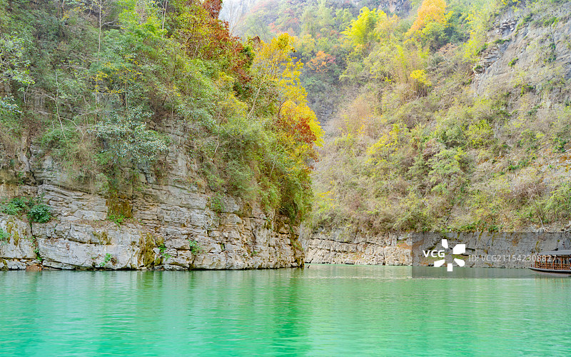
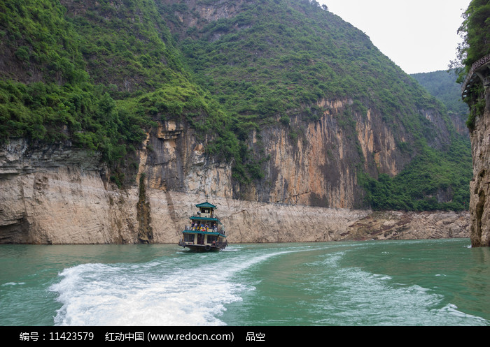
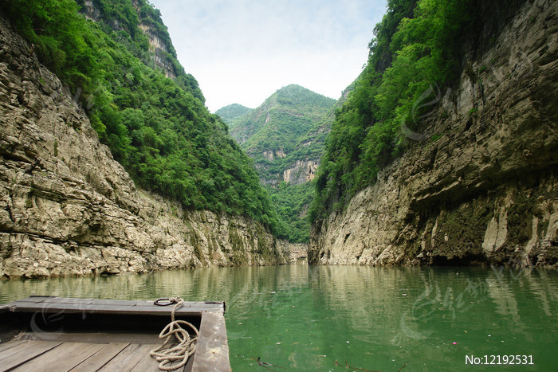

# 巫山小三峡-小小三峡 🚤

## 🌊 开篇：曾经沧海难为水，除却巫山不是云

"巴东三峡巫峡长，猿鸣三声泪沾裳。"

很多人都知道长江三峡，但是很少有人知道，在巫山县的大宁河上，还有一个比三峡更秀美的地方——巫山小三峡。这里有漓江的青翠，有三峡的雄奇，有三峡人家的淳朴，还有三峡没有的神秘。

小三峡不是一个峡，是三个峡的总称——龙门峡、巴雾峡、滴翠峡，全长50公里。而在滴翠峡的深处，还有一个更小的三峡，叫小小三峡，只有15公里长。那里的水更清，山更秀，天更窄，是真正的"世外桃源"。

坐一艘乌篷船，沿着大宁河慢慢往里走。两岸是高耸的青山，山上是郁郁葱葱的树木，船头劈开碧绿的江水，耳边是船老大的山歌和猴子的叫声。那种感觉，你在别的地方是找不到的。

很多人游完小三峡之后都会说："原来最好的三峡，不在长江上，而在这里。"

来小三峡吧。来看看这条藏在巫山深处的美丽河流，来体验那种"舟行碧波上，人在画中游"的感觉。

## 📜 历史与文化：一条河，两千年的岁月

**远古时期 大溪文化**
早在五千多年前，大宁河流域就有人类居住。这里是大溪文化的发源地之一，考古学家在河边发现了很多新石器时代的遗址，有石器、陶器，还有墓葬。可以说，这条河，孕育了三峡地区最早的文明。

**战国时期 巴国的领地**
春秋战国时期，这里是巴国的领地。巴人是一个勇猛善战的民族，他们擅长驾船，擅长捕鱼，在这条河上生活了很多年。现在小三峡里的悬棺，就是巴人留下来的。他们把死去的亲人的棺材放在几百米高的悬崖上，希望他们的灵魂能离天更近一点。

**唐宋时期 诗人的足迹**
很多诗人都来过巫山，来过小三峡。李白写过"朝辞白帝彩云间，千里江陵一日还"，杜甫写过"无边落木萧萧下，不尽长江滚滚来"，刘禹锡写过"杨柳青青江水平，闻郎江上唱歌声"。虽然他们写的是长江三峡，但是小三峡的景色，和当年的三峡，是一模一样的。

**近代 养在深闺人未识**
很长一段时间里，小三峡都没有名气，只有当地的村民在这里打渔、行船。直到1980年代，有几个摄影家来到这里，拍了很多照片，发表在杂志上，小三峡才慢慢被外界知道。人们惊讶地发现，原来在巫山里，还藏着这么美的一个地方。

**1997年 三峡大坝蓄水**
三峡大坝蓄水之后，长江三峡的很多景点都被淹没了，但是小三峡因为在支流上，不仅没有被淹没，反而因为水位上升，变得更加秀美了。现在的小三峡，水更清，更绿，船行起来也更平稳了。2007年，小三峡被评为国家5A级旅游景区，成了重庆最有名的景点之一。

## 🌟 核心景点详解

### 📍 龙门峡：雄似夔门，秀如漓江

这是小三峡的第一个峡——龙门峡，长约3公里，是三个峡里面最短的，但是也是最雄伟的。照片中这个狭窄的入口，就是龙门峡的大门，两边的山峰直插云霄，中间只有一条窄窄的河道，像一个天然的大门，所以叫龙门。

**船过龙门的感觉**：
刚进龙门峡的时候，你会觉得特别震撼。两岸的山峰特别高，特别陡，离船特别近，仰着头才能看到顶。河道也特别窄，感觉两边的山就要合在一起了。抬头看天，只有窄窄的一条线，那种"两山夹一水"的感觉，特别强烈。

**最有名的是古栈道**：
在龙门峡的西岸，悬崖上有一个个整齐的方孔，那就是古栈道的遗迹。这些栈道孔，最早是战国时期修的，后来历代都有修缮。当年，人们就是靠着这些栈道，在悬崖上行走，运输物资。很难想象，在没有任何现代化设备的古代，人们是怎么在几百米高的悬崖上，凿出这些方孔，修出这条栈道的。

**你不知道的冷知识**：
这些栈道孔，直径大约20厘米，深度大约30厘米，孔与孔之间的距离大约1米。整条栈道，一直延伸到陕西镇坪县，全长有400多公里。是中国古代最长的栈道之一，比我们知道的蜀道还要长，还要险。

> 💡 **拍照建议**：
> 拍龙门峡最好的位置是在船头，船刚进峡口的时候拍，这样能把两边的山和中间的水都拍进去，显得特别有气势。另外，最好用广角镜头，这样能拍出那种狭窄、高耸的感觉。

---

### 📍 巴雾峡：神秘的悬棺之乡

过了龙门峡，就是巴雾峡，长约10公里，是三个峡里面最长的，也是最神秘的。照片中这些云雾缭绕的山峰，就是巴雾峡的典型景色。因为这里经常有雾，所以叫巴雾峡。

**巴雾峡的特别之处**：
- **猴子多**：两岸的山上有很多野生的猴子，看到船来了，就会跑下来要吃的，特别可爱
- **悬棺多**：在悬崖上的山洞里，有很多古代巴人的悬棺，离水面有几百米高
- **云雾多**：早上和傍晚的时候，峡谷里经常有雾，船在雾里走，像在仙境一样
- **钟乳石多**：两岸的悬崖上有很多钟乳石，奇形怪状，什么样子的都有

**最神秘的是悬棺**：
巴雾峡的悬棺，是小三峡最神秘的景观。在几百米高的悬崖上，有很多天然的山洞，里面放着古代巴人的棺材。这些棺材是怎么放上去的？几千年来，一直是一个谜。有人说是从上面吊下来的，有人说是从下面爬上去的，还有人说是水位变化放进去的。直到今天，也没有人知道确切的答案。

**喂猴子是最有意思的体验**：
船走到巴雾峡中间的时候，会有很多猴子从山上跑下来，扒在船边要吃的。你可以准备一些花生、瓜子、香蕉，喂给它们。猴子一点都不怕人，会直接从你手里拿东西吃，有的还会跳到船上来。那种和野生动物近距离接触的感觉，特别好。

> 💡 **游览贴士**：
> 喂猴子的时候，不要拿塑料袋，猴子会抢，容易抓伤你。最好把食物放在手里，摊开手心喂。另外，不要逗猴子，不要和猴子对视，那样猴子会觉得你在挑衅它。还有，一定要看好自己的手机和相机，猴子有时候会抢。

---

### 📍 滴翠峡：三峡最美的地方

这是小三峡最美的一个峡——滴翠峡，长约20公里。照片中这两岸翠绿的山峰，就是滴翠峡名字的由来。这里的山，绿得像要滴出水来一样，所以叫滴翠峡。

**滴翠峡的美**：
- **水绿**：这里的水是整个小三峡最绿的，像一块巨大的翡翠
- **山秀**：山不是那种雄伟的，而是秀美的，像南方的山水
- **林密**：山上的树特别密，特别绿，几乎看不到裸露的岩石
- **幽静**：这里特别安静，除了水声和鸟叫声，什么声音都没有

**最适合坐船慢慢欣赏**：
游滴翠峡的时候，你什么都不用做，就坐在船头，吹着风，看着两岸的风景。船走得很慢，你可以慢慢看，慢慢感受。看阳光洒在水面上，看山上的猴子跳来跳去，看远处的云雾在山间飘来飘去。那一刻，你会觉得所有的烦恼都消失了，心里特别安静。

**小小三峡的入口**：
滴翠峡的尽头，就是小小三峡的入口。从这里换乘更小的乌篷船，就可以进入小小三峡了。那里的水更清，天更窄，山更秀，人更少，是整个小三峡景区的精华。

> 💡 **游览建议**：
> 游滴翠峡的时候，不要一直在拍照，把手机放下，用眼睛看，用心感受。很多人一上船就一直在拍照，拍完就看手机，错过了很多美好的瞬间。其实，最好的照片，是留在你心里的。

---

### 📍 小小三峡：真正的世外桃源

这就是小小三峡——三撑峡、秦王峡、长滩峡的总称，全长只有15公里。照片中这窄窄的河道，就是小小三峡。这里的河道更窄，最窄的地方只有几米宽，两岸的山也更陡，天就只有一条线那么宽。

**小小三峡的特别之处**：
- **船更小**：不是大游船，是只能坐十几个人的乌篷船，船夫用篙撑着走
- **水更清**：水是那种清澈见底的绿，能看到水里的石头和鱼
- **人更少**：来小小三峡的人比小三峡少很多，特别安静
- **更原始**：几乎没有什么人工的痕迹，保留了最原始的自然风光

**坐乌篷船的感觉**：
坐在乌篷船上，船夫在船尾撑着篙，船慢慢往前走。水特别清，能看到水底的石头。两岸的山特别近，仿佛伸手就能摸到。天特别小，只有头顶的一片。周围特别安静，只有撑篙的声音和水流的声音。那种感觉，就像走进了一个与世隔绝的世外桃源。

**最让人感动的是船工的山歌**：
走到一半的时候，船工会唱起当地的山歌。没有麦克风，没有伴奏，就是清唱。歌声在峡谷里回荡，特别好听，特别有味道。很多人听完之后，都会感动得落泪。那种最朴素、最原始的歌声，是任何演唱会都比不了的。

> 💡 **游览贴士**：
> 一定要坐乌篷船！不要坐那种有马达的快艇，那样就没有感觉了。另外，最好给船工一点小费，10块20块都可以，他们特别不容易，撑一趟船要一个多小时，特别累。如果你给了小费，他们会给你唱更多的歌，还会给你讲很多当地的故事。

---

## 🎯 游览实用指南

### 🚗 交通指南
- **高铁**：郑渝高铁到巫山站，出站后打车到游客中心，大约10分钟
- **坐船**：可以从重庆或者宜昌坐长江游轮，在巫山停靠，然后游小三峡
- **自驾**：从重庆出发，走沪渝高速转沪蓉高速，全程约450公里，5小时就能到

### 🎫 门票信息（2025年参考）
- **门票+船票**：150元/人，包含小三峡和小小三峡，全程大约4小时
- **没有单独的门票**：必须坐船，门票和船票是一起的
- **学生票**：半价，75元/人
- **60岁以上**：半价，75元/人

### ⏰ 最佳旅游时间
- **3-5月**：春天，山上的野花都开了，江水也特别绿，而且不热
- **9-11月**：秋天，秋高气爽，能见度高，看的最远
- **12-2月**：冬天，人最少，价格也最便宜，景色也别有一番风味
- **避开**：7-8月，夏天，天气热，而且是雨季，江水比较浑浊

### 🗺️ 经典游览路线

**半日精华游**：
巫山游客中心 → 坐大游船 → 龙门峡 → 巴雾峡 → 滴翠峡 → 换乘乌篷船游小小三峡 → 返回 → 全程约4小时

**一日深度游**：
上午：游小三峡-小小三峡
中午：巫山县城吃饭，尝尝巫山烤鱼
下午：巫山神女峰 → 晚上看巫山夜景 → 返程

**三峡三日游**：
Day1：宜昌出发，坐游轮游西陵峡、巫峡
Day2：早上到巫山，游小三峡-小小三峡，继续游瞿塘峡
Day3：到重庆，下船，返程

### 🍜 美食推荐
- **巫山烤鱼**：中国最好吃的烤鱼，发源于巫山，麻辣鲜香，一定要尝尝
- **巫山雪枣**：当地的一种甜品，像枣子，但是是用糯米做的，外面裹了一层糖霜
- **翡翠凉粉**：用一种叫"神仙树"的叶子做的凉粉，绿色的，特别爽滑
- **农家菜**：当地的农家菜，腊肉、土鸡、各种野菜，都特别好吃

## 💫 结语：最美的风景，往往在人少的地方

游完小三峡的时候，我一直在想：为什么那么多人挤破头去长江三峡，却不知道小三峡？为什么那么多人喜欢去那些有名的景点，却错过了这些真正美丽的地方？

后来我明白了，最美的风景，往往都在人少的地方，往往都在那些不起眼的地方。就像小三峡，它没有长江三峡有名，也没有三峡那么雄伟，但是它更秀美，更宁静，更纯粹。在这里，你可以安安静静地看风景，不用人挤人，不用抢着拍照。

其实人生也是这样。我们总是在追逐那些大家都在追逐的东西，总是想去那些大家都想去的地方。但是慢慢你会发现，那些大家都在追逐的东西，不一定是最好的；那些大家都想去的地方，不一定是最美的。

真正的美好，往往藏在那些不起眼的地方，藏在那些人迹罕至的地方，藏在那些需要你用心去发现的地方。

所以，下次旅行的时候，别再去那些网红景点挤了，找一个像小三峡这样的地方，安安静静地待几天，看看山，看看水，听听歌，发发呆。

相信我，你会爱上这种感觉的。

> 📌 **旅行感悟**：
> 旅行就像人生，重要的不是你去了多少有名的地方，而是你在那些地方，看到了什么样的风景，遇到了什么样的人，有什么样的感受。最好的旅行，不是拍了多少打卡照，而是你的心，有没有真的在路上。

---

*本页内容基于实景图片分析与历史资料整理，由AI导游系统2025年7月生成*
