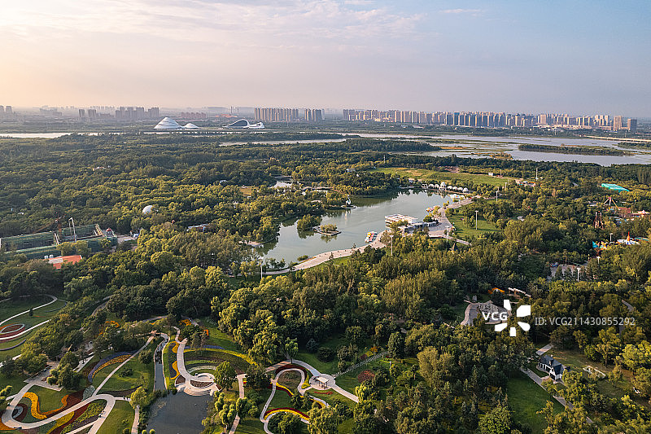
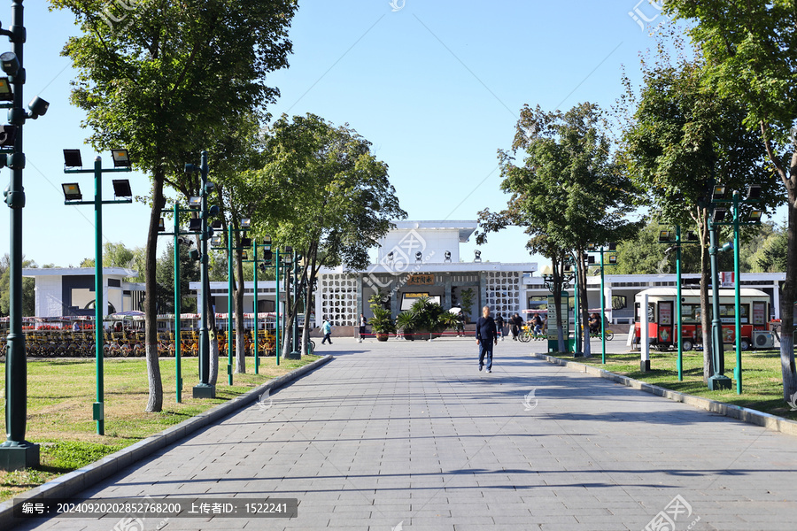
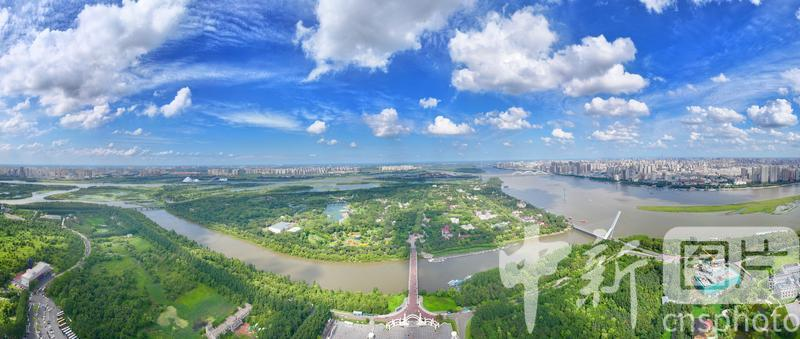
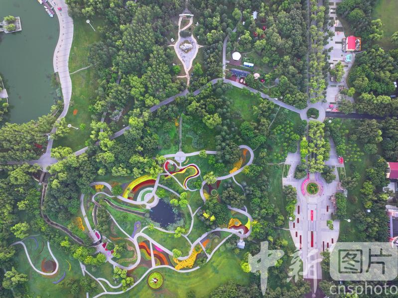

# 太阳岛景区 ❄️

## 🌅 开篇：松花江心上的明珠

当你乘坐过江缆车从哈尔滨市区缓缓滑向松花江北岸，脚下那片被江水环抱的绿色岛屿，就是太阳岛。这座总面积38平方公里的江心岛，不是一座普通的公园，而是哈尔滨这座冰雪城市最温柔的一面。

一首《太阳岛上》让这里成为全中国人的青春记忆——"明媚的夏日里天空多么晴朗，美丽的太阳岛多么令人神往。"八十年代，这首歌响彻大江南北，太阳岛也因此成为了一代人心中的浪漫圣地。如今，它依然是哈尔滨人的骄傲：夏天，这里是20℃的避暑天堂；冬天，这里是世界上最大的雪雕艺术博览会。

四季轮回，太阳岛展现着不同的面孔，但它的灵魂始终是那片纯净——松花江水滋养的湿地，俄式风情的建筑，以及哈尔滨人刻在骨子里的浪漫基因。

## 📜 历史与文化：从渔村到艺术殿堂

**1900年代 俄侨的避暑胜地**
随着中东铁路的修建，大批俄侨来到哈尔滨。他们发现了松花江上这座美丽的小岛，开始在这里修建别墅和度假村。太阳岛的名字，据说就来自俄文"太阳的花园"。那些色彩斑斓的俄式建筑，至今仍是岛上最迷人的风景。

**1964年 正式建园**
太阳岛风景区正式成立。但真正让它名扬天下的，是1983年那首火遍全国的歌曲《太阳岛上》。一夜之间，全国各地的游客蜂拥而至，太阳岛成为了中国最著名的旅游胜地之一。

**1988年至今 雪博会的诞生**
从第一届雪雕艺术博览会开始，太阳岛的冬天就不再寂静。每年冬天，来自世界各地的雪雕艺术家在这里创作，一座座高达数十米的雪雕拔地而起，太阳岛成为了名副其实的"冰雪迪士尼"。

如今的太阳岛，是哈尔滨的城市绿肺，也是中国北方最具代表性的风景旅游区。

## 🌟 核心景点详解

### 📍 太阳石：一座岛的精神图腾

这是每一位游客来到太阳岛看到的第一幕——这块重达150吨的天然巨石，就是太阳岛的标志。照片中"太阳岛"三个遒劲的大字，是著名书法家赵朴初先生亲笔题写。

**太阳石的故事**：
- **来历**：这块巨石来自黑龙江省的阿城区，是一块有着亿万年历史的花岗岩
- **重量**：150吨，运输它动用了军用坦克牵引车
- **象征意义**：它像一颗金色的太阳，每天迎接第一缕阳光
- **拍照最佳角度**：站在石前台阶上，让太阳石和身后的景区大门同框

**你不知道的冷知识**：
赵朴初先生题写"太阳岛"三个字时已经92岁高龄，这是他晚年最后的重要题字作品之一。

> 💡 **导游贴士**：
> 不要只在正面拍照！绕到太阳石的侧面，你会发现它的轮廓像一只展翅的天鹅。清晨阳光斜射时拍照效果最好，这时石头会呈现温暖的金色。

---

### 📍 雪博会主雕：冰雪艺术的巅峰

这是太阳岛冬天最震撼的景象——每年雪博会的主雪雕。照片中这座高达数十米的雪雕，是艺术家们用数百立方米的纯雪精心雕琢而成的。

**令人惊叹的雪雕数据**：
- **高度**：主雪雕通常高达30-40米，相当于10层楼
- **用雪量**：一座主雪雕需要用雪超过1万立方米
- **创作时间**：50多位艺术家连续工作20天
- **保存时间**：仅存在2-3个月，春天来临时就会融化

**最佳观赏时间**：
- **白天**：阳光照耀下，雪雕洁白无瑕，适合拍照
- **夜晚**：彩色灯光亮起，雪雕呈现梦幻般的效果
- **日落时分**：夕阳染红雪雕，是摄影爱好者的黄金时刻

> 💡 **观赏技巧**：
> 不要离雪雕太近！站在50米开外才能看到它的全貌。如果想拍一张有对比的照片，可以让朋友站在雪雕底座旁边——你会惊讶于人类在这座冰雪巨人面前是多么渺小。

---

### 📍 太阳瀑：北国的水榭长廊

这张照片展现的是太阳岛最经典的景观——太阳瀑和水阁云天。白色的瀑布从假山飞流直下，落入碧绿的潭中，周围是典型的中式园林建筑。你可能想不到，在遥远的北国哈尔滨，能看到如此江南风情的景致。

**水阁云天的设计理念**：
- **建筑风格**：中西合璧，既有江南园林的雅致，又有俄式建筑的浪漫
- **太阳瀑**：人工瀑布，高25米，是东北地区最大的人工瀑布
- **荷花湖**：夏天，湖面上铺满荷花，是哈尔滨最佳的赏荷地点
- **环湖栈道**：沿着湖边散步，可以从不同角度欣赏这片美景

**四季皆景**：
春天看桃花，夏天赏荷花，秋天观红叶，冬天这里变成了天然的冰场。太阳岛的美，从来不分季节。

> 💡 **拍照建议**：
> 夏天清晨6点来，此时湖面雾气缭绕，荷花上还带着露珠，是拍出水墨画效果的最佳时机。冬天瀑布结冰时，会形成壮观的冰瀑景观，又是另一种震撼。

---

### 📍 天鹅湖：湿地之美

这是太阳岛最宁静的角落——天鹅湖。照片中这片被芦苇环绕的水域，是哈尔滨城市湿地的精华。在这里，你能真正理解为什么太阳岛被称为"松花江的绿宝石"。

**湿地生态系统**：
- **鸟类天堂**：这里栖息着天鹅、大雁、野鸭等数十种水鸟
- **芦苇荡**：12万亩芦苇荡，坐船穿行其中，仿佛进入迷宫
- **花海**：夏天，湖边开满了格桑花和波斯菊
- **负氧离子**：这里的空气负氧离子含量是市区的50倍

> 💡 **游览贴士**：
> 租一辆自行车环湖骑行是最佳方式。天鹅湖深处有一个观鸟台，带上望远镜，你可以看到野生水鸟捕鱼的精彩瞬间。记住，保持安静，不要惊扰这些大自然的精灵。

---

## 🎯 游览实用指南

### 🚇 交通指南
- **索道**：防洪纪念塔乘坐过江索道，单程50元，俯瞰松花江美景
- **轮渡**：九站码头坐船，2元船票，体验松花江轮渡
- **公交**：29路、47路、80路、119路、125路、126路直达
- **自驾**：停车场充足，停车费5元/小时

### 🎫 门票信息（2025年参考）
- **夏季（5-10月）**：免费开放
- **冬季雪博会（12-2月）**：240元（提前网上预订有优惠）
- **观光车**：20元/人，招手即停
- **自行车租赁**：30元/小时（单人），50元/小时（双人）

### ⏰ 开放时间
- **夏季**：8:00-18:00
- **冬季**：8:30-17:30
- **建议游览时长**：
  - 夏季：3-4小时
  - 冬季雪博会：4-5小时

### 🗺️ 经典游览路线

**夏季精华游（3小时）**：
太阳石 → 水阁云天 → 太阳瀑 → 天鹅湖 → 花卉园 → 松鼠岛 → 鹿苑 → 太阳岛风情小镇

**冬季雪博会（4小时）**：
主雪雕区 → 国际雪雕大赛区 → 市民雪雕区 → 冰雪游乐区 → 雪雕艺术长廊

### 🍜 餐饮服务
- **岛上餐厅**：水阁云天附近有餐厅，东北菜为主
- **冰雪大世界**：冬季建议游玩后去冰雪大世界附近用餐
- **推荐美食**：锅包肉、地三鲜、杀猪菜、哈尔滨红肠

## 💫 结语：一座城市的浪漫告白

太阳岛不是一座普通的公园，它是哈尔滨这座城市性格的写照。

在这里，你能看到东北人的豪迈——他们能把零下30度的冬天变成全世界最热闹的冰雪嘉年华；你也能看到哈尔滨人的浪漫——在最寒冷的地方，他们创造了最温暖的艺术。

春天的丁香、夏天的荷花、秋天的红叶、冬天的雪雕。太阳岛用四季轮回，讲述着一个关于美的故事。

多少人因为一首歌来到这里，又因为这里的美爱上了这座城市。太阳岛，就是哈尔滨写给每一位游客的浪漫情书。

> 📌 **旅行感悟**：
> 人生就像太阳岛的四季，有夏天的热烈，也有冬天的沉静。重要的不是天气，而是看风景的心情。在太阳岛，你会明白：最寒冷的地方，往往有着最炽热的浪漫。

---

*本页内容基于实景图片分析与历史资料整理，由AI导游系统2025年7月生成*
