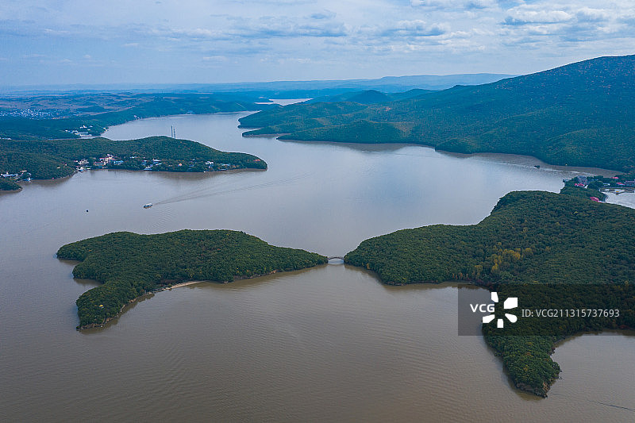
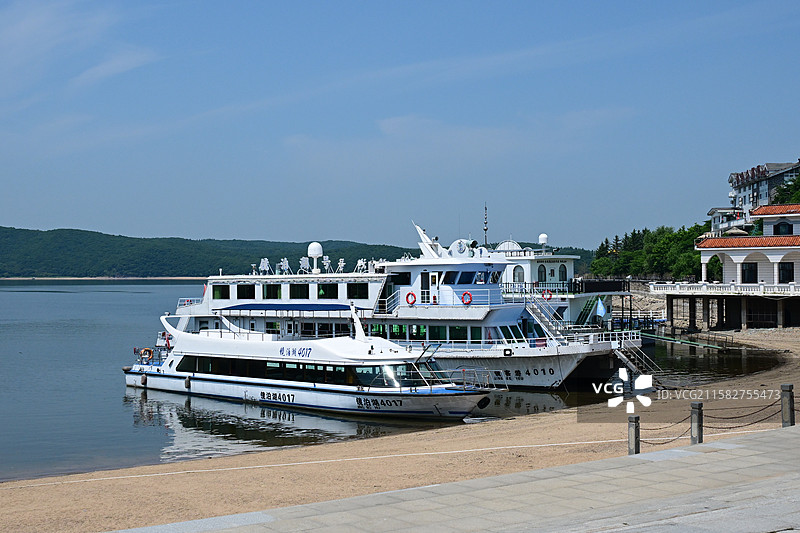
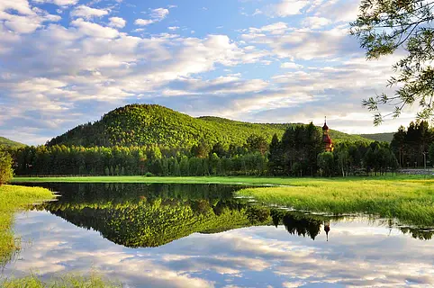
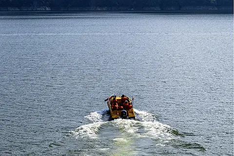
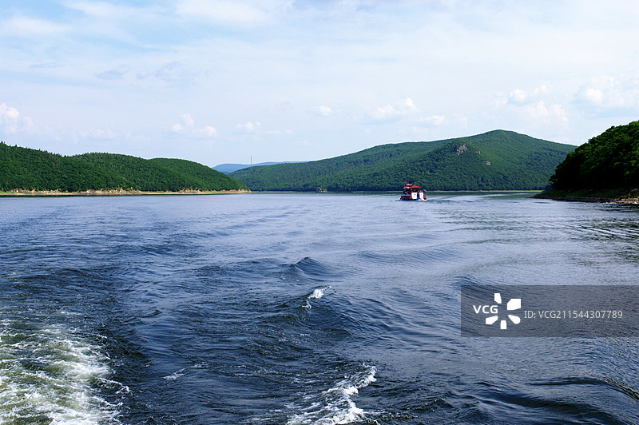

# 镜泊湖景区

## 🎤 AI导游带你游

### 【开场白】
各位朋友，大家好！欢迎来到黑龙江省牡丹江市，欢迎来到镜泊湖景区。我是你们今天的导游小艾。

站在这片土地上，你们可能想象不到，千百年前，这里曾是怎样一番景象。历史的年轮在这里留下了深深的印记，每一寸土地都在诉说着古老的故事。

镜泊湖国家级风景名胜区 “镜泊湖风景区”是“镜泊湖国家级风景名胜区”的同义词。 镜泊湖国家级风景名胜区，国家AAAAA级旅游景区，世界地质公园，中国十佳休闲旅游胜地，与千岛湖相媲美，有沙石之雕，兔耳岭之风情。 镜泊湖国家级风景名胜区位于黑龙江省东南部张广才岭与老爷岭[黑龙江省东南部和吉林省东部的长白...

今天，就让我们一起走进这片神奇的土地，感受它独有的魅力。建议游览时间：半天到一天。拍照最佳时间是清晨或傍晚，光线柔和时最美。

---

## 🗺️ 景区全景导览
镜泊湖景区位于黑龙江省牡丹江市宁安市境内，是国家AAAAA级旅游景区。

镜泊湖国家级风景名胜区 “镜泊湖风景区”是“镜泊湖国家级风景名胜区”的同义词。 镜泊湖国家级风景名胜区，国家AAAAA级旅游景区，世界地质公园，中国十佳休闲旅游胜地，与千岛湖相媲美，有沙石之雕，兔耳岭之风情。 镜泊湖国家级风景名胜区位于黑龙江省东南部张广才岭与老爷岭[黑龙江省东南部和吉林省东部的长白山支脉]之间，宁安市西南60公里处，距牡丹江市区90公里，总体规划面积为1726平方公里，景区由百里长湖、火山口原始森林、渤海国上京龙泉府遗址三部分组成。 镜泊湖以湖光山色为主，兼有火山口地下原始森林、地下熔岩隧道等地质奇观，及唐代渤海国遗址为代表的历史人文景观，是可供科研、避暑、游览、观光、度假和

**游览路线推荐**：景区入口 → 核心景观区 → 精华景点 → 观景平台 → 出口

---

## 🏛️ 主要景点详解

### 📍 核心景区

**核心看点**：
- 这里是景区最具代表性的景观，绝对不可错过
- 独特的自然/人文风貌，是拍照打卡的首选之地
- 建议停留15-20分钟，细细品味它的独特魅力

> 💡 **导游贴士**：
> 游览核心景区时，不妨关掉手机，用眼睛和心灵去感受这份美好。

---

### 📍 精华观景台

**核心看点**：
- 远离人群的小众精华景点，安静而美好
- 喜欢深度游的朋友一定不要错过
- 这里能让你感受到不一样的景区魅力

> 💡 **导游贴士**：
> 游览精华观景台时，建议放慢脚步，细细品味它的美。从不同角度欣赏会有不同的收获哦！

---

### 📍 特色景观区

**核心看点**：
- 景区的标志性景观，没来过等于没来过
- 最佳观赏时间是清晨和傍晚，光线最美
- 记得带上充电宝，美景会让你停不下快门

> 💡 **导游贴士**：
> 如果你是摄影爱好者，特色景观区一定能让你拍出满意的作品，记得带上广角镜头！

---

### 📍 文化展示区

**核心看点**：
- 自然风光与人文景观完美融合的典范
- 四季景致各异，无论何时来都有惊喜
- 摄影爱好者的天堂，随手一拍都是大片

> 💡 **导游贴士**：
> 游览文化展示区时，不妨找个地方坐下来，静静感受周围的氛围，这才是旅行的意义。

---

### 📍 历史遗迹区

**核心看点**：
- 景区内最受欢迎的打卡点，游客必到
- 站在这里可以俯瞰整个景区的壮丽景色
- 天气好的时候拍照效果绝佳，记得预留时间

> 💡 **导游贴士**：
> 来历史遗迹区游览，建议穿舒适的鞋子，这里需要多走走才能发现它的美。

---

### 📍 自然观光带

**核心看点**：
- 这里承载着景区最深厚的历史文化底蕴
- 每一处细节都诉说着动人的故事
- 建议跟随讲解员深入了解背后的历史

> 💡 **导游贴士**：
> 自然观光带是整个景区的精华所在，建议至少预留20-30分钟在这里慢慢欣赏。

---

## 【结束语】
各位朋友，今天的游览即将结束。希望镜泊湖景区的美景能给你们留下美好的回忆。

有人说，旅行的意义不在于去过多少地方，而在于那些让你心动的瞬间。希望在镜泊湖景区的这一天，能成为你旅途中一个温暖的记忆。

临走前，别忘了回头再看一眼。夕阳下的镜泊湖景区，会给你最温柔的道别。

> ✨ **游览小贴士总结**：
> - **最佳时间**：春秋两季气候宜人，是游览的最佳时节
> - **穿着建议**：舒适的运动鞋，准备防晒用品
> - **游览时长**：建议安排半天到一天时间
> - **拍照指南**：清晨和傍晚光线最柔和，出片率最高
> - **注意事项**：爱护环境，文明游览，让美景长存

祝你们旅途愉快，平安吉祥！🙏

---

## 📷 景区美图

*景区全景*

*核心景观*

*特色风光*

*细节之美*

*四季风光*

*人文景观*

---

## 📚 镜泊湖景区小档案

| 项目 | 信息 |
|------|------|
| 景区级别 | 国家AAAAA级旅游景区 |
| 所属省份 | 黑龙江省 |
| 所属城市 | 牡丹江市 |
| 建议游览时间 | 半天 - 1天 |
| 最佳游览季节 | 春秋两季 |

---

> 💡 **本页说明**：
> 本README由AI导游小艾根据网络公开资料整理生成。
> 坐标、图片、简介均来自豆包搜索API，仅供参考。
